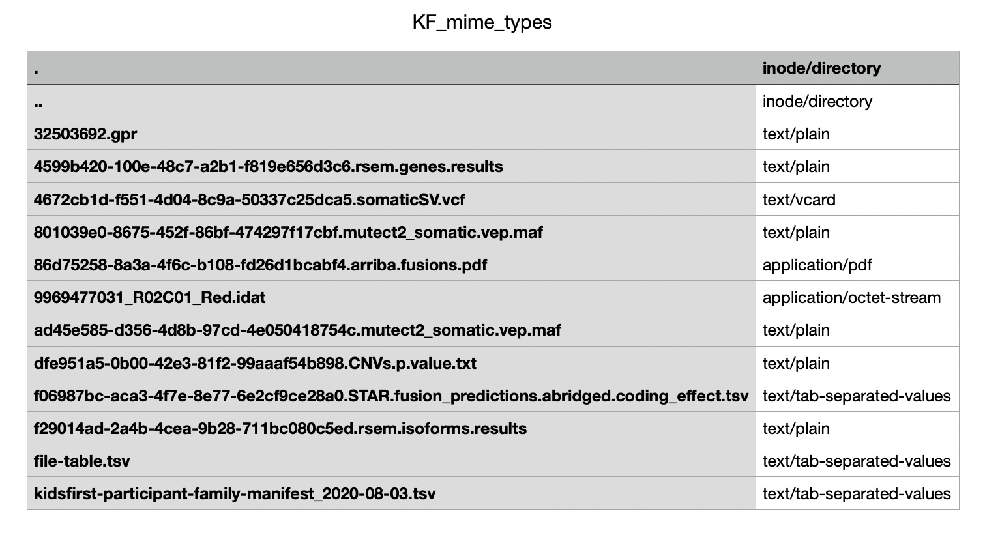

Introduction to MIME type
==========================

MIME which stands for Multipurpose Internet Mail Extensions are standards for recognizing the format of a file.
MIME types follow a certain format:
```
media-type/subtype-identifier
```

`image/png` is an example of MIME type where media-type is image and png is the subtype-identifier.

The [Internet Assigned Numbers Authority (IANA)](https://www.iana.org) is the
governing body responsible for all the [official MIME types](https://www.iana.org/assignments/media-types/media-types.xhtml).
Internet programs such as Web servers and browsers work with MIME type and not file extensions to ensure consistent transfer of
same types of files irrespective of the underlying operating system. Upload of DCC data to CFDE portal and download by users or other DCCs
is a crucial example where MIME type will help determine content of the media-types and avoid erroneous file transfers.

In this tutorial, we will describe how to determine MIME type for a file and append the MIME list to add new types specific to
the file format. **This tutorial is written for a Unix or Linux compute environment (e.g., MacOS, Linux-based HPC).**

Get MIME type for a file
------------------------

The most straightforward option to obtain MIME type for a file is:

```
file --mime-type <name of the file>
```

Another option is to use xdg-utils package which offers options for modifying and adding new MIME types.

```
sudo apt-get update -y
sudo apt-get install -y xdg-utils
```

For this tutorial, some open access data from [Kids First Data portal](https://kidsfirstdrc.org) were downloaded.
We can obtain the MIME type of a Kids First file:

```
xdg-mime query filetype file-table.tsv
```
which results in:

```
text/tab-separated-values
```

A few general rules for the MIME types are:
  - The x- prefix of a MIME subtype simply means that it is non-standard.
  - The vnd prefix means that the MIME value is vendor specific.
  - MIME type for unknown file type is generally application/octet-stream

MIME type for many files
--------------------------

Following our above example, we have downloaded multiple files from Kids First data portal and wish to obtain the MIME types for
all of them. Here is the directory structure with all the files:

```
.
├── 32503692.gpr
├── 4599b420-100e-48c7-a2b1-f819e656d3c6.rsem.genes.results
├── 4672cb1d-f551-4d04-8c9a-50337c25dca5.somaticSV.vcf
├── 801039e0-8675-452f-86bf-474297f17cbf.mutect2_somatic.vep.maf
├── 86d75258-8a3a-4f6c-b108-fd26d1bcabf4.arriba.fusions.pdf
├── 9969477031_R02C01_Red.idat
├── ad45e585-d356-4d8b-97cd-4e050418754c.mutect2_somatic.vep.maf
├── dfe951a5-0b00-42e3-81f2-99aaaf54b898.CNVs.p.value.txt
├── f06987bc-aca3-4f7e-8e77-6e2cf9ce28a0.STAR.fusion_predictions.abridged.coding_effect.tsv
├── f29014ad-2a4b-4cea-9b28-711bc080c5ed.rsem.isoforms.results
├── file-table.tsv
└── kidsfirst-participant-family-manifest_2020-08-03.tsv
```

We can write a script to utilize the `xdg-mime` command to obtain the MIME type for each file and store the results as a
tab-separated-values file.

```
for file in {.,}*; do      # For all files in the current directory with all the Kids First data files
  mime_type=`xdg-mime query filetype $file`        # Obtain MIME type
  echo "$file   $mime_type" >> KF_mime_types.tsv   # Write to output file
done
```

The resulting table:



Adding custom MIME type
-------------------------

In the above example the filetype associated with `.idat` extension has MIME type typically associated with unknown file types.
In addition the variant calling format files `.vcf` are associated with vcard MIME type which is typically used for contact cards.

To correct this, we can add custom MIME types by creating a xml file `new-idat.xml` for the file extensions.

```
<?xml version="1.0"?>
<mime-info xmlns='http://www.freedesktop.org/standards/shared-mime-info'>
  <mime-type type="image/idat">
    <comment>Shiny new file type</comment>
    <glob pattern="*.idat"/>
  </mime-type>
</mime-info>
```

Then run this code:

```
xdg-mime install new-idat.xml
```

Following this, run the script above again to update the results.


