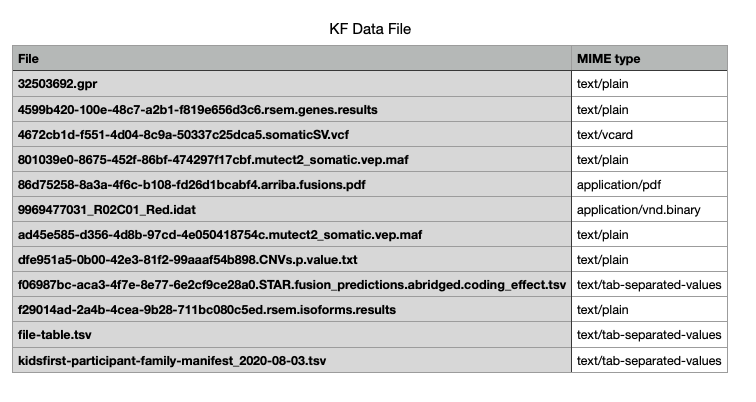

Introduction to MIME type
==========================

MIME which stands for Multipurpose Internet Mail Extensions are standards for recognizing the format of a file.
MIME types follow a certain format:
```
media-type/subtype-identifier
```

`image/png` is an example of MIME type where media-type is image and png is the subtype-identifier.

The [Internet Assigned Numbers Authority (IANA)](https://www.iana.org) is the
governing body responsible for all the [official MIME types](https://www.iana.org/assignments/media-types/media-types.xhtml).
Internet programs such as Web servers and browsers work with MIME type and not file extensions to ensure consistent transfer of same types of files irrespective of the underlying operating system. Upload of DCC data to CFDE portal and download by users or other DCCs is a crucial example where MIME type will help determine content of the media-types and avoid erroneous file transfers.

A few general rules for the MIME types are:
  - The x- prefix of a MIME subtype simply means that it is non-standard.
  - The vnd prefix means that the MIME value is vendor specific.
  - MIME type for unknown file type is generally application/octet-stream

In this tutorial, we will describe how to determine MIME type for single and multiple files and append the MIME list to add new types specific to the file format.

!!! note "Prerequisites"
    This tutorial is written for a Unix or Linux compute environment (e.g., MacOS, Linux-based HPC). Some of the commands require root privileges.

DCC example files
-------------------

For this tutorial, we downloaded multiple open access files from [Kids First Data portal](https://kidsfirstdrc.org). Here is the directory structure of `KF_data` with all the files:

```
.
├── 32503692.gpr
├── 4599b420-100e-48c7-a2b1-f819e656d3c6.rsem.genes.results
├── 4672cb1d-f551-4d04-8c9a-50337c25dca5.somaticSV.vcf
├── 801039e0-8675-452f-86bf-474297f17cbf.mutect2_somatic.vep.maf
├── 86d75258-8a3a-4f6c-b108-fd26d1bcabf4.arriba.fusions.pdf
├── 9969477031_R02C01_Red.idat
├── ad45e585-d356-4d8b-97cd-4e050418754c.mutect2_somatic.vep.maf
├── dfe951a5-0b00-42e3-81f2-99aaaf54b898.CNVs.p.value.txt
├── f06987bc-aca3-4f7e-8e77-6e2cf9ce28a0.STAR.fusion_predictions.abridged.coding_effect.tsv
├── f29014ad-2a4b-4cea-9b28-711bc080c5ed.rsem.isoforms.results
├── file-table.tsv
└── kidsfirst-participant-family-manifest_2020-08-03.tsv
```

MIME type for a file
------------------------

There are multiple utilities that allow to determine MIME type for a file. Here we will explore a few to provide options that can best suit the desired application. For our code example we will work with 9969477031_R02C01_Red.idat file.

#### file

The default option that requires no installation would be to use the `file` command.

Usage:
```
file --mime-type <name of the file>
```

Example code and output:

```
mimetype 9969477031_R02C01_Red.idat
9969477031_R02C01_Red.idat: application/octet-stream
```

Adding the `-b` flag returns only the MIME type for the selected file without the filename.

#### mimetype

Another option is using [`mimetype` utility](http://manpages.ubuntu.com/manpages/trusty/man1/mimetype.1p.html). This closely follows the `file` command but uses MIME types instead of descriptions.

Installation:

```
sudo apt install libfile-mimeinfo-perl
```

Usage:

```
mimetype <name of the file>
```

Example code and output:

```
mimetype 9969477031_R02C01_Red.idat
9969477031_R02C01_Red.idat: application/octet-stream
```

There are multiple options to customize the result. The `-D` or `--debug` option prints the logic behind choosing the MIME type for the file. The `--describe` or `-d` option returns the file description instead of MIME type.

`mimetype` allows for addition of custom MIME types.  

From our example files list, we have an `.idat` extension which is Illumina BeadArray data associated with microarray technology and solution for DNA and RNA analysis. `.idat` is an example of a file extension not listed in the [official MIME types](https://www.iana.org/assignments/media-types/media-types.xhtml). The IDAT file format varies from binary to encrypted XML depending on the array platform.

!!! warning
    For demonstration purposes we chose to apply `application/vnd.binary` as MIME type for `.idat` files. This may or may not be the appropriate choice. **The default `application/octet-stream` which is defined as arbitrary binary data is desired behavior for files without an accepted designation**. It is preferable to have unknown MIME type to prevent a file from being pushed somewhere inappropriate compared to a custom MIME type that may cause a file to be shunted into an application/pipeline where it doesn't belong.

We can add custom MIME types by creating a xml file `illumina-idat.xml` for the file extensions.

```
<?xml version="1.0"?>
<mime-info xmlns='http://www.freedesktop.org/standards/shared-mime-info'>
  <mime-type type="application/vnd.binary">
    <comment>Illumina proprietary IDAT format</comment>
    <glob pattern="*.idat"/>
  </mime-type>
</mime-info>
```     

Copy this file and update the mime-database.

```
sudo cp illumina-idat.xml /usr/share/mime/packages
sudo update-mime-database /usr/share/mime
```

Rerunning the code now results in the updated MIME type

```
mimetype 9969477031_R02C01_Red.idat
9969477031_R02C01_Red.idat: application/vnd.binary
```

#### xdg-utils

Another option is to use [xdg-utils](https://www.freedesktop.org/wiki/Software/xdg-utils/) package which also offers options for modifying and adding new MIME types.

Installation:

```
sudo apt-get update -y
sudo apt-get install -y xdg-utils
```

Usage:

```
xdg-mime query filetype <name of the file>
```

Example code and output:

```
xdg-mime query filetype 9969477031_R02C01_Red.idat
application/octet-stream
```

Addition of the custom MIME type is similar to `mimetype` utility with creating the xml file and updating the local database. Similar to our above example, we can create the `illumina-idat.xml` file:

```
<?xml version="1.0"?>
<mime-info xmlns='http://www.freedesktop.org/standards/shared-mime-info'>
  <mime-type type="application/vnd.binary">
    <comment>Illumina proprietary IDAT format</comment>
    <glob pattern="*.idat"/>
  </mime-type>
</mime-info>
```     

Update the database:

```
xdg-mime install illumina-idat.xml
```

#### Siegfried

Another signature-based file format identification tool is Siegfried. Full list of options and installation instructions for multiple platforms can be found on it's [official page](https://www.itforarchivists.com/siegfried).

Installation (Ubuntu/Debian, 64 Bit):

```
wget -qO - https://bintray.com/user/downloadSubjectPublicKey?username=bintray | sudo apt-key add -
echo "deb http://dl.bintray.com/siegfried/debian wheezy main" | sudo tee -a /etc/apt/sources.list
sudo apt-get update && sudo apt-get install siegfried
```

Usage:

```
sf <name of the file>
```

Example code and output:

```
sf 9969477031_R02C01_Red.idat

---
siegfried   : 1.8.0
scandate    : 2020-08-06T20:14:22Z
signature   : default.sig
created     : 2020-01-21T23:30:42+01:00
identifiers :
  - name    : 'pronom'
    details : 'DROID_SignatureFile_V96.xml; container-signature-20200121.xml'
---
filename : '9969477031_R02C01_Red.idat'
filesize : 8095228
modified : 2020-08-05T20:51:17Z
errors   :
matches  :
  - ns      : 'pronom'
    id      : 'UNKNOWN'
    format  :
    version :
    mime    :
    basis   :
    warning : 'no match'
```

The default results are in the National Archives UK's PRONOM file format signature which is displayed in YAML format. There are built in flags such as `-csv` or `-json` to change the output format.

Modification and customization of the underlying signature database is done using [`roy` tool](https://github.com/richardlehane/siegfried/wiki/Building-a-signature-file-with-ROY). It is installed with homebrew and Ubuntu packages. To build a MIME-info signature file, we can use the included signature files from [Apache Tika](https://tika.apache.org) (tika-mimetypes.xml) and [freedektop.org](https://www.freedesktop.org/wiki/) (freedesktop.org.xml) and use the `-mi` flag. The `roy build` creates a new signature file while `roy add` adds a new identifier to an existing signature file. The changes will be reflected to the included `default.sig` file.

```
roy build -mi tika-mimetypes.xml
roy add -mi freedesktop.or.xml
```

!!! note "Aliases"
    You can use aliases tika and freedektop in the above commands instead of the full `.xml` file name. For example:
    ```
    roy build -mi tika
    ```

The output now changes to update the `identifiers` to indicate the underlying database and the `mime` fields:
```
---
siegfried   : 1.8.0
scandate    : 2020-08-06T18:24:38Z
signature   : default.sig
created     : 2020-08-06T16:48:25Z
identifiers :
  - name    : 'tika'
    details : 'tika-mimetypes.xml (1.23, 2019-12-02)'
  - name    : 'freedesktop.org'
    details : 'freedesktop.org.xml (1.15, 2019-10-30)'
---
filename : '9969477031_R02C01_Red.idat'
filesize : 8095228
modified : 2020-08-04T04:23:05Z
errors   :
matches  :
  - ns      : 'tika'
    id      : 'UNKNOWN'
    format  :
    mime    : 'UNKNOWN'
    basis   :
    warning : 'no match'
  - ns      : 'freedesktop.org'
    id      : 'UNKNOWN'
    format  :
    mime    : 'UNKNOWN'
    basis   :
    warning : 'no match'
```

To add custom MIME types, we can update either of the two MIME-info files. The `xml` format remains consistent with previous examples for `mimetype` and `xdg-mime` and can be added to either `tika-mimeinfo.xml` or `freedesktop.org.xml`.

```
# Open the xml file
sudoedit /usr/share/siegfried/freedektop.org.xml  

# Add the entry for .idat
  <mime-type type="application/vnd.binary">
    <comment>Illumina proprietary IDAT format</comment>
    <glob pattern="*.idat"/>
  </mime-type>
```     

We can now build a MIME-info database with the updated files. Instead of overwriting the `default.sig` file, it is best practice to create a different signature file with different identifier using the `-name` flag. We can also create a single signature file with multiple identifiers. In our example, the `.idat` entry was added to the `freedesktop.org.xml` file. Since it would be useful to keep original identifiers, a custom signature file is built.

```
# Builds a custom.sig file using tika identifier
roy build -mi tika -name tika custom.sig

# Adds the modified freedesktop signature file to custom.sig
roy add -mi freedesktop -name freedesktop custom.sig

# Check the file entry using custom.sig
sf -sig custom.sig 9969477031_R02C01_Red.idat

# Output
---
siegfried   : 1.8.0
scandate    : 2020-08-06T20:57:10Z
signature   : custom.sig
created     : 2020-08-06T20:49:20Z
identifiers :
  - name    : 'tika'
    details : 'tika-mimetypes.xml (1.23, 2019-12-02)'
  - name    : 'freedesktop'
    details : 'freedesktop.org.xml (1.15, 2019-10-30)'
---
filename : '9969477031_R02C01_Red.idat'
filesize : 8095228
modified : 2020-08-04T04:23:05Z
errors   :
matches  :
  - ns      : 'tika'
    id      : 'UNKNOWN'
    format  :
    mime    : 'UNKNOWN'
    basis   :
    warning : 'no match'
  - ns      : 'freedesktop'
    id      : 'application/vnd.binary'
    format  : 'Illumina proprietary IDAT format'
    mime    : 'application/vnd.binary'
    basis   : 'extension match idat'
    warning : 'match on filename only'
```

MIME type for many files
--------------------------

To obtain MIME type for multiple files, we can script the utility commands in a for loop. As an example, here is one possible script using the `xdg-mime` command to obtain the MIME type for each file and store the results as a tab-separated-values file.

```
for file in {.,}*; do      # For all files in the current directory with all the Kids First data files
  mime_type=`xdg-mime query filetype $file`        # Obtain MIME type
  echo "$file   $mime_type" >> KF_mime_types.tsv   # Write to output file
done
```



Siegfried has an built-in option to obtain the file format information for files in a directory.

```
sf <path to the directory>

# Example code combined with other flags
sf -sig custom.sig -csv KF_data/
```

Unexpected behavior for MIME type
---------------------------------

So far in our tutorial we have used a proprietary file extension as an example to showcase the various options across different utilities/tools for file format identification. While, the results will be consistent across all utilities for the common file extensions, there can however be differences.

In our example directory for KF data files we have a `.vcf` file associated with variant-call-format in bioinformatics/genetics fields. However, `.vcf` is considered a file format standard for electronic business cards. This results in different results across the tools for the same input file.

|   Tool    |   Output   |  
|-----------|------------|       
| file      | text/plain |
| mimetype  | text/vcard |       
| xdg-mime  | text/vcard |       
| siegfried | text/vcard |

!!! note "Siegfried"
    Siegfried with the PRONOM default signature file correctly identified the format as 'Variant Call Format' but had no associated MIME type. Using the MIME-info signature databases results in the `text/vcard`.

In cases where there may be erroneous file extensions, it is useful to examine the file contents in addition to the file format. Assume there was mistake in renaming of a file and the `file-table.tsv` was named `file-table.png`
without any change in the file contents.

`file` which examines the contents of the file before reporting its type results in `text/plain`.

The `mimetype` and `xdg-mime` results in `image/png`. However, using the `--debug` flag in `mimetype` it is evident that the MIME type was extracted based on extension. This behavior can be overridden with the use of `-M` or `--magic-only` flag which only considers the contents of the file without accounting for the extensions or globs. The result is similar to `file` with `text/plain` MIME type.

Siegfried with the MIME-info database also results in `image/png` MIME type but includes a warning message, indicating signature error.

```
warning : 'match on filename only; byte/xml signatures for this format did not match'
```

Using `file` without the `--mime-type` flag reports additional information that could be useful for debugging differences in MIME types.
