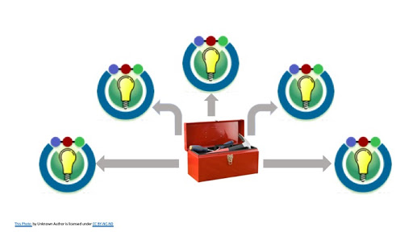

# Introduction
Training, in the context of the Common Fund, serves many purposes. Within each Common Fund Program (CFP), training can efficiently on-board new users, facilitate user transitions to cloud-based infrastructure, and minimize strain on tech support. Across all CFPs, centrally-run introductory computational training will release CFPs to focus on specialized instruction, providing a generally-applicable foundation of skills and awareness upon which all other training may build. For the CFDE as a whole, training offers an opportunity to demonstrate the capabilities of new projects to unfamiliar audiences, and also presents opportunities for early user feedback to support ongoing development of tools and infrastructure that effectively meet the needs of researchers. Finally, good training itself demands training. Best practices in instruction, materials development, instructor training, assessment, and event logistics are necessary to build a program that is maximally effective and sustainable at all levels.

To serve these many purposes in a coherent and consistent way, we propose to create a CFDE Training Coordination Center (TCC). The TCC team, composed primarily of UC Davis awardees with support from RTI, will provide strategic vision and infrastructure for training. The TCC will support training for all participating staff in best practices relevant to their instructional roles, match people to projects based on expertise, support administrative logistics, and provide a go-to resource for effective, efficient, and interoperable training across CFPs. 
 
 

**Figure 1: We propose a CFDE Training Coordinating Center that would provide a resource of best practices and training materials for use by the CFPs to supplement the targeted training that many have ongoing. By providing centralized expertise and resources we can increase the ramp up of a CFPs training program while enabling them to maintain ownership and the potential for customizations.**

## Specific Training Events Planned, in Brief
Based on the results from our site visits to several Common Fund Program awardees, CFDE plans to engage in the following pilot training efforts through the remainder of this year, and into 2020:		
 - Kids First is intensely interested in developing a hands-on workshop series to train clinicians to use their portal. We will work with KF to outline, write, and pilot workshops focused on clinicians.		
 - CFDE will work with GTEx to pilot a webinar series on eQTL use and interpretation. These webinars will be recorded and made available through the GTEx site for users.	
 - We will also work with GTEx and the Terra platform to build and pilot a curriculum for a two-day hands-on data analysis workshop that teaches users how to use the GTEx analysis pipelines on the Terra platform for their own data, so that they can reuse GTEx data for their own analyses.	
 - We will work with KF to build and pilot a similar two-day curriculum for the Cavatica data analysis platform.

## Implementation Plan 

### CFDE Training Coordination Center
The TCC will consist of a full time Project Manager, and a full time Training Coordinator, supported by a cross-trained team of researchers and clinicians with instructional expertise.

The Training Coordinator will provide:
 - Central point of contact: connecting questions with answers or experts for all training-related needs
 - Curriculum development: coordinating development panels, tracking and connecting content for consistency and compatibility
 - Instructor training: connecting prospective instructors with appropriate training and tracking trained instructors for recruitment to workshops.
 - Workshop administration: matching instructors, managing enrollment, and supporting travel and site logistics for all workshops.
 - Assessment: connecting qualitative and quantitative feedback from workshops with those who can use it to support iteration on both curriculum and technical advances within the CFPs.

Other TCC team-members possess expertise and experience in bioinformatics, medicine, education, and training program management. The Training Coordinator will help to focus the efforts of these researchers efficiently to support curriculum development and assessment.
In 2020, we expect that the TCC will:
 - Support development of new curriculum and workshop administration at up to 5 CFPs, with the expectation of hosting two 2-day workshops each within the first year, with additional support for non-workshop training efforts
 - Support internal CFDE training and assessment on new projects, with the expectation of hosting up to 5 pilot workshops
 - Begin to scale existing introductory training efforts towards a future goal of making this available to all prospective users prior to CFP-specific onboarding

### CFP-Specific Curriculum
All CFPs will need new workshop content. Where prior curricula exist, new content may address updates, adjust depth or breadth, improve modular fit with general training, or fill gaps evident from helpdesk requests. 

#### 2-day workshop example timeline

- Assessment. (2-4 weeks)
CFP personnel with knowledge of user challenges will be identified. Pre-assessment will evaluate training needs based on existing knowledge, reaching out to users as needed.
 - Outline content. (2-6 weeks)
TCC will work with CFP to draft learning objectives consistent with a 2-day workshop format. May need to continue pre-assessment as questions become clear.
 - On-board designers (2 weeks)
TCC will train designers on best practices in curriculum and instruction as well as modes of collaboration and communication about training. 
 - Draft content. (8-16 weeks)
Designers will work collaboratively to develop content. 
 - Train/on-board additional instructors as needed. (concurrent with late-phase drafting)
Test curriculum and use Instructor feedback to iterate.
 - Pilot & assess (4-8 weeks)
Designers attend pilot workshops where possible to troubleshoot.   
 - Iterate (ongoing)
In addition to iteration towards a finalized workshop curriculum, ongoing maintenance of curriculum is necessary and expected, but can now occur largely within the CFP.
 
#### Non-workshop curricula
In some cases, alternative formats (e.g. webinars) may be appropriate for a given target training. This is most likely to occur with advanced content for active users that can be delivered in small doses with minimal chance of error. These items may be developed on a shorter time scale. The steps to workshop development serve as a general guideline for structure and iteration as applicable.

#### Sustainable support cycle for CFPs

Once a CFP is equipped with trained curriculum designers and instructors and has a fully developed workshop curriculum in hand, they will be equipped to conduct their own workshops and, in most respects, to maintain their own curriculum. The TCC will remain available to support workshop administration and to connect CFPs with people or resources as needed. As each CFP reaches independence, this will free the TCC to begin training and curriculum development with a new CFP.

### General Workshop Development and Scaling
Training materials for in-person workshops that teach basic bioinformatics workflows and associated skills are generally extant and in use at UC Davis. Some customization of these materials to focus on maximally relevant and available data sets will be desirable, as will selection of content for desired duration of format (or vice versa). CFP representatives will be consulted to identify and review content priorities. In addition, some attention will need to be paid to modularity and fit with CFP-specific training as it develops. 

The particular challenge with respect to this training is thus not its creation but, rather, its scaling. At present UC Davis hosts a 2-week introductory training program (ANGUS) during the summers that can accommodate up to 75 learners. This program functions as a community of practice, composed of learners, helpers, and instructors, in which all participants report learning gains, and many return across years to play different roles as their skills advance. In its ten year history, this community has grown and changed. However, it is not a model that can immediately be scaled by duplication, because it relies on a community foundation. In particular, that community tends to be bound by academic schedules, and a 2-week workshop during the academic year is likely unfeasible.

Within the next year, there are several ways in which we can begin to work towards applying components of this training model to improve bioinformatics training at the Common Fund. We can begin work on building a community within the CFDE that could ultimately be used to expand the existing ANGUS workshop or support an additional location during the summer months. The ANGUS 2020 event can itself be tailored to meet CFDE training needs and engage the community with planning for expansion. The instructional materials developed for this workshop can also be modularized to create a series of shorter workshops, which could be piloted in 2020 during the academic year. 

### CFDE Internal On-Boarding & User Feedback for New Tools

Where new tools or procedures have been developed, personnel within and across CFPs will need to be trained. In these cases, content goals for training existing users are clear, so preliminary assessment steps may be bypassed for internal training. A multi-phase approach to training may be applied, with early in-person workshops (to maximize early feedback and speed on-boarding) followed by webinar availability and ultimate incorporation into training for new users once internal training has run its course. 

Internal training on existing tools will also be necessary to facilitate work on interoperability across CFPs. To some extent, cross-CFP personnel training may be incorporated into instructor onboarding for CFP-specific curricula (step 5, above). Any additional needs that are sufficiently common to merit curriculum development will be addressed on a case-by-case basis as with other CFP-specific training.

### Workshop Administration

Administration of in-person workshops includes procurement of workshop space, AV equipment and supplies, snacks and/or catering, instructor recruitment and travel arrangements, enrollment, and travel recommendations or arrangements for learners (depending on attendance funding). The physical location for these workshops, and what services are required, will be largely dependent on whether they are targeted toward a general audience, CFDE users, or for users at a specific CFP. Details for CFDE and general workshops will be managed by the Training Coordinator, with support from local personnel. Workshops on CFP specific materials will likely take place at their sites, and will require more cross-coordination. The Project Manager and Training Coordinator will work with each CFP to find an administrative system that is mutually beneficial. 	

### Continuing Services

Once local CFPs are equipped with trained curriculum designers and instructors, the main support that they will need is administrative. However, all technical curricula require maintenance -- tools change, users change, and better ways of teaching certain things emerge over time. The Training Coordinator will be available to connect CFPs with curriculum designers and other consultants with appropriate expertise to support updates to training materials at any time, and to coordinate the smaller project work associated with these sorts of updates.

