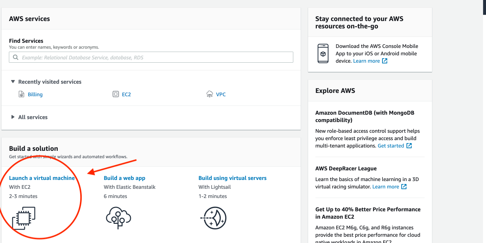
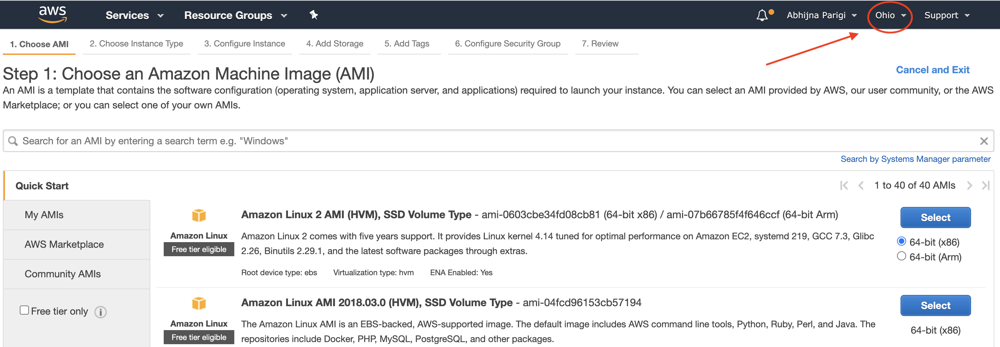
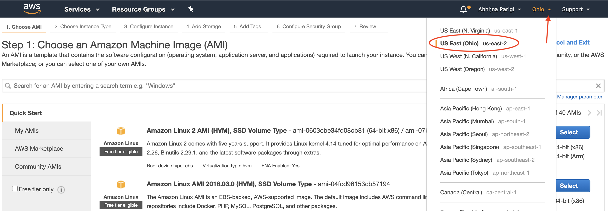
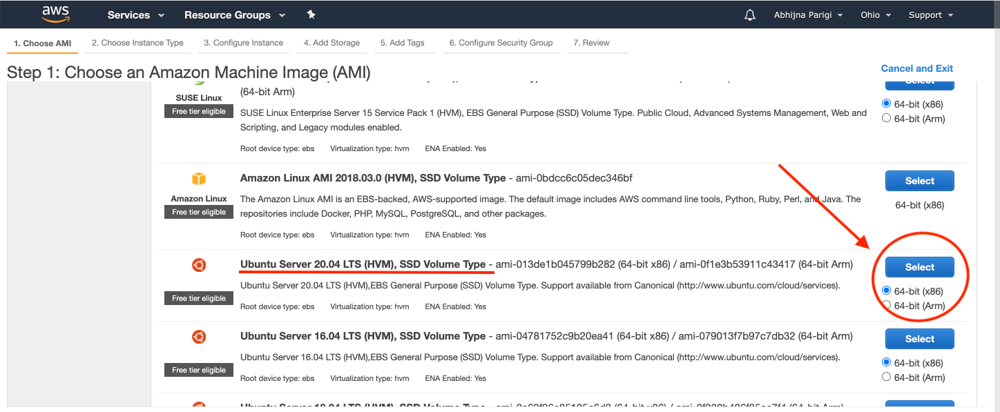
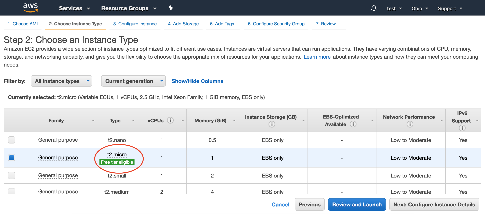
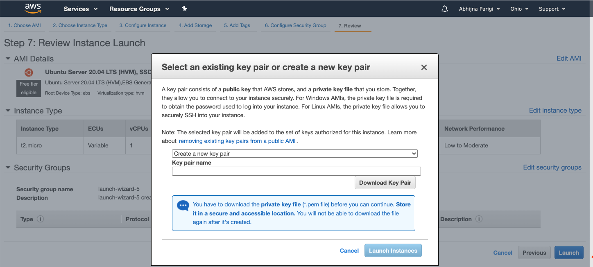
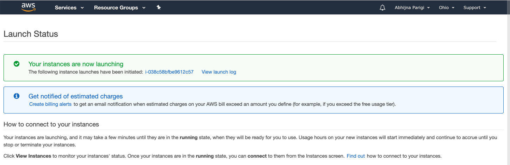
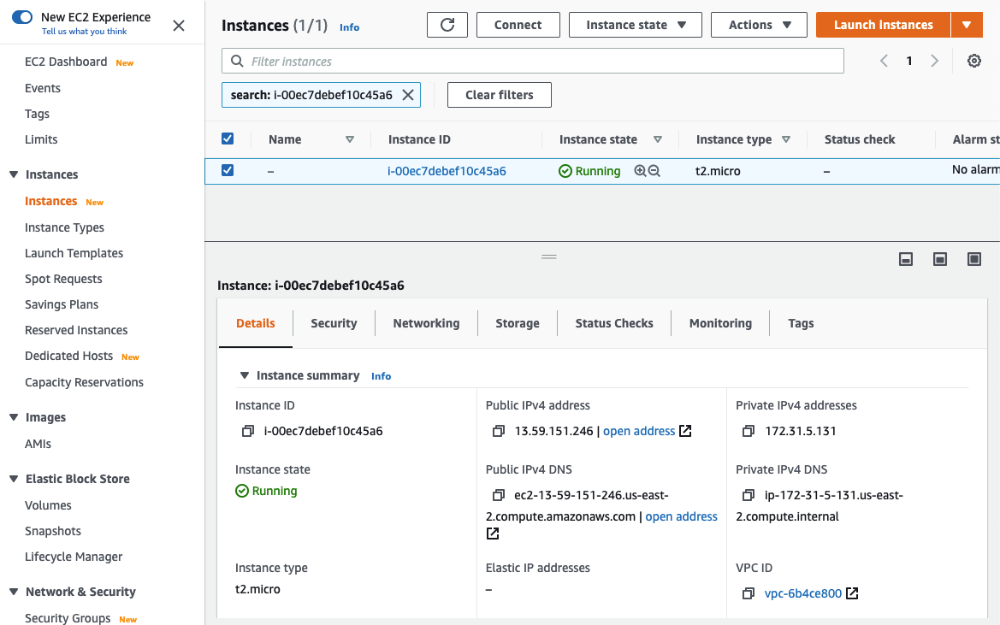

Lesson in Development

Setting up an AWS Instance
==========================

Amazon offers a cloud computing platform called Amazon Web Services (AWS). Please check out our [full lessons on AWS](../../Cloud-Platforms/Introduction_to_Amazon_Web_Services/introtoaws1.md) for more details!

AWS is not free, however, you can use the Free Tier for 12 months after you sign up for an AWS account. If you are no longer eligible for the Free Tier, you're charged at the [standard billing rate](https://docs.aws.amazon.com/awsaccountbilling/latest/aboutv2/free-tier-eligibility.html) for your AWS usage.

Let's set up a Free Tier AWS Ubuntu instance!

!!! Important
    AWS periodically updates its user experience. We strive to keep our tutorials up to date with AWS's constantly changing user interface. However, these updates may take some time to become incorporated into our tutorial. **Please watch this space for updates**.

## Step 1: Create AWS account

* Go to <http://aws.amazon.com/> and click on the create an AWS account button located on the top right. If you have an existing AWS account, click the Sign in to an existing AWS account option below the continue option on the sign-up page. Log in to your account as a root user.

!!! note "New Account"

    * To create a new account, fill in your email, (create a) password and choose a name for your AWS account. Click Continue.

    * On the next page, fill in your name, phone number and address. Check the AWS customer agreement box.

    * Once you click Create Account and Continue, you will be redirected to a payment info page. Fill in your credit card info. Account approval/creation requires two factor authentication and may take a few mins (to hour or days). When you receive the code, enter it and click Verify Code

    * You can now log in and launch an instance!

## Step 2: Configure and launch the virtual machine

* Next, click on the Launch a virtual machine option as shown in the image:

### Step 2A: Select the right geographical region

* For this tutorial, it is important to select the Ohio amazon machine image. The geographical region of your remote machine is displayed on the top right of this page (shown in image below)."

* If it does not say "Ohio", click on the drop down arrow and select: US East (Ohio).

### Step 2B: Select the right Ubuntu image

* On the left navigation bar, check the "Free tier only" option, then select this Ubuntu machine: "Ubuntu Server 20.04 LTS (HVM), SSD Volume Type" (provided through 2030).

!!! Important
    Please specifically select the Ubuntu Pro 20.04 LTS (HVM). Choosing a different machine will result in error messages during various installation steps.

### Step 2C: Review and launch

* Make sure the free tier version is selected. Shown here:

Then click Review and launch --> Launch. You should see a pop-up window like this:

* Key pair for AWS:

    - If this is your first time using AWS or creating a key pair: Choose the Create a new key pair option from the drop down menu.
    - For this tutorial, under key pair name, type "amazon" and click save.
    - The default location for saving files on a Mac is the "Downloads" folder -- that's where you'll find your key pair "amazon.pem".
    - **Next time you launch an instance, you can reuse the key pair you just generated by selecting Choose an existing key pair.**
    - If you have a previously generated key pair, you can reuse it to launch an instance.

* Then check the acknowledgement box and click Launch Instance . You should see this:

* Click on the Instance ID link (in the screenshot above, `i-038c58bfbe9612c57`) in the green box and on the next page, select your instance by checking the box. Your page should look like this:

* This page shows you a list of all your active instances. You can launch multiple instances. Just remember that every instance costs money if you don't qualify for Free Tier.

You have now successfully launched your AWS instance!

!!! Important

    You will need some information from this amazon webpage to access your AWS computer, so **keep this page open**! If you happen to close the webpage by accident, click on this link: <https://us-east-2.console.aws.amazon.com/ec2/v2/home?region=us-east-2#Instances:sort=instanceId>
