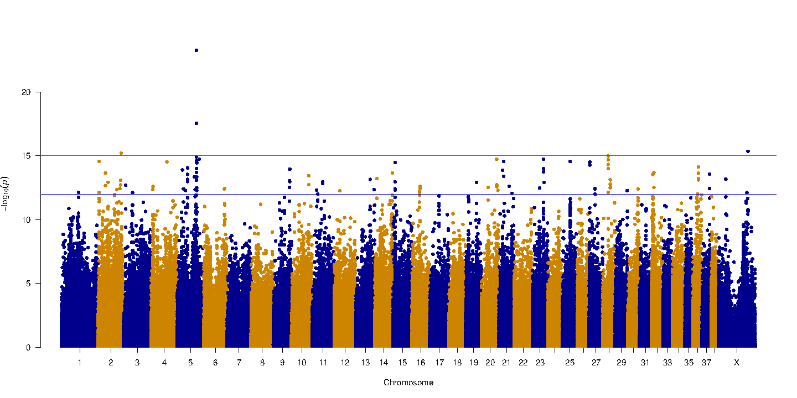

<div class="banner"><span class="banner-text">Lesson in Development</span></div>

Create a Manhattan Plot
=========================

## Step 1: Install qqman package

The [qqman package](https://cran.r-project.org/web/packages/qqman/vignettes/qqman.html) includes functions for creating Manhattan plots and q-q plots from GWAS results. Install it by running:

=== "AWS Instance"
    ```
    sudo Rscript -e "install.packages('qqman', contriburl=contrib.url('http://cran.r-project.org/'))"
    ```

## Step 2: Identify statistical cutoffs

This code finds the equivalent of 0.05 and 0.01 p value in the negative-log-transformed p values file. We will use these cutoffs to draw horizontal lines in the Manhattan plot for visualization of haplotypes that cross the 0.05 and 0.01 statistical threshold (i.e. have a statistically significant association with yellow coat color)

=== "AWS Instance"
    ```
    unad_cutoff_sug=$(tail -n+2 coatColor.assoc.adjusted | awk '$10>=0.05' | head -n1 | awk '{print $3}')
    unad_cutoff_conf=$(tail -n+2 coatColor.assoc.adjusted | awk '$10>=0.01' | head -n1 | awk '{print $3}')
    ```

## Step 3: Run the plotting function

=== "AWS Instance"
    ```
    Rscript -e 'args=(commandArgs(TRUE));library(qqman);'\
    'data=read.table("coatColor.assoc", header=TRUE); data=data[!is.na(data$P),];'\
    'bitmap("coatColor_man.bmp", width=20, height=10);'\
    'manhattan(data, p = "P", col = c("blue4", "orange3"),'\
    'suggestiveline = 12,'\
    'genomewideline = 15,'\
    'chrlabs = c(1:38, "X"), annotateTop=TRUE, cex = 1.2);'\
    'graphics.off();' $unad_cutoff_sug $unad_cutoff_conf
    ```
=== "Expected Output"
    ```
    ubuntu@ip-172-31-30-100:~/GWAS$ Rscript -e 'args=(commandArgs(TRUE));library(qqman);'\
    > 'data=read.table("coatColor.assoc", header=TRUE); data=data[!is.na(data$P),];'\
    > 'bitmap("coatColor_man.bmp", width=20, height=10);'\
    > 'manhattan(data, p = "P", col = c("blue4", "orange3"),'\
    > 'suggestiveline = 12,'\
    > 'genomewideline = 15,'\
    > 'chrlabs = c(1:38, "X"), annotateTop=TRUE, cex = 1.2);'\
    > 'graphics.off();' $unad_cutoff_sug $unad_cutoff_conf

    For example usage please run: vignette('qqman')

    Citation appreciated but not required:
    Turner, S.D. qqman: an R package for visualizing GWAS results using Q-Q and manhattan plots. biorXiv DOI: 10.1101/005165 (2014).
    ```

Run the following code to check if you've created the ".bmp" file

=== "AWS Instance"
    ```
    ls -ltrh
    ```
=== "Expected Output"
    ```
    -rw-rw-r-- 1 ubuntu ubuntu  34K Sep 15 23:44 coatColor_man.bmp
    -rw-rw-r-- 1 ubuntu ubuntu 2.6K Sep 15 23:42 coatColor.log
    -rw-rw-r-- 1 ubuntu ubuntu  61M Sep 15 23:42 coatColor.assoc.adjusted
    -rw-rw-r-- 1 ubuntu ubuntu  56M Sep 15 23:42 coatColor.assoc
    -rw-rw-r-- 1 ubuntu ubuntu  908 Sep 15 23:42 coatColor.nosex
    -rw-rw-r-- 1 ubuntu ubuntu 6.4M Sep 15 23:41 coatColor.binary.bed
    -rw-rw-r-- 1 ubuntu ubuntu 1.9K Sep 15 23:41 coatColor.binary.log
    -rw-rw-r-- 1 ubuntu ubuntu  16M Sep 15 23:41 coatColor.binary.bim
    -rw-rw-r-- 1 ubuntu ubuntu 1.4K Sep 15 23:41 coatColor.binary.fam
    -rw-rw-r-- 1 ubuntu ubuntu  908 Sep 15 23:41 coatColor.binary.nosex
    -rw-rw-r-- 1 ubuntu ubuntu 2.2K Sep 15 23:34 miss_stat.log
    -rw-rw-r-- 1 ubuntu ubuntu  33M Sep 15 23:34 miss_stat.lmiss
    -rw-rw-r-- 1 ubuntu ubuntu 3.1K Sep 15 23:34 miss_stat.imiss
    -rw-rw-r-- 1 ubuntu ubuntu  908 Sep 15 23:34 miss_stat.nosex
    -rw-rw-r-- 1 ubuntu ubuntu  555 Sep 15 23:33 plink.log
    -rw-rw-r-- 1 ubuntu ubuntu 8.6M Sep 15 23:31 minor_alleles
    -rw-rw-r-- 1 ubuntu ubuntu  97M Sep 15 23:29 coatColor.ped
    -rw-rw-r-- 1 ubuntu ubuntu  14M Sep 15 23:29 coatColor.map
    -rw-r--r-- 1 ubuntu ubuntu 1.2K Sep 15 22:52 coatColor.pheno
    -rw-r--r-- 1 ubuntu ubuntu 116M Sep 15 22:52 pruned_coatColor_maf_geno.vcf
    ```

You should have a **34K file called "coatColor_man.bmp"**.


## Step 4: Visualization

[Watch this video for a detailed explanation of GWAS Manhattan plots](https://www.google.com/search?q=how+to+read+a+manhattan+plot&oq=how+to+read+a+manhattan+plot&aqs=chrome..69i57.7911j0j4&sourceid=chrome&ie=UTF-8#kpvalbx=_tXIPX9mmFsmT0PEP64-OkAk26)

You can visualize the Manhattan plot that you just generated by downloading the coatColor_man.bmp file to your local computers. To do this, open a new terminal window (by selecting the terminal window and typing ++command+n++ ).

Now run the following code on your Mac terminal window (not Ubuntu!) to do the actual copying:

=== "Local Machine"
    ```
    scp -i ~/Desktop/amazon.pem ubuntu@ec2-??-???-???-??.us-east-2.compute.amazonaws.com:/home/ubuntu/GWAS/coatColor_man.bmp ~/Desktop/
    ```
Be sure to change the `ec2-??-???-???-??` part like you did before.

!!! Note
    If you wish to copy the entire "GWAS" folder, you can do so by adding a `-r` flag like this:

    ```
    scp -i ~/Desktop/amazon.pem -r ubuntu@ec2-??-???-???-??.us-east-2.compute.amazonaws.com:/home/ubuntu/GWAS/ ~/Desktop/
    ```


The file has been copied to your Desktop! Here's what it should look like when opened using the "Preview" application in Mac:



The X- axis represents haplotypes from each region of the genome that was tested, organized by chromosome. Each colored block represents a chromosome and is made of thousands of dots that represent haplotypes. The Y axis is a p value (probability that the association was observed by chance) and is negative log transformed.

In our graph, haplotypes in four parts of the genome (chromosome 2, 5, 28 and X) are found to be associated with an increased occurrence of the yellow coat color phenotype.

The top associated mutation is a nonsense SNP in the gene MC1R known to control pigment production. The MC1R allele encoding yellow coat color contains a single base change (from C to T) at the 916th nucleotide.
