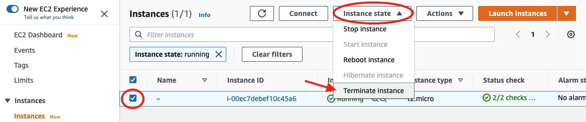

Lesson in Development

Terminate AWS Instance
=======================

When you are done with all the analyses, be sure to terminate the AWS instance. If you fail to terminate your instance, AWS will keep charging you money!

!!! Warning
    Upon termination, you will lose all installations and data. Be sure to download all useful data before you terminate the instance!

 Log in to AWS and navigate to the instances page. Then select the instance and click on Instance State and Terminate instance. Then click Terminate

!!! note "Key Points"

    You've reached the end of the GWAS tutorial. You should now be able to:

    - Set up an AWS instance

    - Access your AWS instance via your Mac terminal

    - Move data into the AWS computer

    - Download and install all the software necessary for GWAS

    - Run some basic GWAS analyses

    - Make Manhattan plots

    - Terminate your instance

    We hope you found this tutorial helpful!
