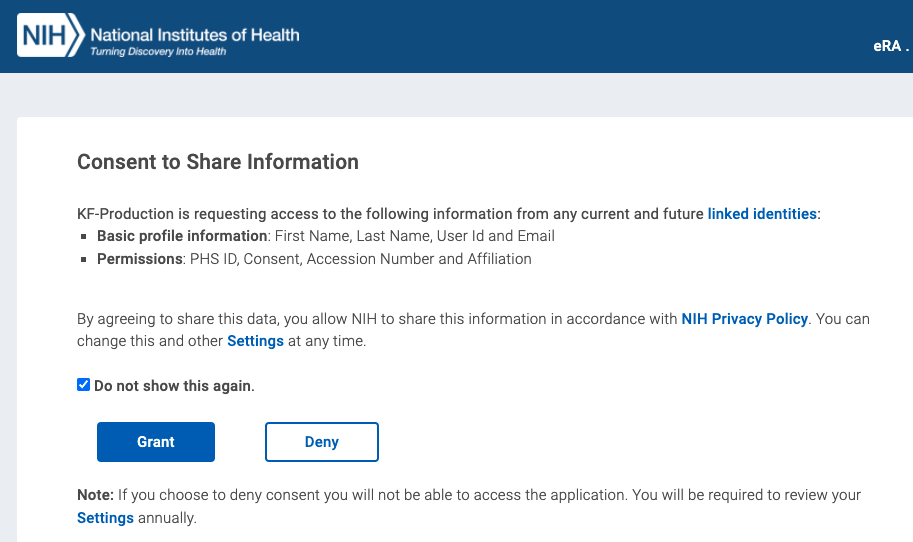
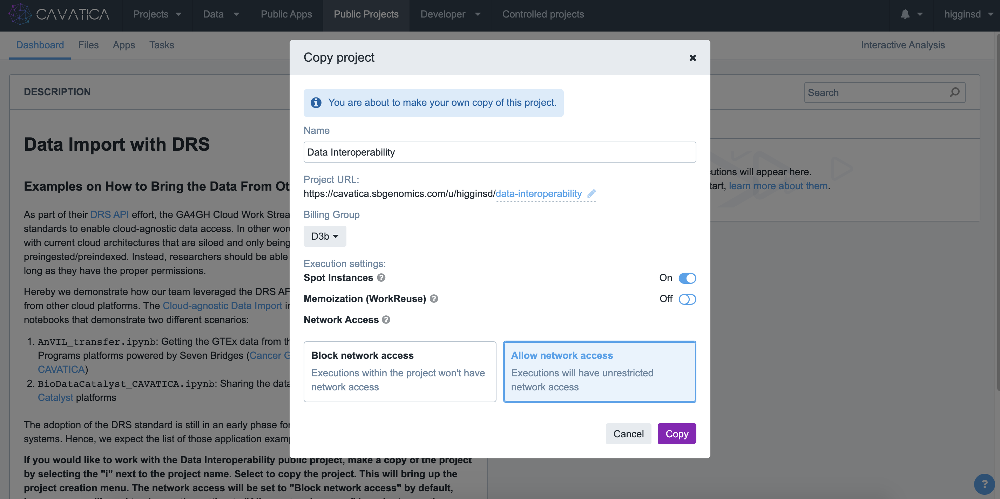

Lesson in Development

Incorporating CFDE Portal Datasets in Kids First Analyses: Find CFDE datasets on CFDE Portal and import into a CAVATICA project
==========================

As part of the NCPI Effort, methods have been developed to allow users to bring datasets from the other NIH platforms into CAVATICA for combined research projects. One external dataset that is supported is the [Genotype Tissue Expression (GTEx) Program](https://commonfund.nih.gov/gtex). GTEx was funded to study the relationship between genetic variants (inherited changes in DNA sequence) and gene expression (how genes are turned on and off) in multiple human tissues and across individuals. Their datasets can serve as great controls for RNA-Seq experiments, comparing expression in GTEx's "normal" brain tissue to Kids First's brain cancer tissue.

The previous examples provided a walkthroughs for identifying RNA-Seq datasets from the [Kids First Data Resource Portal](https://portal.kidsfirstdrc.org/) and pushing them to [CAVATICA](https://cavatica.sbgenomics.com/) for analysis, as well as bringing in data from the [NHGRI Analysis Visualization and Informatics Lab-space (AnVIL)](https://anvilproject.org/) Portal and import these files into a CAVATICA project for a combined analysis with Kids First data.

This supplemental lesson will demonstrate how to find datasets, such as GTEx and those of other CFDE Data Coordinating Centers, on the CFDE Portal and then importing a manifest list of file DRS URIs into a CAVATICA Project.

## Step 1: Identify Files on the CFDE Portal and Export as an NCPI Manifest of DRS URIs

- First, navigate to the [CFDE Portal](https://app.nih-cfde.org/) and select `Data Browser`, then `File` from the top toolbar.

    
    
- From there, you can select from the filters in the left-hand toolbar to narrow the scope of your search to your desired files. In this example, we have chosen the `FASTQ` and `BAM` file formats, `RNA sequencing assay` Assay type, and the GTEx and Gabriella Miller Kids First Common Fund Programs.

    
    

      
      
      
    

    
- Once you have found your desired set of files, click on the `Export` button in the top-right corner of the screen and select the `NCPI File Manifest` option from the dropdown menu. Once selected, your manifest file should then download.

    
    

      
    

- This concludes the necessary steps in the CFDE Portal. We will now move to CAVATICA.

## Step 2: Import the NCPI Manifest of DRS URIs into CAVATICA

The process for importing the DRS URIs into a CAVATICA project is extremely straightforward and does not require coding. 

- First, navigate to [CAVATICA](https://cavatica.sbgenomics.com/) and log-in via your eRA Commons account.

    

      
    

    
- Note: if you are logging into CAVATICA for the first time you will be presented with an NIH consent screen followed by a Gen3 authorization screen.

    

      
      
    

- Once you have logged into CAVATICA, you must *either* select a pre-existing project *or* create a new project where you would like to import the files from your manifest. This can be done from the `Projects` section on the homepage or using the `Projects` dropdown menu from the top bar.

    

      
    

- If you are creating a new project, click on the `Create Project` button. Select a title and billing group for your new project. Be sure to choose to `Allow network access` for this project under `Advanced settings`.

    

      
      
    

!!! info "Allow Network Access"
    If you would like to work with the Data Interoperability public project, make a copy of the project by selecting the "i" next to the project name. Select to copy the project. This will bring up the project creation menu. The network access will be set to "Block network access" by default, however you will need to change the setting to "Allow network access" in order to use the Cloud-agnostic Data Import interactive analysis.

    

- After creating or opening your target project, select the `Files` menu from the project toolbar. You may import your files into the main directory or you may choose at this point to create a folder where you would like to import your files instead. Once you have navigated to the desired location, select `+ Add files` and then click on `GA4GH Data Repository Service (DRS)` from the dropdown menu.

    
    
    
- Next, select `From a manifest file` and upload your manifest file from the CFDE Portal. You may then add tags to the files you are about to import, as well as select whether to skip or autorename files when confronted with a naming conflict. Finally, select the checkbox acknowledging that you will adhere to acceptable use of the data, including but not limited to any applicable data use agreements. Once you have completed these steps, click on the `Submit` button to begin importing your files.

    
    
    
- You should then be navigated back to the file explorer for your project where you should now be able to see your imported files.

    

- This completes the file transfer - the files will now be accessible in the Data Cruncher as well as in the Files Tab of the Project!
