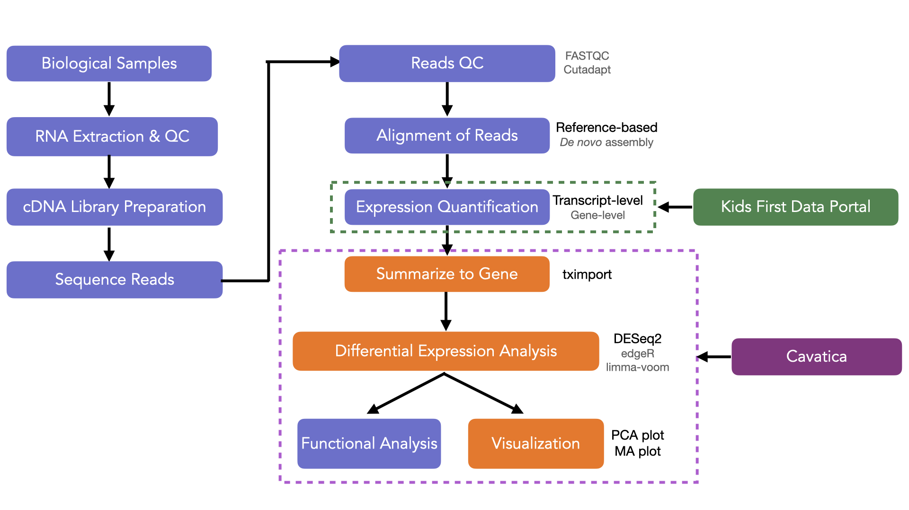

Lesson in Development

An Introduction to RNA-Seq
=========================

RNA-Seq uses the capability of next generation sequencing techniques to explore and/or quantify expression. The information stored in the DNA is organized into genes which are used to encode proteins, the functional products necessary for cell function. Although all cells within a single organism contain the same DNA, the expression of genes varies widely across cell types and cell states according to their function. When the level of gene expression is disrupted by different biological conditions, disorders, or mutations, cells can become unable to carry out their function and become cancerous. Gene expression can be altered in broad on/off states, or in smaller increments, either of which could negatively impact the cell.

!!! info "DNA to Protein"

    Learn more about the [biological processes involved in conversion of DNA to proteins](https://www.nature.com/scitable/topicpage/translation-dna-to-mrna-to-protein-393/){:target="_blank"} .

RNA-Seq data can be used to study the **transcriptome**, a collection of all the RNA transcripts from a sample. The transcriptome data can be utilized for many types of analyses. In this lesson we will focus on one such application: **Differential Gene Expression (DGE)** analysis in order to determine which genes are expressed at different levels between the conditions/groups of interest. The identified genes offer biological insight into the processes and pathways affected by the chosen experimental conditions.

A typical RNA-Seq workflow is highlighted in the schematic diagram below. The orange boxes highlight the steps you will do in this tutorial!

The first steps involve extraction, purification, and quality checks of RNA from the biological samples, followed by library preparation to convert the RNA to cDNA (complimentary DNA) fragments which are then sequenced on a high-throughput sequencer.

The generated raw reads are quality checked and aligned against either a reference genome/transcriptome (if available) or used for *de novo* assembly. Based on read depth, estimates for the abundance of expression can be generated and the values can be summarized for gene-level analysis. The expression count data is used for statistical modeling and testing to identify differentially expressed genes which can be examined further via visualization and downstream functional analysis.

!!! info "RNA-Seq Resources"

    Learn more about RNA-Seq through this [video tutorial by StatQuest](https://www.youtube.com/watch?v=tlf6wYJrwKY&list=PLblh5JKOoLUJo2Q6xK4tZElbIvAACEykp&index=1){:target="_blank"}. You can also follow this [end to end RNA-Seq workflow](https://www.bioconductor.org/packages/devel/workflows/vignettes/rnaseqGene/inst/doc/rnaseqGene.html){:target="_blank"}  that uses well known [Bioconductor packages](http://bioconductor.org){:target="_blank"} .

Experimental Plan

In this tutorial, we will evaluate the difference between [pediatric **Medulloblastoma** vs **Ependymoma**](https://www.ncbi.nlm.nih.gov/pmc/articles/PMC2719002/){:target="_blank"} .

**Medulloblastoma** is a common malignant childhood brain tumor that typically occurs in the 4th ventricle region of the brain. There are five different histological types of medulloblastoma, which impact prognosis and predicted response to therapy.

**Ependymoma** is a broad group of tumors that often arises from lining of the ventricles in the brain. Ependymomas can also occur in the central canal in the spinal cord, with the anotomical distribution impacting prognosis.

We will use the [Kids First Data Portal (KF Portal)](https://kidsfirstdrc.org){:target="_blank"}  to build a virtual cohort of tumor samples of the two pediatric cancers and select pre-processed transcript abundance files, which we will then analyze on [Cavatica](https://cavatica.sbgenomics.com){:target="_blank"} , the KF Portal's integrated cloud based platform.
