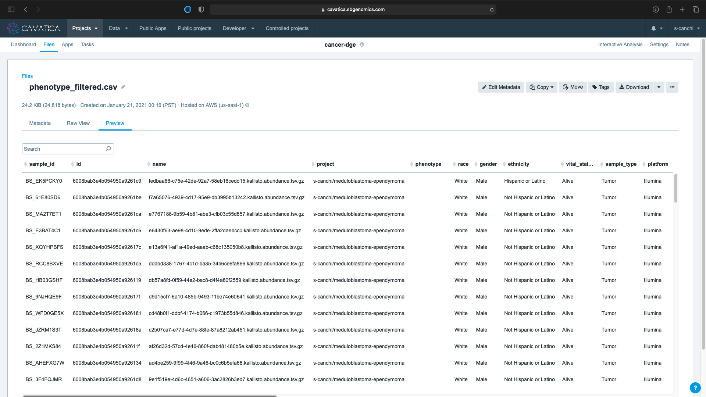

<div class="banner"><span class="banner-text">Lesson in Development</span></div>

Phenotype File and Upload to Cavatica
====================================

One of the necessary input files for DGE analysis using DESeq2 is the **phenotype file** which lists the experimental groups and associated metadata for use in our design. You previously [downloaded the metadata manifest for the filtered files from Cavatica](./rna_seq_4.md#step-3-create-tags-download-filtered-dataset). </br></br>
In this lesson, you will learn to modify the phenotype data and upload it from your local computer back into Cavatica. Microsoft Excel is used in this lesson for data modification but any other equivalent program could be used to accomplish the same tasks.

## Step 1: Change column order

The DESeq2 app requires **Phenotype data** input file in CSV format with the Sample ID in the first column.

* The default column order of the downloaded metadata manifest had **id** in the first column.


* Rearrange the order by using cut/insert to move the **sample_id** to the first column.


## Step 2: Convert age at diagnosis to intervals

The unit for **age_at_diagnosis** is in days with wide spread of values across the experimental groups and hence needs to be included in the design as a covariate. It is more meaningful to convert the continuous values of this variable into small number of defined bins or in this case age ranges. Here, we split the ages into five year bins capped at twenty years of age.

* Create a new column **age_at_diagnosis_yrs** and enter the formula. This column lists **age_at_diagnosis** in years rounding at three decimal places.

```
=ROUND(N2/365,3)
```


* Sort the newly created column from largest to smallest value.
* The data indicates one biospecimen (BS_BA6AZWB3) was collected from a patient at 36.5 yrs of age, who is considered an adult. Because we are studying the difference between pediatric cancers types, we will remove this entry by deleting it from the table, leaving 49 rows.

* Next, create a new column **diagnosis_age_range** and enter the formula. This column converts the age at diagnosis in years to intervals spanning five years.

```
=LOOKUP(Z2,{0,5,10,15},{"0-5","5-10","10-15","15-20"})
```


!!! note "Column Names"

    If you choose your own version of column names for the newly created columns, remember to substitute those names in the appropriate input files for the DESeq2 app in the following lesson.


## Step 3: Upload phenotype file to Cavatica  

* Save and export the modified metadata file in CSV format to your local computer.

!!! important

    * It is crucial to name the CSV file **phenotype_filtered.csv** to ensure the R scripts can run without errors. If you choose a different file name, be sure to update the file name in the R script before executing.

    * Avoid having empty rows in your exported CSV. This may cause the DESeq2 app to error. To avoid this, select all the rows and columns with values and select File -> Save as option. You can also check the number of rows in the file on Cavatica after uploading to ensure you have 49 rows and 27 columns.

* Access the <span class="highlight_txt">Files</span> tab in your project folder on Cavatica and click the <span class="highlight_txt">:fontawesome-solid-plus: Add files</span>.


* Select <span class="highlight_txt">Your Computer</span> as source to add files. You can either browse files or Drag & drop files from your local system.


* Click on <span class="highlight_txt">Start upload</span> to add the files to Cavatica.


* Successful upload results in a popup box and Status updated to {==UPLOADED==}. Click on the <span class="highlight_txt">:fontawesome-solid-times:</span> on the top right hand corner.


* Navigate back to the <span class="highlight_txt">Files</span> tab in your project folder and select <span class="highlight_txt">Type: CSV</span> to confirm the upload.


* Click on the file name to preview the contents of the phenotype file.



We have completed all the initial setup necessary and are now ready to run the DESeq2 app for DGE analysis. Continue to the next lesson to learn more!
