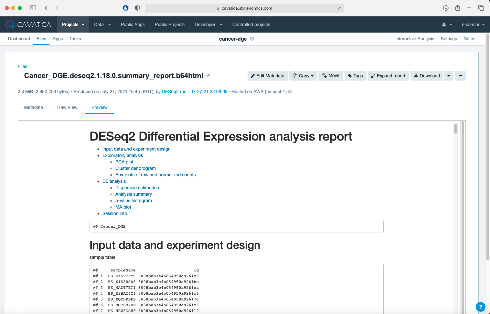
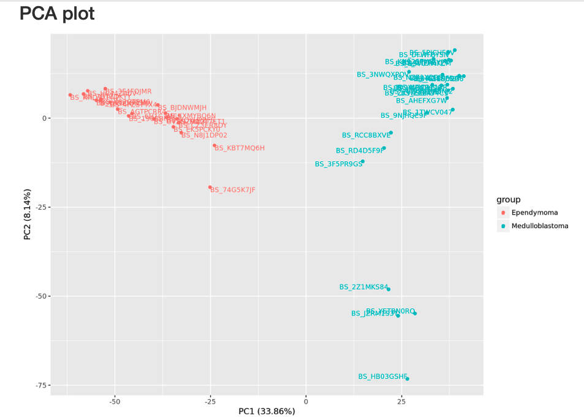
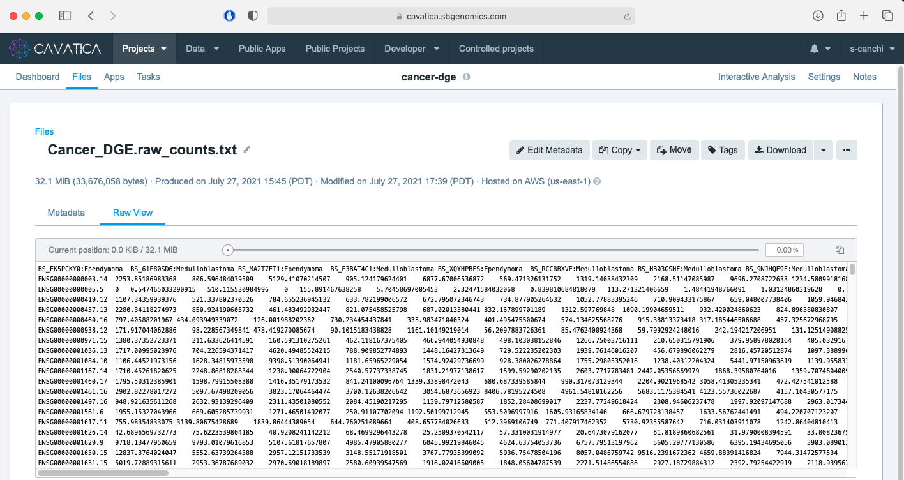

Lesson in Development

Analysis with DESeq2 Public App
=============================

## Step 1: Select inputs

* Access the DESeq2 app under Apps.
* Click :fontawesome-solid-play: Run to open the app task page.
* Under Inputs, click the :fontawesome-solid-folder-open: Select files icon next to each of data type.
      * For Expression data, use Type option to choose **TSV.GZ** files and subset using  :fontawesome-solid-tags:Tags to select **DGE-Filter-Data**. Select all filtered files by clicking on :material-square-rounded-outline: on the left corner of the table and click Save selection.
      * For Gene annotation, the files list is updated to show the **GTF** file. Choose the file and click Save selection.
      * For Phenotype data, the file list is updated to show the **CSV** file. Choose the file and click Save selection.

<iframe id="kaltura_player" src="https://cdnapisec.kaltura.com/p/1770401/sp/177040100/embedIframeJs/uiconf_id/29032722/partner_id/1770401?iframeembed=true&playerId=kaltura_player&entry_id=1_83kgekai&flashvars[localizationCode]=en&amp;flashvars[leadWithHTML5]=true&amp;flashvars[sideBarContainer.plugin]=true&amp;flashvars[sideBarContainer.position]=left&amp;flashvars[sideBarContainer.clickToClose]=true&amp;flashvars[chapters.plugin]=true&amp;flashvars[chapters.layout]=vertical&amp;flashvars[chapters.thumbnailRotator]=false&amp;flashvars[streamSelector.plugin]=true&amp;flashvars[EmbedPlayer.SpinnerTarget]=videoHolder&amp;flashvars[dualScreen.plugin]=true&amp;flashvars[Kaltura.addCrossoriginToIframe]=true&amp;&wid=1_53alpurp" width="608" height="402" allowfullscreen webkitallowfullscreen mozAllowFullScreen allow="autoplay *; fullscreen *; encrypted-media *" sandbox="allow-forms allow-same-origin allow-scripts allow-top-navigation allow-pointer-lock allow-popups allow-modals allow-orientation-lock allow-popups-to-escape-sandbox allow-presentation allow-top-navigation-by-user-activation" frameborder="0" title="Kaltura Player"></iframe>

## Step 2: Update app settings & execute

* Provide an **Analysis title**. In this lesson, **Cancer_DGE** was used as the title.
* **Control variables** represent potential confounders in the data that need to be controlled in the test for differential expression. You can add more than one variable as values for this field by using the :fontawesome-solid-plus: button. In this tutorial, **tumor_location** and **diagnosis_age_range** are two metadata variables which contribute to additional biological variability in the expression levels of the genes.
* Input the column name from the uploaded phenotype file for **Covariate of interest** which captures the experimental groups we are interested in pairwise comparison. In this tutorial, **histology** designates the two different pediatric cancers that we wish to compare.
* The default value for **FDR cutoff** is set at 0.1. Set the FDR, or false discovery rate to **0.05**, which means that the proportion of false positives we expect amongst the differentially expressed genes is 5%.
* **Factor level - reference** represents the denominator for the log2 fold change (LFC) i.e what condition/group do we compare against. Enter **Ependymoma** as the reference factor. Changing the order of the reference or test factor level results in reversal of direction of log fold change.
* **Factor level - test** represents the numerator for the LFC. Enter **Medulloblastoma** as the test factor.
* Select the **Quantification tool** used to calculate transcript abundance from the drop down menu. The expression data for our data were generated using **kallisto**.
* DESeq2 allows for the shrinkage of the LFC which uses information from all genes to generate accurate estimates. LFC shrinkage tampers down any non-informative differences in the small count gene while the large fold changes from genes with lots of statistical information are not shrunk. This allows for comparing all estimated LFC across experiments. Set the **log2 fold change shrinkage** to **True**.
* Click :fontawesome-solid-play: Run on the right hand corner to initiate the analysis.

!!! note "Default Settings"

    The other fields in the app settings we left at default `No value` setting.   

<iframe id="kaltura_player" src="https://cdnapisec.kaltura.com/p/1770401/sp/177040100/embedIframeJs/uiconf_id/29032722/partner_id/1770401?iframeembed=true&playerId=kaltura_player&entry_id=1_uppzq4u7&flashvars[localizationCode]=en&amp;flashvars[leadWithHTML5]=true&amp;flashvars[sideBarContainer.plugin]=true&amp;flashvars[sideBarContainer.position]=left&amp;flashvars[sideBarContainer.clickToClose]=true&amp;flashvars[chapters.plugin]=true&amp;flashvars[chapters.layout]=vertical&amp;flashvars[chapters.thumbnailRotator]=false&amp;flashvars[streamSelector.plugin]=true&amp;flashvars[EmbedPlayer.SpinnerTarget]=videoHolder&amp;flashvars[dualScreen.plugin]=true&amp;flashvars[Kaltura.addCrossoriginToIframe]=true&amp;&wid=1_2dr4vul3" width="608" height="402" allowfullscreen webkitallowfullscreen mozAllowFullScreen allow="autoplay *; fullscreen *; encrypted-media *" sandbox="allow-forms allow-same-origin allow-scripts allow-top-navigation allow-pointer-lock allow-popups allow-modals allow-orientation-lock allow-popups-to-escape-sandbox allow-presentation allow-top-navigation-by-user-activation" frameborder="0" title="Kaltura Player"></iframe>

## Step 3: Explore analysis outputs

Upon successful completion of the task, the label next to the task name is updated to {==COMPLETED==}. The execution details along with the Price and Duration for the task are listed below the task name. For this lesson, the DESeq2 app took 36 minutes for completion with total cost of $0.14.

!!! info "Email notification"

    An email is sent from The Seven Bridges Team to the email ID associated with your Cavatica account whenever a task starts and when the task is completed. Learn more about [managing the notifications for your project](https://docs.sevenbridges.com/docs/manage-email-notifications).

The generated output are listed under the Outputs section:

### DESeq2 analysis results

It is an output file with name {Analysis title}.out.csv in CSV format. This is generated using the `results()` function in DESeq2 package and contains gene level statistics.

Column Header | Description |
| :--- | :-------- |
| baseMean | mean of normalized counts for all samples|
| log2FoldChange | log-ratio of a gene's expression values in two different conditions|
| lfcSE | standard error |
| stat | Wald statistic |
| pvalue | Wald test p-value |
| padj   | [Benjamini-Hochberg](https://www.statisticshowto.com/benjamini-hochberg-procedure/) adjusted p-value |

### HTML report

The file with name {Analysis title}.{deseq2_app_version}.summary_report.b64html is a summary report. This report contains information on the inputs, plots from exploratory analysis, details of the DGE analysis along with the R Session info which includes a list of all the packages along with the version number for reproducibility.

One of the plots under the exploratory analysis section is the principal component analysis (PCA) plot based on the expression values. PCA is a technique used to emphasize variation and highlight patterns in a dataset. To learn more, we encourage you to explore [StatQuest's video on PCA](https://www.youtube.com/watch?v=_UVHneBUBW0&list=PLblh5JKOoLUJo2Q6xK4tZElbIvAACEykp&index=22).

In the dataset used in this analysis, we observe the separation of the data along x-axis (PC1) is greater than separation of data along y-axis (PC2) indicating that the between-group variation is greater than the within-group variation.

A summary of the DGE analysis indicates that 10,830 genes are upregulated and 8,591 genes are downregulated in Medulloblastoma when compared to Ependymoma pediatric cancer.

These results are visualized in a MA plot which shows the mean of the normalized counts versus the LFC for all genes tested. The red colored dots represent genes that are significantly differentially expressed between the two cancer types.

### Normalized counts

These are in TXT format with name {Analysis title}.raw_counts.txt. It contains the counts normalized using the estimates sample-specific normalization factors.

### RData files

This is a R workspace image with name {Analysis title}.env.RData. It contains all the app-defined objects including vectors, matrices, dataframes, lists and functions from the R working environment.

## Step 4: Tag & download analysis outputs

You can easily tag these files and download them to your local computer. The files are also clickable to preview the content on Cavatica.

* Navigate to Files tab.
* Use the Type drop down menu to select B64HTML, CSV, RDATA and TXT.
* Select all files with the {Analysis title} in the name.
* Click on :fontawesome-solid-tags:Tags, add a new tag and click Apply. Here **DESEQ2-OUTPUT** was used as tag name.
* Click :fontawesome-solid-download: Download to obtain a local copy of the files. The files will be downloaded to your computer's default location for e.g. Downloads on MacOS.  

<iframe id="kaltura_player" src="https://cdnapisec.kaltura.com/p/1770401/sp/177040100/embedIframeJs/uiconf_id/29032722/partner_id/1770401?iframeembed=true&playerId=kaltura_player&entry_id=1_6ywyajcp&flashvars[localizationCode]=en&amp;flashvars[leadWithHTML5]=true&amp;flashvars[sideBarContainer.plugin]=true&amp;flashvars[sideBarContainer.position]=left&amp;flashvars[sideBarContainer.clickToClose]=true&amp;flashvars[chapters.plugin]=true&amp;flashvars[chapters.layout]=vertical&amp;flashvars[chapters.thumbnailRotator]=false&amp;flashvars[streamSelector.plugin]=true&amp;flashvars[EmbedPlayer.SpinnerTarget]=videoHolder&amp;flashvars[dualScreen.plugin]=true&amp;flashvars[Kaltura.addCrossoriginToIframe]=true&amp;&wid=1_w9d1hx9d" width="608" height="402" allowfullscreen webkitallowfullscreen mozAllowFullScreen allow="autoplay *; fullscreen *; encrypted-media *" sandbox="allow-forms allow-same-origin allow-scripts allow-top-navigation allow-pointer-lock allow-popups allow-modals allow-orientation-lock allow-popups-to-escape-sandbox allow-presentation allow-top-navigation-by-user-activation" frameborder="0" title="Kaltura Player"></iframe>

In the next lesson, we will learn the second approach of using a RStudio computational environment to perform DGE analysis!
