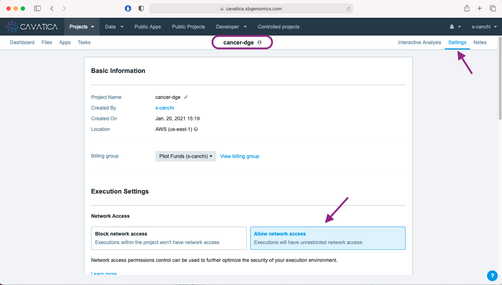
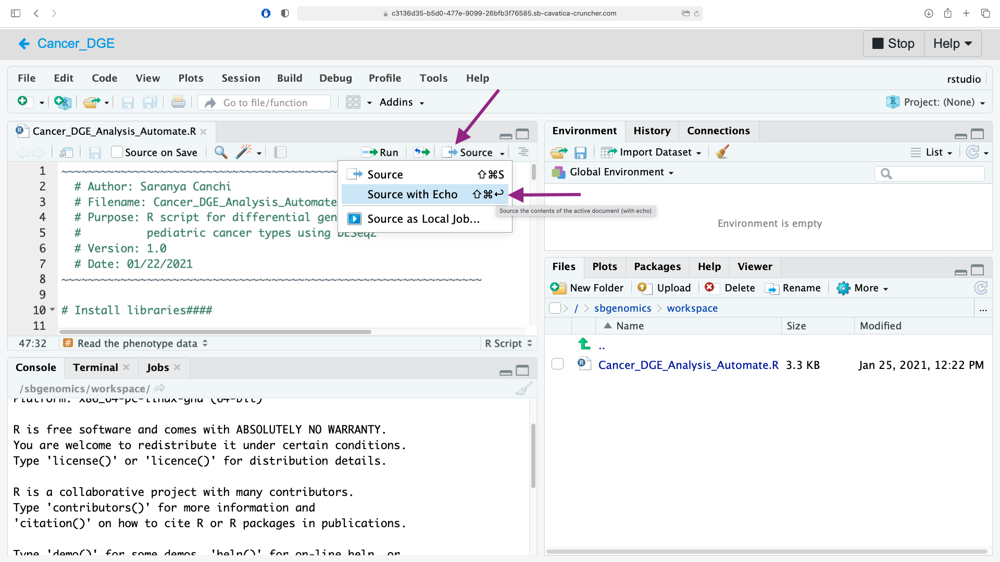
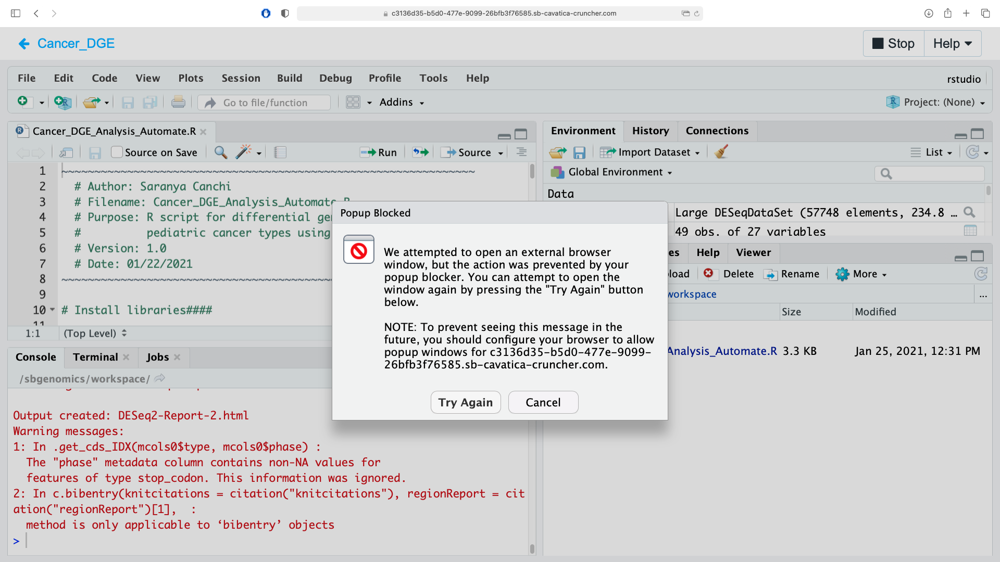
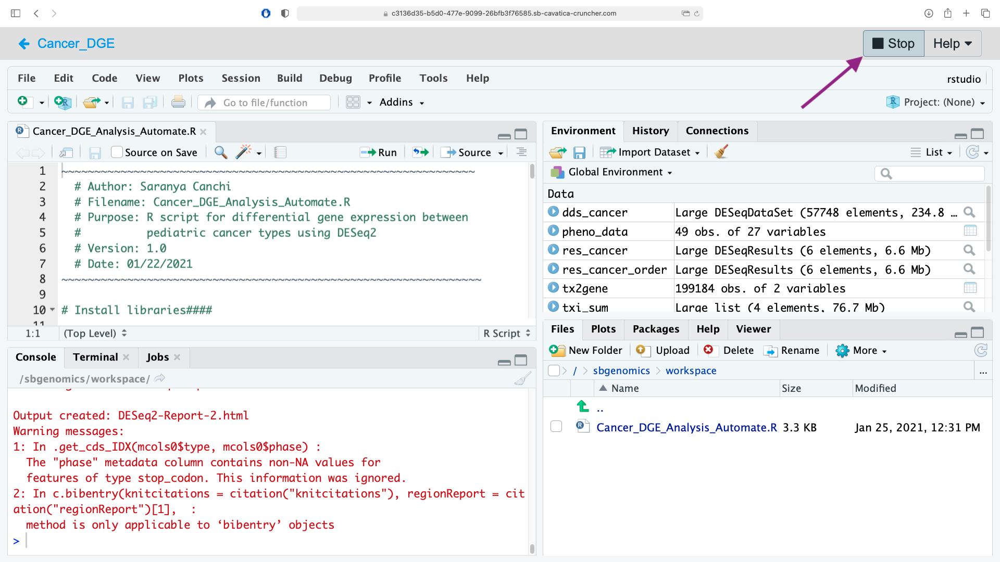
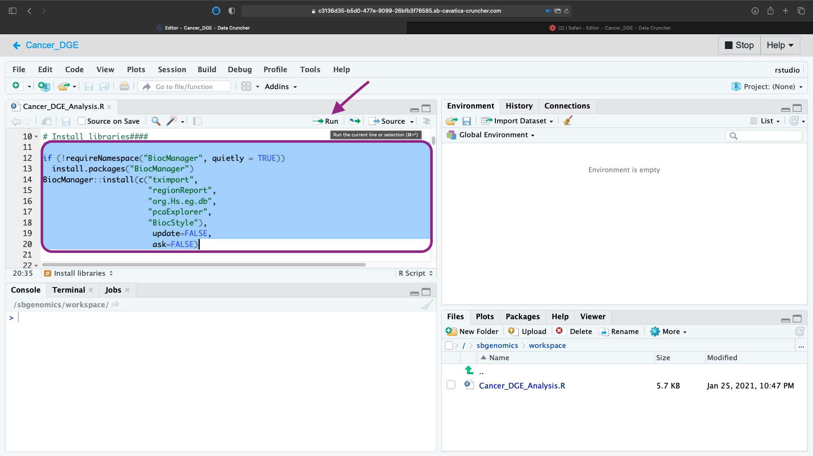
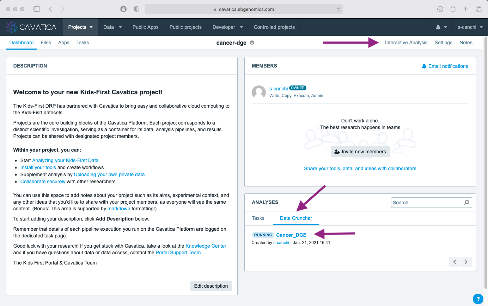
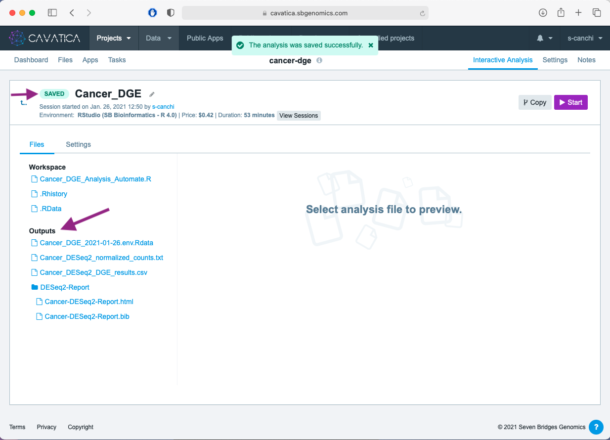

<div class="banner"><span class="banner-text">Lesson in Development</span></div>

Incorporating GTEx Data in Kids First Analyses
==========================

The Kids First DRC is a member of the [NIH Cloud Platform Interoperability Effort (NCPI)](https://anvilproject.org/ncpi), a collaboration of four NIH-funded DCCs to establish and implement guidelines and technical standards to empower end-user analyses across participating cloud platforms and facilitate the realization of a trans-NIH, federated data ecosystem. In brief, the goal of the NCPI Effort is to allow any authenticated user access to all of the platforms' datasets and the ability to work in the user's analysis platform of choice.

As part of the NCPI Effort, methods have been developed to allow users to bring datasets from the other NIH platforms into CAVATICA for combined research projects. One external dataset that is supported is the [Genotype Tissue Expression (GTEx) Program](https://commonfund.nih.gov/gtex). GTEx was funded to study the relationship between genetic variants (inherited changes in DNA sequence) and gene expression (how genes are turned on and off) in multiple human tissues and across individuals. Their datasets can serve as great controls for RNA-Seq experiments, comparing expression in GTEx's "normal" brain tissue to Kids First's brain cancer tissue.

The previous example provides a walkthrough for identifying RNA-Seq datasets from the [Kids First Data Resource Portal](https://portal.kidsfirstdrc.org/) and pushing them to [CAVATICA](https://cavatica.sbgenomics.com/) for analysis. This supplemental lesson will demonstrate how to find GTEx datasets on the [NHGRI Analysis Visualization and Informatics Lab-space (AnVIL)](https://anvilproject.org/) Portal] and import these files into a CAVATICA project for a combined analysis with Kids First data.


## Step 1: Identify GTEx Files on AnVIL and Export a PFB
- Navigate to [the AnVIL Portal](https://gen3.theanvil.io/login) and login using NIH or Google credentials. [11.10.55AM]
- Using the [AnVIL Data Explorer](https://gen3.theanvil.io/explorer), identify the GTEx files for your analysis. For more information on using AnVIL Gen3, see [their support documentation here](https://anvilproject.org/learn/introduction/getting-started-with-gen3). [11.13.02AM]
- Once you have identified the subset of files for your analysis, return to the top of the screen and choose `Export All to PFB`. This will create a manifest of files on the AnVIL Portal. This process may take several minutes, depending upon the number of files for export. [11.16.23AM]
- Once the PFB is created, download it to your local machine. This document contains the information CAVATICA needs to pull these files into your CAVATICA project. [11.25.34AM]
- Before navigating away from the AnVIL Portal, you also must generate an API key. This will be used to authenticate your access to the files in the PFB and allow the transfer of GTEx data into CAVATICA. Select your username in the top right of the AnVIL Portal. Select `Create API Key` in the top left of the page that opens. After a key is generated, download this key by choosing `Dowload json`. A file will save to your local machine. [11.26.08AM]

This concludes the necessary steps in the AnVIL Portal. We will now move to CAVATICA.

## Step 2: Access the Data Interoperability Jupyter Notebook on CAVATICA
The commands necessary to import the chosen GTEx files from the AnVIL Portal have been saved in a Jupyter Notebook that is available on the CAVATICA platform. We will copy this notebook to a project we can work in and then begin an interactive session in the Data Cruncher to run the transfer.
- Navigate to [CAVATICA](https://cavatica.sbgenomics.com/) and login using NIH or CAVATICA credentials. [11.31.27AM]
- Within CAVATICA, choose [`Public Projects`](https://cavatica.sbgenomics.com/public/projects) from the menu bar at the top, then select [`Data Interoperability`](https://cavatica.sbgenomics.com/u/sevenbridges/data-interoperability). [11.32.13AM]
- This Public Project contains the notebook we need to begin the data transfer. Save a copy of this public project to be able to run and execute this workflow. To do this, click the `i` symbol next to the Project Title and click `Copy project`. [11.32.14AM]
- Select a title and billing group for your new project. Be sure to choose to `Allow network access` for this project. [11.32.15AM]

!!! info "Allow Network Access"

    If you would like to work with the Data Interoperability public project, make a copy of the project by selecting the "i" next to the project name. Select to copy the project. This will bring up the project creation menu. The network access will be set to "Block network access" by default, however you will need to change the setting to "Allow network access" in order to use the Cloud-agnostic Data Import interactive analysis.

- CAVATICA will automatically navigate you to your duplicate project. From here, choose `Interactive Analysis` and then open the `Data Cruncher`. [11.40.06AM]
- Start the `Cloud-agnostic Data Import` analysis by clicking the small blue "Play" button in the far right of the row. [11.40.07AM]
- When the Analysis finishes initializing, it is ready to begin. Click the small blue button to enter the Data Cruncher. [11.40.08AM]


## Step 3: Within Data Cruncher, Import the Files in the PFB


## Step 1: Starting Data Cruncher

* Click the <span class="highlight_txt">Interactive Analysis</span> tab located on the right hand corner below your account settings menu.
* Select <span class="highlight_txt">Open</span> in the Data Cruncher panel.
* Click on the <span class="highlight_txt">Create your first analysis</span> which appears the first time your are setting up.
* In the popup box, select <span class="highlight_txt">RStudio</span> for Environment. Provide an analysis name in the box. Here, **Cancer_DGE** was used to title the analysis. Click <span class="highlight_txt">Next</span> when done.
* In the `Compute requirements` tab, we will use the default instance type (c5.2xlarge, $0.49/hr). We increase the `Suspend time`, which is the period of inactivity after which the instance is stopped automatically and the analysis is saved, from 30 to 60 minutes.
* Click <span class="highlight_txt">Start the analysis</span>. This prompts the initialization of the analysis which involves set up of the instance and preparation of the analysis environment.

<iframe id="kaltura_player" src="https://cdnapisec.kaltura.com/p/1770401/sp/177040100/embedIframeJs/uiconf_id/29032722/partner_id/1770401?iframeembed=true&playerId=kaltura_player&entry_id=1_4hc4cd8i&flashvars[mediaProtocol]=rtmp&amp;flashvars[streamerType]=rtmp&amp;flashvars[streamerUrl]=rtmp://www.kaltura.com:1935&amp;flashvars[rtmpFlavors]=1&amp;flashvars[localizationCode]=en&amp;flashvars[leadWithHTML5]=true&amp;flashvars[sideBarContainer.plugin]=true&amp;flashvars[sideBarContainer.position]=left&amp;flashvars[sideBarContainer.clickToClose]=true&amp;flashvars[chapters.plugin]=true&amp;flashvars[chapters.layout]=vertical&amp;flashvars[chapters.thumbnailRotator]=false&amp;flashvars[streamSelector.plugin]=true&amp;flashvars[EmbedPlayer.SpinnerTarget]=videoHolder&amp;flashvars[dualScreen.plugin]=true&amp;flashvars[mediaProxy.mediaPlayTo]=44&amp;flashvars[Kaltura.addCrossoriginToIframe]=true&amp;&wid=1_6ih50uzu" width="608" height="402" allowfullscreen webkitallowfullscreen mozAllowFullScreen allow="autoplay *; fullscreen *; encrypted-media *" sandbox="allow-forms allow-same-origin allow-scripts allow-top-navigation allow-pointer-lock allow-popups allow-modals allow-orientation-lock allow-popups-to-escape-sandbox allow-presentation allow-top-navigation-by-user-activation" frameborder="0" title="Kaltura Player"></iframe>

!!! info "Instance Types"

    You can find details on all available US instances from Amazon Web Services (AWS) on [Cavatica's Platform Documentation](https://docs.sevenbridges.com/docs/list-of-available-amazon-web-services-instances).

## Step 2: Navigating analysis editor and load script

After the instance is initialized, you will be automatically directed to the analysis editor which in this case is the RStudio interface.

!!! info "RStudio IDE"

    [Read more about the different panes and options of the RStudio interface](https://georgejmount.com/tourofrstudio/), the integrated development environment (IDE) for the R programing language.

### Directory structure

The editor is associated with a directory structure to help you navigate the working space. You can access it via the Files/Packages/Plots/Help/Viewer pane on the bottom right hand corner of RStudio.

```
/sbgenomics
|–– output-files
|–– project-files
|–– projects
|–– workspace
```

!!! important "Important"

    The `project-files` directory which contains all the input files is a read only file system while you have read-write permissions for the `workspace` and `output-files` directories.

* **workspace** is the default working directory for the analysis. You can use the RStudio <span class="highlight_txt">Upload</span> option to get files from your local computer to the workspace.
* **output-files** can be used as the directory to save all the outputs from your analysis. If not specified, the files are saved to workspace.
* **project-files** is the directory containing all the input files from the current project. Because it is a read only file system, no changes can be made to these files via the editor interface.

<a name="upload"></a>
<iframe id="kaltura_player" src="https://cdnapisec.kaltura.com/p/1770401/sp/177040100/embedIframeJs/uiconf_id/29032722/partner_id/1770401?iframeembed=true&playerId=kaltura_player&entry_id=1_uennaoay&flashvars[mediaProtocol]=rtmp&amp;flashvars[streamerType]=rtmp&amp;flashvars[streamerUrl]=rtmp://www.kaltura.com:1935&amp;flashvars[rtmpFlavors]=1&amp;flashvars[localizationCode]=en&amp;flashvars[leadWithHTML5]=true&amp;flashvars[sideBarContainer.plugin]=true&amp;flashvars[sideBarContainer.position]=left&amp;flashvars[sideBarContainer.clickToClose]=true&amp;flashvars[chapters.plugin]=true&amp;flashvars[chapters.layout]=vertical&amp;flashvars[chapters.thumbnailRotator]=false&amp;flashvars[streamSelector.plugin]=true&amp;flashvars[EmbedPlayer.SpinnerTarget]=videoHolder&amp;flashvars[dualScreen.plugin]=true&amp;flashvars[mediaProxy.mediaPlayTo]=33&amp;flashvars[Kaltura.addCrossoriginToIframe]=true&amp;&wid=1_77fny8c6" width="608" height="402" allowfullscreen webkitallowfullscreen mozAllowFullScreen allow="autoplay *; fullscreen *; encrypted-media *" sandbox="allow-forms allow-same-origin allow-scripts allow-top-navigation allow-pointer-lock allow-popups allow-modals allow-orientation-lock allow-popups-to-escape-sandbox allow-presentation allow-top-navigation-by-user-activation" frameborder="0" title="Kaltura Player"></iframe>

### Session outputs

The generated output and environment files from an active session are saved when the analysis is stopped by clicking <span class="highlight_txt">:fontawesome-solid-stop: Stop</span> located on the right hand top corner. You can access the session files via the <span class="highlight_txt">Files</span> tab in your project folder.

The Data Cruncher comes with a set of libraries that are pre-installed. These vary depending on the environment you chose during setup. We chose the default environment for RStudio `SB Bioinformatics - R 4.0` which is loaded with [set of CRAN and Bioconductor libraries](https://docs.sevenbridges.com/docs/about-libraries-in-a-data-cruncher-analysis).

!!! important "Installing additional libraries"

    Although the output files, the environment, and history of the session are saved upon stopping the analysis editor, any installed libraries are only good for the session and must be re-installed for every restart of the instance.

## Step 3: Run analysis script <a name="R-code"></a>

!!! important "Network settings"

    To enable download of packages included in the analysis scripts via internet, it is important to ensure the network access is set to On. Click on <span class="highlight_txt">Settings</span> within your project folder and select <span class="highlight_txt">Allow network access</span> box.

     


You will need to download an analysis script for this step. We have provided you with the option to download two versions of the analysis script based on your choice of execution in RStudio. Click on your preferred option and save the file: </br>

 (a) [version to execute automatically using `Source`](./rna-seq-supporting-docs/Cancer_DGE_Analysis_Automate.R)</br>
 (b) [version to execute the code in chunks using the `Run` option](./rna-seq-supporting-docs/Cancer_DGE_Analysis.R).

The (b) version of the script is run manually and contains some additional packages and lines of code to allow for interactive exploration of the data prior to analysis. The DGE analysis and all the generated output are otherwise identical between the two versions.

Upload the script file to the **workspace** directory. View the upload steps in the [vidlet](#upload). Briefly:

  * Click on the <span class="highlight_txt">Upload</span> option in the Files/Packages/Plots/Help/Viewer pane.
  * Click <span class="highlight_txt">Choose File</span> to select the file from your local computer.
  * Once uploaded, click on the script file name to open it in the script editor pane (top left hand corner).
  * To execute go to **[Step 3a](#step3a)** if you chose the (a) version or **[Step 3b](#step3b)** if you chose (b).

!!! important "Phenotype File Name"

      For the scripts to run error-free ensure that the name of the phenotype CSV file is [**"phenotype_filtered.csv"**](./rna_seq_6.md#step-3-upload-phenotype-file-to-cavatica). Otherwise, update the R script file if your CSV file has a different name before execution.

### Step 3a: Execute using `Source` version <a name="step3a"></a>

To get started, click on the down arrow next to <span class="highlight_txt">Source</span> and click <span class="highlight_txt">Source with Echo</span>. This will print the comments as the code is executed.



This process will take about 15-20 minutes. Once completed, you will get a popup window asking to try to open the html report. Click <span class="highlight_txt">Try Again</span> to open a new tab for the report.



Alternatively, you can click <span class="highlight_txt">Cancel</span> in the popup window and subsequently click <span class="highlight_txt">:fontawesome-solid-stop: Stop</span> to view the files in your project folder.



For costs and time comparison between the two approaches, we use the automated version with the option to view the output files in the project folder which took 25 minutes to run and cost $0.2. You are now ready to view your output. Go to **[Step 4](#step4)**.


### Step 3b: Execute using `Run` version <a name="step3b"></a>

You can also execute the code by selecting a line or multiple lines of code and clicking the <span class="highlight_txt">Run</span> option or using ++ctrl+enter++ keys. This allows you greater flexibility to explore and understand the outputs of each line of code.

The first step is installing the packages necessary for DGE analysis and this takes approximately 17 minutes. Highlight the package install section as shown in the image below and click <span class="highlight_txt">Run</span>.



This version includes the Bioconductor package [`pcaExplorer`](https://bmcbioinformatics.biomedcentral.com/articles/10.1186/s12859-019-2879-1), which provides interactive visualization of RNA-Seq datasets based on [Principal Components Analysis](https://www.youtube.com/watch?v=_UVHneBUBW0&list=PLblh5JKOoLUJo2Q6xK4tZElbIvAACEykp&index=22).

After running **lines 1-99** of the R script, you should see an interactive output from the `pcaExplorer()` command. Watch the video below to learn how to use `pcaExplorer` for the filtered cancer dataset.

<iframe id="kaltura_player" src="https://cdnapisec.kaltura.com/p/1770401/sp/177040100/embedIframeJs/uiconf_id/29032722/partner_id/1770401?iframeembed=true&playerId=kaltura_player&entry_id=1_1z57clip&flashvars[mediaProtocol]=rtmp&amp;flashvars[streamerType]=rtmp&amp;flashvars[streamerUrl]=rtmp://www.kaltura.com:1935&amp;flashvars[rtmpFlavors]=1&amp;flashvars[localizationCode]=en&amp;flashvars[leadWithHTML5]=true&amp;flashvars[sideBarContainer.plugin]=true&amp;flashvars[sideBarContainer.position]=left&amp;flashvars[sideBarContainer.clickToClose]=true&amp;flashvars[chapters.plugin]=true&amp;flashvars[chapters.layout]=vertical&amp;flashvars[chapters.thumbnailRotator]=false&amp;flashvars[streamSelector.plugin]=true&amp;flashvars[EmbedPlayer.SpinnerTarget]=videoHolder&amp;flashvars[dualScreen.plugin]=true&amp;flashvars[mediaProxy.mediaPlayTo]=104&amp;flashvars[Kaltura.addCrossoriginToIframe]=true&amp;&wid=1_tywvb439" width="608" height="402" allowfullscreen webkitallowfullscreen mozAllowFullScreen allow="autoplay *; fullscreen *; encrypted-media *" sandbox="allow-forms allow-same-origin allow-scripts allow-top-navigation allow-pointer-lock allow-popups allow-modals allow-orientation-lock allow-popups-to-escape-sandbox allow-presentation allow-top-navigation-by-user-activation" frameborder="0" title="Kaltura Player"></iframe>

When you are finished running the R script, click <span class="highlight_txt">:fontawesome-solid-stop: Stop</span> to view the output files in your Cavatica project folder.

!!! bug "Login Timeout"

    It is possible to be logged out of Cavatica despite having an active RStudio session. You will be unable to stop the analysis from within the editor using <span class="highlight_txt">:fontawesome-solid-stop: Stop</span> if that occurs.

     * Login to Cavatica in a new tab or window.
     * Navigate to the data cruncher session via either the <span class="highlight_txt">Interactive Analysis</span> tab or using the `ANALYSES` pane in your project home page.

     {: width=70%}

    * Click <span class="highlight_txt">:fontawesome-solid-stop: Stop</span> on the session page.

## Step 4: View output files <a name="step4"></a>

All the session files and the generated outputs are saved after the analysis is stopped and are accessible on the session page.



The tag for the session changes from {==RUNNING==} to {==SAVED==}. Similar to the DESeq2 app, four output files are generated:

* **Cancer_DESeq2_DGE_results.csv** contains the ordered table of gene level statistics generated using the `results()` function in DESeq2 package.
* **Cancer_DESeq2_normalized_counts.txt** contains counts normalized using the estimated sample-specific normalization factors.
* **DESeq2-Report** folder which contains the HTML report generated using [regionReport](https://f1000research.com/articles/4-105/v2). The report contains all the visualizations along with the associated code from the [DESeq2 vignette](https://bioconductor.org/packages/release/bioc/vignettes/DESeq2/inst/doc/DESeq2.html#how-do-i-use-vst-or-rlog-data-for-differential-testing).
* **Cancer_DGE_{Date}.env.RData** is the R workspace image that includes all the objects and variables generated from the code. The `.RData` listed under Workspace is saved by default by the Data Cruncher.

!!! info "Output Differences"

        Although the DGE results are the same between the two analysis approaches, there are some differences between the two `html` reports since they are not the exact same code. The MA plots generated using Data Cruncher use blue to signify significant genes and the counts plot uses points instead of bars.

All the files are clickable for preview on Cavatica. You can either download individual files by clicking on the file name or follow the steps to [tag and download the files listed in the Analysis with DESeq2 Public App](./rna_seq_7.md#step-4-tag-download-analysis-outputs) lesson.

## Conclusion

This concludes the RNA-Seq on Cavatica tutorial. We hope that you found the tutorial helpful and will continue to use cloud computing for your analysis!

!!! note " Key Points"

    * The [Kids First Portal](https://kidsfirstdrc.org){:target="_blank"} is the go-to resource for pediatric cancer & structural birth defects datasets.
    * Examine data and run analyses using [Cavatica](https://cavatica.sbgenomics.com){:target="_blank"}, the cloud based analysis platform integrated into Kids First Portal.
    * You can filter, view, and download data from Cavatica.
    * Upload data to Cavatica from multiple sources including your local machine.
    * You can search, copy, and modify a public app on Cavatica.
    * Setup and successful run of the DESeq2 app by choosing appropriate inputs.
    * Setup a virtual computational environment running RStudio and analyze by executing code from a script.
