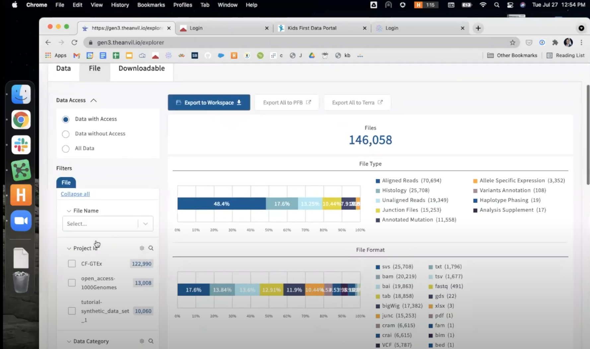
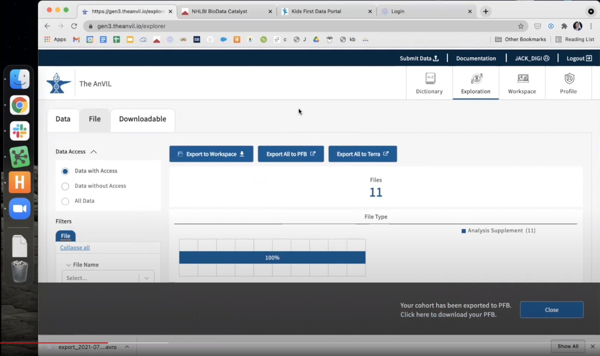
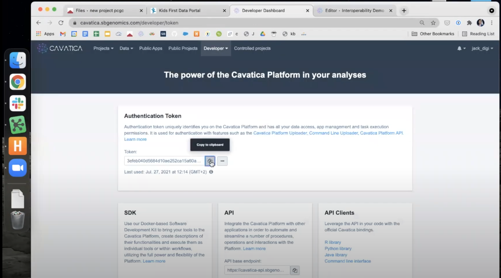
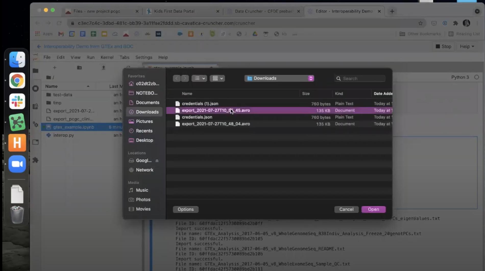
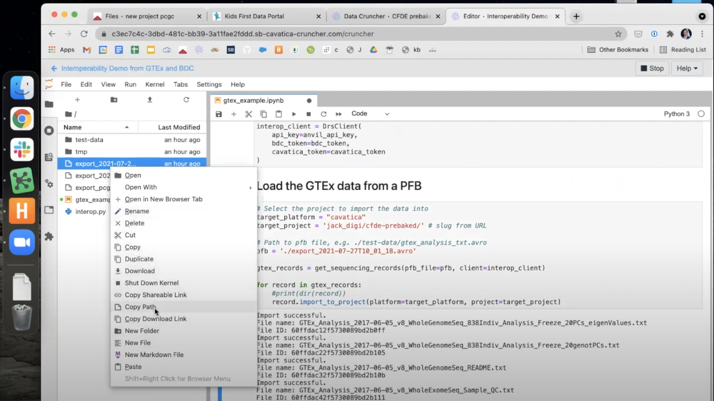

<div class="banner"><span class="banner-text">Lesson in Development</span></div>

Incorporating GTEx Data in Kids First Analyses
==========================

The Kids First DRC is a member of the [NIH Cloud Platform Interoperability Effort (NCPI)](https://anvilproject.org/ncpi), a collaboration of four NIH-funded DCCs to establish and implement guidelines and technical standards to empower end-user analyses across participating cloud platforms and facilitate the realization of a trans-NIH, federated data ecosystem. In brief, the goal of the NCPI Effort is to allow any authenticated user access to all of the platforms' datasets and the ability to work in the user's analysis platform of choice.

As part of the NCPI Effort, methods have been developed to allow users to bring datasets from the other NIH platforms into CAVATICA for combined research projects. One external dataset that is supported is the [Genotype Tissue Expression (GTEx) Program](https://commonfund.nih.gov/gtex). GTEx was funded to study the relationship between genetic variants (inherited changes in DNA sequence) and gene expression (how genes are turned on and off) in multiple human tissues and across individuals. Their datasets can serve as great controls for RNA-Seq experiments, comparing expression in GTEx's "normal" brain tissue to Kids First's brain cancer tissue.

The previous example provides a walkthrough for identifying RNA-Seq datasets from the [Kids First Data Resource Portal](https://portal.kidsfirstdrc.org/) and pushing them to [CAVATICA](https://cavatica.sbgenomics.com/) for analysis. This supplemental lesson will demonstrate how to find GTEx datasets on the [NHGRI Analysis Visualization and Informatics Lab-space (AnVIL)](https://anvilproject.org/) Portal and import these files into a CAVATICA project for a combined analysis with Kids First data.


## Step 1: Identify GTEx Files on AnVIL and Export a PFB

- Navigate to [the AnVIL Portal](https://gen3.theanvil.io/login) and login using NIH or Google credentials.
    {: align=right width=95%}
- Click the "Explore Data" button to use the [AnVIL Data Explorer](https://gen3.theanvil.io/explorer), identify the GTEx files for your analysis. For more information on using AnVIL Gen3, see [their support documentation here](https://anvilproject.org/learn/introduction/getting-started-with-gen3).
    {: align=right width=95%}
- Once you have identified the subset of files for your analysis, return to the top of the screen and choose `Export to PFB`. This will create a manifest of files on the AnVIL Portal. This process may take several minutes, depending upon the number of files for export.
    {: align=right width=95%}
- Once the PFB is created, download it to your local machine. This downloaded PFB file contains the information CAVATICA needs to pull these files into your CAVATICA project.
    {: align=right width=95%}
- Before navigating away from the AnVIL Portal, you also must generate an API key. This will be used to authenticate your access to the files in the PFB and allow the transfer of GTEx data into CAVATICA. Select your username in the top right of the AnVIL Portal. Select `Create API Key` in the top left of the page that opens. After a key is generated, download this key by choosing `Dowload json`. A file will save to your local machine.
    {: align=right width=95%}

- This concludes the necessary steps in the AnVIL Portal. We will now move to CAVATICA.

## Step 2: Access the Data Interoperability Jupyter Notebook on CAVATICA

The commands necessary to import the chosen GTEx files from the AnVIL Portal have been saved in a Jupyter Notebook that is available on the CAVATICA platform. We will copy this notebook to a project we can work in and then begin an interactive session in the Data Cruncher to run the transfer.

- Navigate to [CAVATICA](https://cavatica.sbgenomics.com/) and login using NIH or CAVATICA credentials.
    {: align=right width=95%}
    
- Note: if you are logging into CAVATICA for the first time you will presented with an NIH consent screen followed by a Gen3 authorization screen.
    {: align=right width=95%}
    {: align=right width=95%}

- Within CAVATICA, choose [`Public Projects`](https://cavatica.sbgenomics.com/public/projects) from the menu bar at the top, then select [`Data Interoperability`](https://cavatica.sbgenomics.com/u/sevenbridges/data-interoperability).
    - 
    {: align=right width=95%}
- This Public Project contains the notebook we need to begin the data transfer. Save a copy of this public project to be able to run and execute this workflow. To do this, click the `i` symbol next to the Project Title and click `Copy project`.
    {: align=right width=95%}
- Select a title and billing group for your new project. Be sure to choose to `Allow network access` for this project.
    {: align=right width=95%}

!!! info "Allow Network Access"

    If you would like to work with the Data Interoperability public project, make a copy of the project by selecting the "i" next to the project name. Select to copy the project. This will bring up the project creation menu. The network access will be set to "Block network access" by default, however you will need to change the setting to "Allow network access" in order to use the Cloud-agnostic Data Import interactive analysis.

- CAVATICA will automatically navigate you to your duplicate project. From here, choose `Interactive Analysis` and then open the `Data Cruncher`.
    {: align=right width=95%}
- Start the `Cloud-agnostic Data Import` analysis by clicking the small blue "Play" button in the far right of the row.
    {: align=right width=95%}
- When the Analysis finishes initializing, it is ready to begin. Click the small blue button to enter the Data Cruncher.
    {: align=right width=95%}


## Step 3: Within Data Cruncher, Import the Files in the PFB

The commands for importing the GTEx files from AnVIL into CAVATICA are written into the `interop.py` script included in the public project you copied.  We will be using the Jupyter Notebook `AnVIL_transfer.ipynb` to input the PFB manifest and authentication for the transfer.

- Open the `AnVIL_transfer.ipynb` notebook by selecting it from the left column in the Data Cruncher.
    {: align=right width=95%}
- The first two commands install dependencies needed for the data transfer. Click within each of these paragraphs (blocks of code) and then run each of them by clicking the `Play` button at the top of the window.
    {: align=right width=95%}
- The next paragraph will ask for your AnVIL API Key. Run this paragraph and a text box will apear. Open the `credentials.json` file on your computer and copy the api_key (without quotation marks) and paste it into the text box. Hit Enter on your keyboard to confirm.
    {: align=right width=95%}
- The next two paragraphs ask for credentials from the Cancer Genomics Cloud and BioData Catalyst. We may skip these paragraphs because we are not using these platforms.
- The next paragraph asks for your CAVATICA Authentication Token. You can access this token by navigating to [https://cavatica.sbgenomics.com/developer/token](https://cavatica.sbgenomics.com/developer/token). Copy it to your clipboard.
    {: align=right width=95%}
- Back in the Data Cruncher, run this paragraph and paste your CAVATICA Authentication Token in the box. Hit Enter on your keyboard to confirm.
    {: align=right width=95%}
- The next paragraph includes a number of commands necessary for the transfer. Because we will only be using the AnVIL and CAVATICA tokens, we should remove the additional lines which set the `cgc_token` and `bdc_token`s. Delete these two lines from the paragraph before running it using the `Play` button above. The text in this box should read...

```
interop_client = DrsClient(
    api_key=anvil_api_key,
    cavatica_token=cavatica_token
)
```

- Upload the PFB file into the Data Cruncher. This is the manifest of GTEx files downloaded from the AnVIL Portal. Do this by clicking the `Up` arrow in the Data Cruncher window and selecting it from among the files on your computer.
    {: align=right width=95%}

- The final paragraph includes three final variables that must be set to complete the transfer.
    - Set `target_platform = 'cavatica'`
    - Set `target_project = 'USER/PROJECT'`, where `USER` is your CAVATICA username and `PROJECT` is the name of the CAVATICA project you wish to move the files to. You may also copy these from the URL of the project after navigating there in your browser window.
    - Set `pfb = 'PATH'`, where `PATH` is the path to the .avro PFB file you uploaded. You can copy the path by right-clicking the file and choosing `Copy Path`. 
        {: align=right width=95%}
- When all three variables have been set, use the `Play` button to run this paragraph. The files will begin to transfer and appear one-by-one below the paragraph.
     {: align=right width=95%}
- This completes the file transfer - the files will now be accessible in the Data Cruncher as well as in the Files Tab of the Project!
