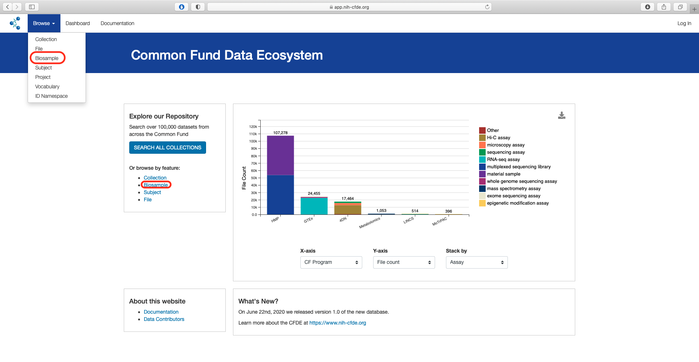
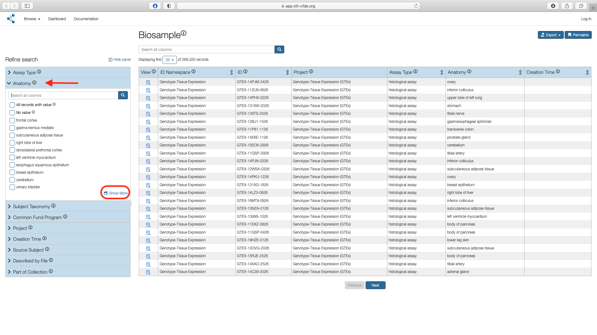
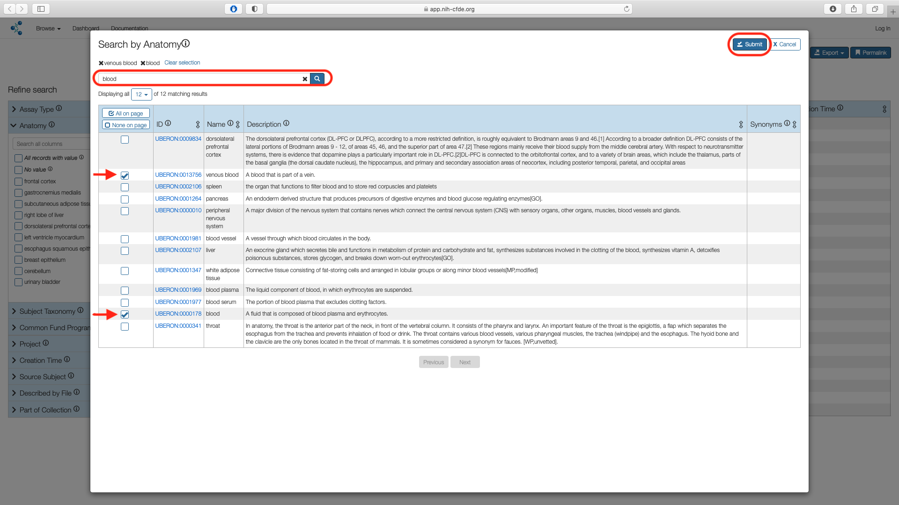
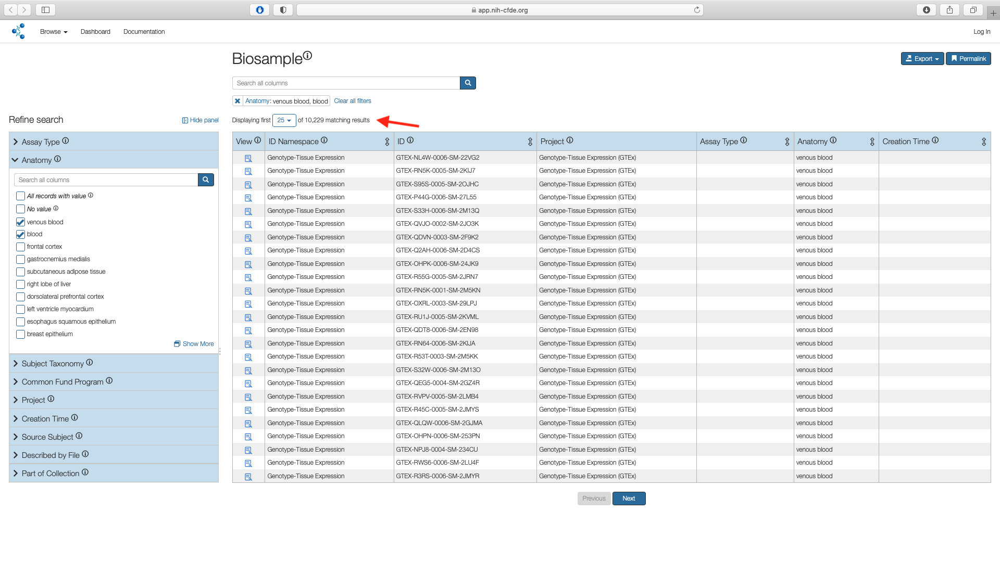
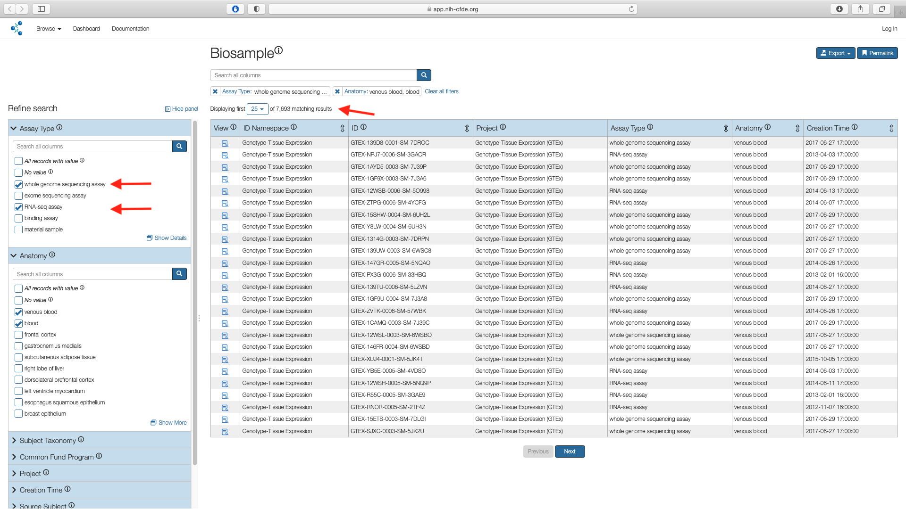
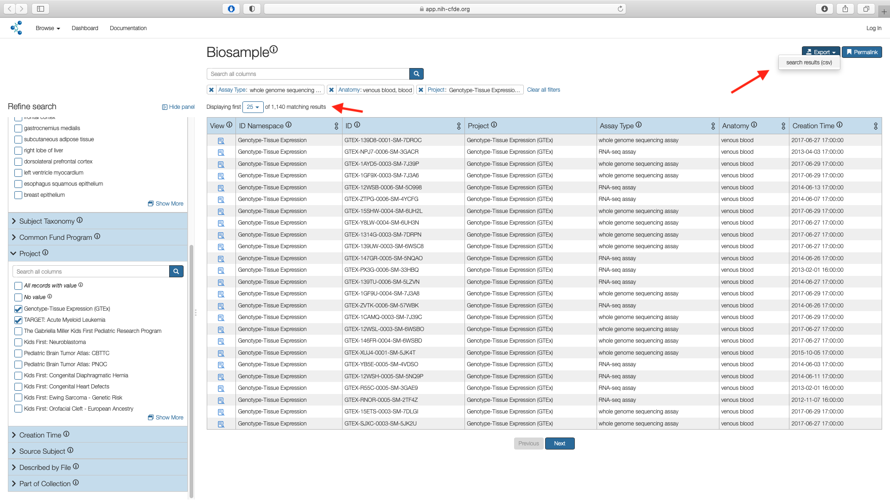

# Cohort Selection for Blood Cancer

Acute Myeloid Leukemia (AML) is a type of blood cancer. In AML, the affected myeloid cells which are a type of white blood cells, are not functional and build up in the bone marrow leaving reduced capacity for healthy white and red blood cells. While risk factors for developing AML exist, often times the underlying cause remains unknown. Gene mutations and chromosomal abnormality in the leukemia cells occur sporadically. Characterization of the wide spectrum of genetic events involved in AML will aide in better understanding of its etiology and ultimately in development of improved therapy.

Combining whole genome sequencing (WGS) data with global transcriptomic profiling using RNA-sequencing (RNA-seq) can help elucidate functional dysregulation for genes of interest.
In this use case, we demonstrate the utility of the [CFDE portal](https://app.nih-cfde.org) in identifying and extracting suitable WGS and RNA-seq datasets derived from blood from across the CF programs.

A video walk through demonstrating the cohort selection for AML.

<iframe id="kaltura_player" src="https://cdnapisec.kaltura.com/p/1770401/sp/177040100/embedIframeJs/uiconf_id/29032722/partner_id/1770401?iframeembed=true&playerId=kaltura_player&entry_id=1_yjudzmwr&flashvars[mediaProtocol]=rtmp&amp;flashvars[streamerType]=rtmp&amp;flashvars[streamerUrl]=rtmp://www.kaltura.com:1935&amp;flashvars[rtmpFlavors]=1&amp;flashvars[localizationCode]=en&amp;flashvars[leadWithHTML5]=true&amp;flashvars[sideBarContainer.plugin]=true&amp;flashvars[sideBarContainer.position]=left&amp;flashvars[sideBarContainer.clickToClose]=true&amp;flashvars[chapters.plugin]=true&amp;flashvars[chapters.layout]=vertical&amp;flashvars[chapters.thumbnailRotator]=false&amp;flashvars[streamSelector.plugin]=true&amp;flashvars[EmbedPlayer.SpinnerTarget]=videoHolder&amp;flashvars[dualScreen.plugin]=true&amp;flashvars[Kaltura.addCrossoriginToIframe]=true&amp;&wid=1_og10u5tw" width="608" height="402" allowfullscreen webkitallowfullscreen mozAllowFullScreen allow="autoplay *; fullscreen *; encrypted-media *" sandbox="allow-forms allow-same-origin allow-scripts allow-top-navigation allow-pointer-lock allow-popups allow-modals allow-orientation-lock allow-popups-to-escape-sandbox allow-presentation allow-top-navigation-by-user-activation" frameborder="0" title="Kaltura Player"></iframe>

## Step 1: Access the Biosample information

From the main landing page for the [CFDE portal](https://app.nih-cfde.org) there are two
options to access the "Biosample" view of the CFDE data browser.

By using the "Biosample" link under the "Or browse by feature" section listed
under "Explore our Repository" or by selecting the "Biosample under the "Browse" option in the top left navigation bar.

   

The default page shows a total of 289,320 records.

## Step 2: Apply Anatomy Filter

Access the "Anatomy" filter listed under the Refine Search panel. Click on the "Show More" option which opens a pop up window with all search results.

   

Search for "blood" in the search box. Select "blood" and "venous blood" options and choose "Submit".

   

The Biosample page shows the subset of matches for "Anatomy" filters. This results in 10,229 results.

   

## Step 3: Apply Assay Filter

Next use the "Assay" filter listed under the Refine Search panel to select the boxes
for whole genome sequencing assay (WGS) and RNA-seq assay values. This results in 7,693 records.

   

!!! note "Additive Filters"
    The various filters are additive and are useful in subsetting a larger cohort. In this example the "Assay" filter was applied on top of the "Anatomy" subsetted list.

## Step 4: Apply Project Filter

To select only the datasets pertaining to AML, use the "Project" filter under the Refine
Search panel and click on "Show More".
This results in 17 projects stemming from three separate CF programs listed under the
"ID Namespace" column i.e Genotype-Tissue Expression (GTEx), The Gabriella Miller Kids First
Pediatric Research Program (KF) and Molecular Transducers of Physical Activity
Consortium (MoTrPAC).

!!! note "MoTrPAC data "
    Although MoTrPAC will eventually include human data, the current release contains test data from experiments conducted on rats. Thus, this dataset is excluded from the current cohort.

Check the boxes corresponding to `Genotype-Tissue Expression (GTEx)`and `TARGET: Acute Myeloid Leukemia` in the "Name" column and click "Submit". This results in 1,140 matching records.

   

## Step 5: Export Cohort

The filtered cohort containing 1,140 records can now be exported as a `csv` file and can be accessed from downloads folder associated with the web browser in the user's local machine. Default is generally the `Downloads` folder.

   

!!! note "Cohort manifest contains metadata only"
    The exported `csv` contains metadata only. To further investigate the selected cohort, use the data portals of the originating Common Fund (CF) program i.e. GTEx and KF respectively.

The exported `csv` file has thirteen columns.

   

The `anatomy` columns lists the [UBERON](http://uberon.github.io/about.html) values for venous blood (UBERON:0013756) and blood (UBERON:0000178). The `assay_type` lists the [Ontology for Biomedical Investigations (OBI)](http://obi-ontology.org) IDs for WGS (OBI:0002117) and RNA-seq (OBI:0001271).
The `id` column lists the unique sample IDs within the cohort and will be key in obtaining the associated files from data portals for [GTEx](https://gtexportal.org/home/) and [KF](https://kidsfirstdrc.org/) respectively.
