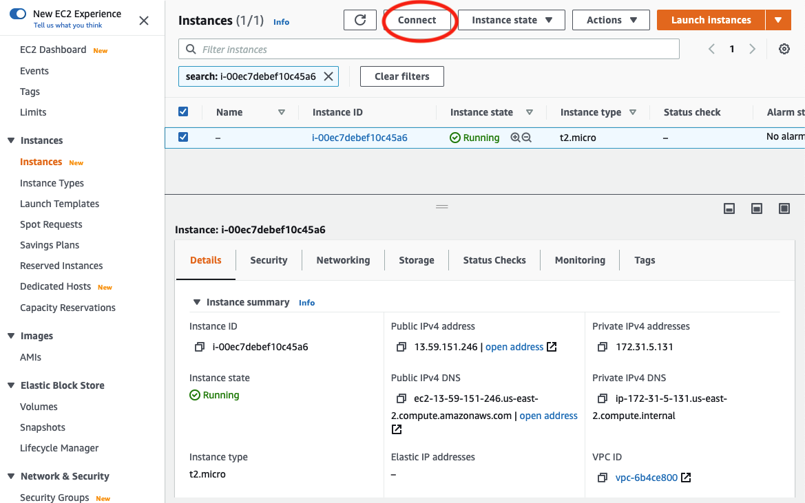
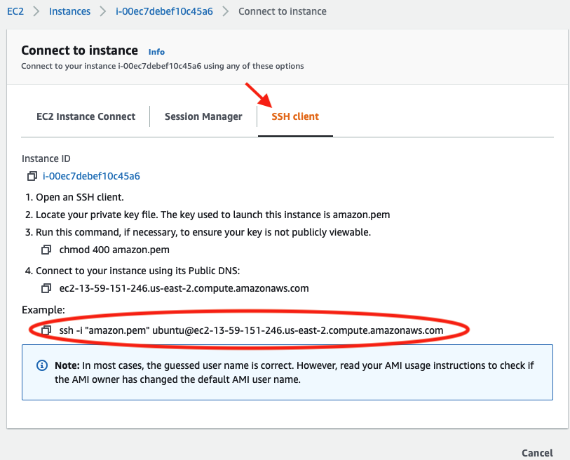
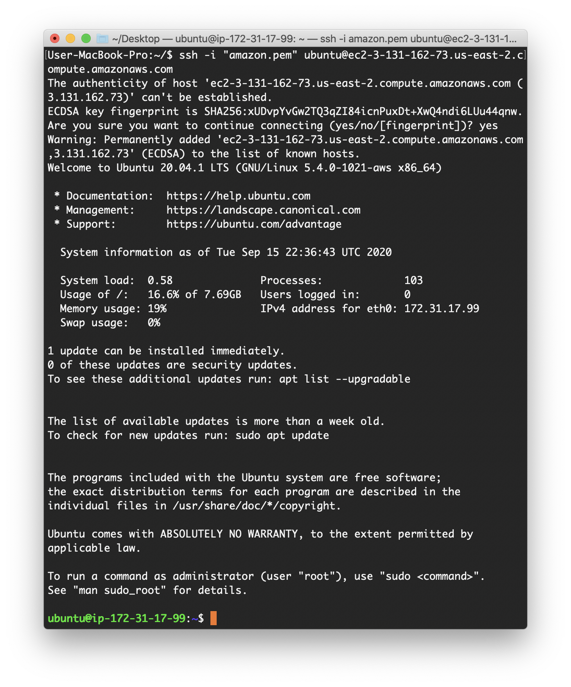

# Download Data & Install Helper Utilities

!!! Important
    The coat color data lives in a website called [Cyverse](https://www.cyverse.org/). It is not easy to make AWS talk to Cyverse; the fastest way to work with this dataset in AWS is to first download it onto your LOCAL computer and then upload it to AWS.

## Step 1: Download data to local computer

* To download data onto your local computer you need to open up a terminal window. You can do this by searching (type ++command+space++) for "terminal" on your Mac.

* Make a folder called "GWAS" on your "Desktop" and then navigate to the folder by typing the following commands in your terminal:

=== "Local Machine"
    ```
    mkdir ~/Desktop/GWAS
    cd ~/Desktop/GWAS
    ```

* You will use a free and open source software called [curl](https://curl.haxx.se/docs/manpage.html#-O) to retrieve data files of interest from Cyverse.

=== "Local Machine"
    ```
    curl -LO https://de.cyverse.org/dl/d/E0A502CC-F806-4857-9C3A-BAEAA0CCC694/pruned_coatColor_maf_geno.vcf.gz
    curl -LO https://de.cyverse.org/dl/d/3B5C1853-C092-488C-8C2F-CE6E8526E96B/coatColor.pheno
    ```

`-L` flag redirects the user to the right URL if the server reports that the requested page has been moved. The `-O` flag names the local file the same as its remote counterpart.

The first command downloads the "vcf" file and the second command downloads the file that specifies phenotype information. This step may take a few seconds.

* Check if your data download worked by typing `ls -ltrh` to list all files in that folder:

=== "Local Machine"
    ```
    ls -ltrh
    ```
=== "Expected Output"
    ```
    -rw-------@ 1 username  staff   1.7K Jul  9 15:33 amazon.pem
    -rw-r--r--  1 username  staff   1.2K Sep 15 15:47 coatColor.pheno
    -rw-r--r--  1 username  staff    11M Sep 15 15:47 pruned_coatColor_maf_geno
    ```
`-l` flag outputs in a long listing format, `-t` sorts list by time added with newest first, `-r` forces sort to list in reverse order so the newest files appear on top, `-h` makes it human readable.

## Step 2: Locate the AWS private key file and change permissions

* Find the private key file; it is the `.pem` file you [downloaded when starting up the EC2 instance](aws_instance_setup.md). If you saved it in the default location, it should be in the "Downloads" folder. Remember, you named it "amazon.pem".

* Move "amazon.pem" to your `~Desktop/GWAS` folder with copy+paste. Remember to delete "amazon.pem" from the "Downloads" folder to avoid clutter. Check the contents of your `~Desktop/GWAS` folder again with `ls`. Do you see the "amazon.pem" file?

* Now run this command to set the permissions on the "amazon.pem" private key file to “closed to all evildoers”.

=== "Local Machine"
    ```
    chmod og-rwx ~/Desktop/GWAS/amazon.pem
    ```

[chmod](https://en.wikipedia.org/wiki/Chmod) is an abbreviation for change mode. The `og-rwx` part removes the read, write, and execute permission for all users except the file’s owner. Running this code does not produce any output on the terminal window.

## Step 3: Access the AWS instance

OK, so you've created a [running computer on the cloud](aws_instance_setup.md). How do you get to it? AWS makes it easy to connect to the cloud computer via your terminal window.

The information you will need lives on the [AWS page that lists your active instances](https://us-east-2.console.aws.amazon.com/ec2/v2/home?region=us-east-2#Instances:).

* On this webpage, select your instance of interest and click the "Connect" button on the top of the page.



* A pop up window will appear. Copy the line of code under "Example:", starting with the `ssh` command.



* In your terminal, make sure you are still in the `~/Desktop/GWAS` folder (in which your "amazon.pem" lives). Paste the entire command and click ++enter++. It should look something like this:

=== "Local Machine"
    ```
    ssh -i ~/Desktop/GWAS/amazon.pem ubuntu@ec2-???-???-???-???.compute-1.amazonaws.com
    ```

!!! Important
    Replace the stuff after the ‘@’ sign with the name of your host computer.


!!! Tip
    You will see this message when running the `ssh`
    command for the first time:

    > The authenticity of host 'ecc2-???-???-???-???.compute-1.amazonaws.com (3.129.57.169)' can't be established. ECDSA key fingerprint is XXX. Are you sure you want to continue connecting (yes/no/[fingerprint])?

    Type "yes" and press ++enter++.


* If everything works ok, the output on your terminal window should look like this:



!!! Note
    My terminal window is black, but yours may not be! Users can [customize their terminal](https://www.maketecheasier.com/customize-mac-terminal/) by right clicking on the terminal window and selecting "Inspector". I've chosen the "Pro" theme.

* You have now successfully logged in as user "ubuntu" to the machine "ec2-18-216-20-166.us-east-2.compute.amazonaws.com" using the "amazon.pem" authentication key.

* This is your remote/cloud Ubuntu computer. Look at what's in this computer by typing `ls`. If nothing happens, it means there are no folders or files to list!

* Make a folder called "GWAS" in the Ubuntu computer by typing:

=== "AWS Instance"
    ```
    mkdir GWAS
    ```

Check if you have this directory by typing `ls`. Do you see it?

## Step 4: Some basic installs

Before you use AWS, there are a few updates or installs that need to be done.

* First, you need to make sure the app installer is up to date because you're using LTS 20.04 which is frozen at version 20.04, and so always needs to be updated when you start:

=== "AWS Instance"
    ```
    sudo apt-get update
    ```

Now you can install stuff.

### Install unzip

Unzip can be used to uncompress files that have the ".zip" extension.

=== "AWS Instance"
    ```
    sudo apt-get install unzip
    ```

Here's how you check if it's installed:

=== "AWS Instance"
    ```
    unzip -v
    ```
=== "Expected Output"

    ```
    UnZip 6.00 of 20 April 2009, by Debian. Original by Info-ZIP.

    Latest sources and executables are at ftp://ftp.info-zip.org/pub/infozip/ ;
    see ftp://ftp.info-zip.org/pub/infozip/UnZip.html for other sites.

    Compiled with gcc 9.2.0 for Unix (Linux ELF).

    UnZip special compilation options:
    ACORN_FTYPE_NFS
    COPYRIGHT_CLEAN (PKZIP 0.9x unreducing method not supported)
    SET_DIR_ATTRIB
    SYMLINKS (symbolic links supported, if RTL and file system permit)
    TIMESTAMP
    UNIXBACKUP
    USE_EF_UT_TIME
    USE_UNSHRINK (PKZIP/Zip 1.x unshrinking method supported)
    USE_DEFLATE64 (PKZIP 4.x Deflate64(tm) supported)
    UNICODE_SUPPORT [wide-chars, char coding: UTF-8] (handle UTF-8 paths)
    LARGE_FILE_SUPPORT (large files over 2 GiB supported)
    ZIP64_SUPPORT (archives using Zip64 for large files supported)
    USE_BZIP2 (PKZIP 4.6+, using bzip2 lib version 1.0.8, 13-Jul-2019)
    VMS_TEXT_CONV
    WILD_STOP_AT_DIR
    [decryption, version 2.11 of 05 Jan 2007]
    UnZip and ZipInfo environment options:
    UNZIP:  [none]
    UNZIPOPT:  [none]
    ZIPINFO:  [none]
    ZIPINFOOPT:  [none]
    ```

### Install other helper utilities

You need lots of other helper utilities to run today's pipeline so now is a good time to install them all:

=== "AWS Instance"
    ```
    sudo apt-get install autoconf autogen g++ gcc make automake pkg-config zlib1g-dev curl gdebi-core -y ghostscript-x
    ```
!!! Important
    Installing helper utilities is VERY important. All sorts of errors in installations/plotting happen if it's not run! For example, you will install "vcftools" in later parts of this tutorial which absolutely needs "autoconf", "autogen", and "make" to be preinstalled. zlib is a library implementing the deflate compression method found in gzip and PKZIP. gdebi lets you install local deb packages resolving and installing its dependencies. And to run plotting functions in R, you will need Ghostscript, an interpreter of the PDF format.

## Step 5: Upload data to AWS

* To upload data from your local computer to AWS, you must first logout of AWS. Type:

=== "AWS Instance"
    ```
    logout
    ```

* Now you are back in your local Mac terminal. You can upload files to AWS by typing this command:

=== "Local Machine"
    ```
    scp -i ~/Desktop/GWAS/amazon.pem ~/Desktop/GWAS/pruned_coatColor_maf_geno.vcf.gz ubuntu@ec2-???-???-???-???.compute-1.amazonaws.com:~/GWAS/
    scp -i ~/Desktop/GWAS/amazon.pem ~/Desktop/GWAS/coatColor.pheno ubuntu@ec2-???-???-???-???.compute-1.amazonaws.com:~/GWAS/
    ```

Here `scp` is short for secure copy. [`scp` allows files to be copied to, from, or between different hosts](http://www.hypexr.org/linux_scp_help.php). It takes three arguments:

1) The first `~/Desktop/GWAS/amazon.pem` is the path to your private key file ("amazon.pem" in this case) which serves as a password for AWS. You will also need the `-i` flag; it tells `scp` to look for a private key file.

2) The second argument `~/Desktop/GWAS/pruned_coatColor_maf_geno.vcf.gz` is the path to the file on your local machine (that needs to be copied).

3) The last argument `ubuntu@ec2-???-???-???-???.compute-1.amazonaws.com:~/GWAS/` is the path to the AWS folder where the file will be pasted.

So you're copying files from the "GWAS" folder on your local machine to the "GWAS" folder in the remote Ubuntu computer. Be sure to **change the ec2 instance name** like you did earlier.

* To check if this worked, log back into the remote Ubuntu instance by **typing in the ssh command described above**. Then change directory to "GWAS" and list files in it:

=== "AWS Instance"
    ```
    cd GWAS
    ls
    ```

Do you see the files?

* Finally, uncompress the "pruned_coatColor_maf_geno.vcf.gz" file using gunzip.

=== "AWS Instance"
    ```
    gunzip pruned_coatColor_maf_geno.vcf.gz
    ```

This command should remove the ".gz" part from the file name.
