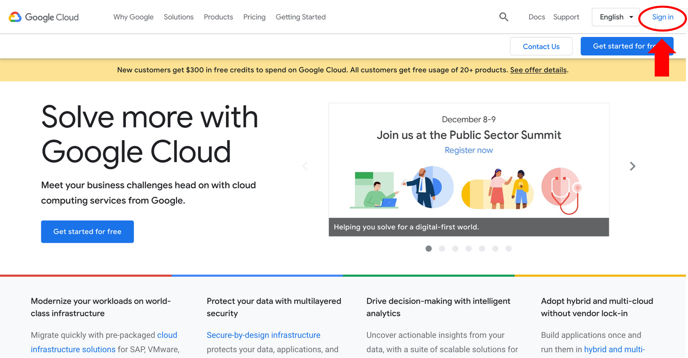
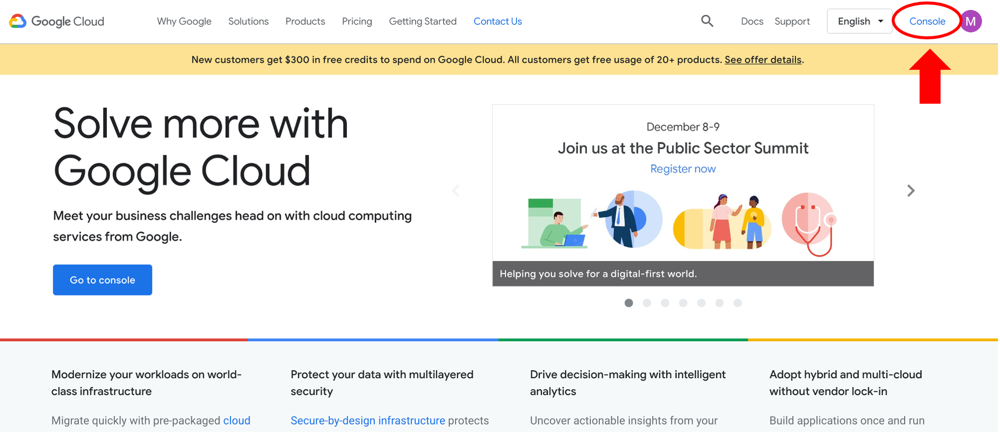
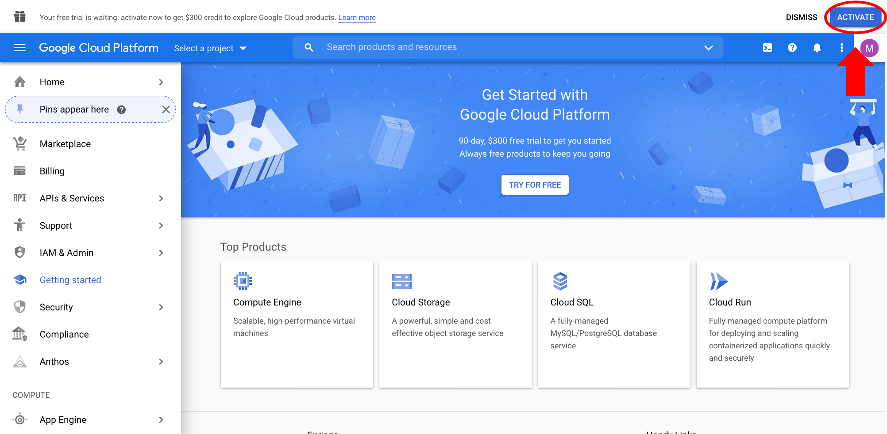

# Set up GCP account overview

## Login to GCP

- Click on "Sign in" on the top right corner and sign in with a Google account at: [https://cloud.google.com/](https://cloud.google.com/)

- After successful login, click on "Console" on the top right corner.

## Create a GCP billing account

For new users, Google offers a free 3-month $300 trial account. While you still have to enter a valid credit card to set up the billing account, you will not be charged during the trial period, nor will you be automatically charged when it completes unless you turn on automatic billing.

- Click on "Activate" to start setting up the billing account.

- This is a 2-step process. On the first page, you must agree to the Terms of Service, then click "Continue". On the second page, you'll create your payments profile. Enter address and billing information, then click "Start free trial".

when you sign up for the GCP free trial, you should get an account confirmation email.

A given user has two options for creating and joining these accounts:
- set up the account as an individual and pay with your own credit card, or
- set up a G Suite organization account that shares a centralized Google Billing Account and pay with the organization host’s credit card.

Start from the [Google Cloud Platform console](https://console.cloud.google.com/getting-started?pli=1) getting started page.

Individual account set up is straightforward, as no additional role permissions are needed on the Google Cloud Platform (GCP) side to add and link the user Google Billing Account to Terra; they are the administrator by default. Following the creation of the billing account, they add Terra (terra-billing@firecloud.org) as a “Billing Account User” to link the accounts and complete setup. However, we expect that most users of Common Fund data are not individuals who are personally financing their research, and would instead need to use the more onerous G Suite organization set up.

!!! information

    You can also set up an organization with a centralized billing account. The steps are...

    For G Suite organization set up, there are more steps and permissions to navigate from the GCP console side. If a hypothetical clinician user, Jon decided to start working in Terra, he and his hospital administrator, Janice, would use the following workflow: First, Jon would create an Organization in G Suite, which would make him the “Resource Manager Organization Administrator”. Once the organization has been created, it will automatically have the additional roles of “Resource Manager Project Creator” and “Billing Account Creator”. Jon can then add Janice as either a User or Admin. Jon must be an Admin on the G Suite organization to access account management pages on the GCP console (for e.g. to change settings, add/change member permissions, add members). However, since the hospital administrator has the credit card information, Janice has to set up the billing account. Janice would then go to the GCP console. To create a Google Billing Account and link a credit card to it, she does not need additional permissions (G Suite User or Admin is sufficient). Janice must add Jon to the Google Billing Account as a “Billing Account Administrator” to give him the ability to edit the billing account and add members/permissions to the billing account, including the ability to add Terra as a “Billing Account User”.

## Check billing account information

- Role/Member - for individual account, you are the "Billing Account Administrator" by default. You can add members with roles such as "Billing Account User" if, for example, you want others to be able to use your GCP billing account (this might be team members or other platforms that use the GCP cloud, such as Terra)
