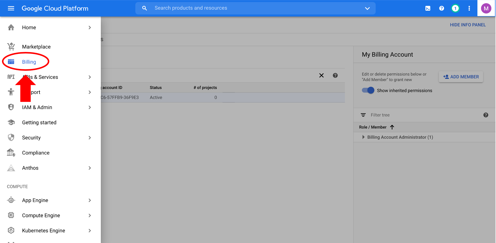
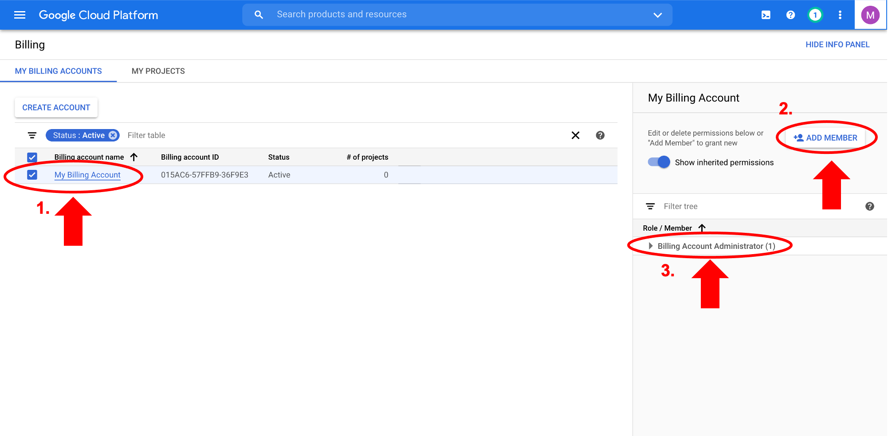

# Setting up GCP account

There are two options for creating a Google Cloud Platform (GCP) billing account:

- set up the account as an individual and pay with your own credit card, or
- set up a G Suite organization account that shares a centralized Google Billing Account and pay with the organization host’s credit card.

!!! note "Centralized billing"

    You can also set up a G Suite organization with a centralized billing account. The Google documentation provides a [quick start guide](https://cloud.google.com/resource-manager/docs/quickstart-organizations) to set this up.

    If a hypothetical user, Jon, decided to start working with the GCP, he and his administrator, Janice, would use the following workflow:

    First, Jon would create an Organization in G Suite, which would make him the “Resource Manager Organization Administrator”. Once the organization has been created, it will automatically have the additional roles of “Resource Manager Project Creator” and “Billing Account Creator”. Jon can then add Janice as either a User or Admin to the G Suite organization. Jon must be an Admin on the G Suite organization to access account management pages on the GCP console (for e.g. to change settings, add/change member permissions, add members). However, since the administrator has the credit card information, Janice has to set up the billing account. Janice would then go to the GCP console to create the Google Billing Account and link a credit card to it. Janice must add Jon to the Google Billing Account as a “Billing Account Administrator” to give him the ability to edit the billing account and add members/permissions to the billing account.

In this tutorial, we will show you how to set up an individual account.

## Step 1: Sign in to GCP

- Click on "Sign in" on the top right corner and sign in with a Google account at: [https://cloud.google.com/](https://cloud.google.com/) with the Chrome web browser.

- After successful sign in, click on "Console" on the top right corner.

## Step 2: Create a GCP billing account

For new users, Google offers a free 3-month $300 trial account. While you still have to enter a valid credit card to set up the billing account, you will not be charged during the trial period, nor will you be automatically charged when it completes unless you turn on automatic billing.

- Click on "Activate" to start setting up the billing account.

- This is a 2-step process. On the first page, you must agree to the Terms of Service, then click "Continue". On the second page, you'll create your payments profile. Enter your address and billing information, then click "Start free trial".

## Step 3: Check billing account information

- Your billing account is now set up! When you sign up for the GCP free trial, you should get an account confirmation email to the email address you used to sign in. To check the billing account, click on the "Billing" tab.

On this page, check the box next to your billing account, below it is called "My Billing Account" (1). The right-hand panel will show information about the members and their roles for your billing account. You can add members by clicking on "Add member" (2). There are many member and role options on the GCP, for example there are several options for billing account member roles - read more from the [Google Cloud support documentation](https://cloud.google.com/billing/docs/how-to/billing-access). By default, as the owner of the billing account, you are designated the "Billing Account Administrator" role (3).

!!! note

    You can add members with roles such as "Billing Account User" if, for example, you want others to have access to your GCP billing account, like team members or other platforms that use the Google cloud, such as the [Terra platform](https://app.terra.bio/).

Now that the billing account is set up, you can use GCP resources!
