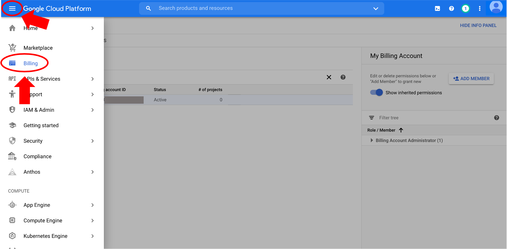

# Setting up GCP account

In this tutorial, you will learn how to create your own Google Cloud Platform (GCP) billing account using your Google account and personal credit card.

## Step 1: Sign in to GCP

- Click on "Sign in" on the top right corner and sign in with a Google account at: [https://cloud.google.com/](https://cloud.google.com/) with the Chrome web browser.

- After successful sign in, click on "Console" on the top right corner.

## Step 2: Create a GCP billing account 

For new users, Google offers a free 3-month $300 trial account. While you still have to enter a valid credit card to set up the billing account, you will not be charged during the trial period, nor will you be automatically charged when it completes unless you turn on automatic billing.

- Click on "Activate" to start setting up the billing account.

- This is a 2-step process. On the first page, you must agree to the Terms of Service, then click "Continue". On the second page, you'll create your payments profile. Enter your address and billing information, then click "Start free trial".

## Step 3: Check billing account information

- Your billing account is now set up! When you sign up for the GCP free trial, you should get an account confirmation email to the email address you used to sign in. To check the billing account, click on the three vertical lines to open the navigation menu and scroll down to "Billing".

On this page, check the box next to your billing account - below it is called "My Billing Account" (a). The right-hand panel will show information about the members and their roles for your billing account. You can add members by clicking on "Add member" (b). There are many member and role options on the GCP. For example, there are several options for billing account member roles - read more from the [Google Cloud support documentation](https://cloud.google.com/billing/docs/how-to/billing-access). By default, as the owner of the billing account, you are designated the "Billing Account Administrator" role (c).

!!! note

    You can add members with roles such as "Billing Account User" if, for example, you want others to have access to your GCP billing account, like team members or other platforms that use the Google cloud, such as the [Terra platform](https://app.terra.bio/).

Now that the billing account is set up, you can use GCP resources!

## Centralized billing account

Alternatively, a centralized billing account to share with a team can be set up using a G Suite organization and a Google Billing Account linked to an organization host's credit card. The Google documentation provides a [quick start guide](https://cloud.google.com/resource-manager/docs/quickstart-organizations) to set this up.

In brief, if a hypothetical user, Jon, decided to start working with the GCP, he and his administrator, Janice, would use the following workflow:

- Jon would create an Organization in G Suite and add Janice as a User to the organization.
- As the administrator, Janice has access to the credit card information, so she must set up the organization's Google billing account. Janice would log in to the GCP console using her G Suite organization Google account to set up the billing account and link a credit card in the same way mentioned [above](#create-billing).
- Janice must add Jon to the billing account as a member with the role "Billing Account Administrator" to give him the ability to edit and use the billing account.
