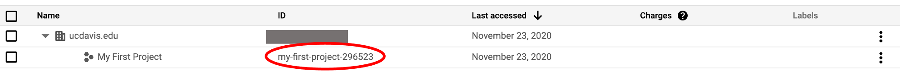
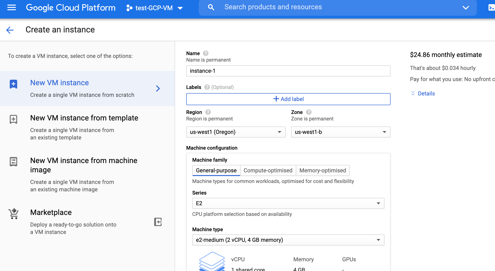
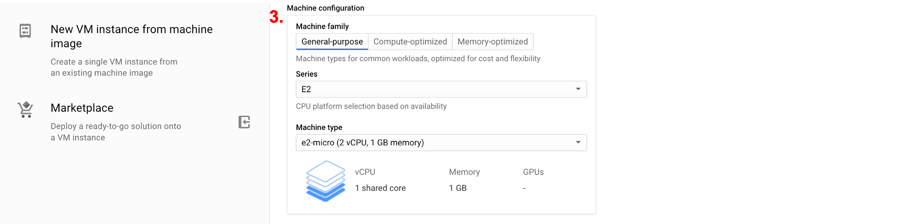
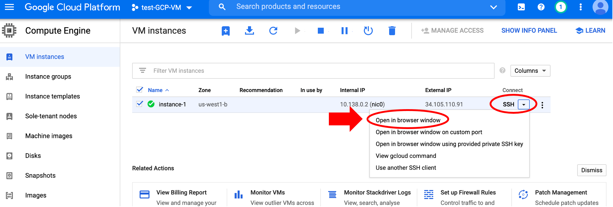

# Setting up a GCP instance

## Step 1: Create a project

- Under the "IAM & Admin" section, select the "Manage Resources" page


- Click on "Create Project", enter a unique project name, and click "Create".


- The new project is now listed in the table, along with a project ID. You'll need the project ID later to connect to a virtual machine (VM).



## Step 2: Configure custom VM

- On the GCP console left-hand panel, scroll down the "Compute Engine" section and select "VM instances". It may take a few minutes to load.


- Click "Create". There are several configuration options to set up:

### 1. Name your VM



Names must be in lowercase letters, numbers. Use hyphens "-" instead of spaces. You'll need the VM name to connect to it.

### 2. Choose a Region

Several regions are available from the dropdown menu. It is less important which zone you choose, and the interface automatically selects a zone based on the region you choose. You'll need the zone name to connect to the VM. We are using the "us-west1 (Oregon)" region.

!!! note "Machine regions"

    **TO DO: add what region and zones mean for GCP**

    This tool can help to choose the region closest to you (http://www.gcping.com/). You may need to refresh several times.

### 3\. Choose machine type and configuration



For this tutorial, select Series "E2" and Machine type `e2-micro`. The estimated monthly cost for each machine type is shown on the top right side panel of the console page next to where you entered the VM name.

!!! note "Machine types"

    **TO DO: add info about what these machine types mean, how to select, etc.**

    **TO DETERMINE: is this a good machine to use?**

### 4\. Customize boot disk


Click on "Change". The default operating system is Debian, change it to "Ubuntu" and select version "Ubuntu 20.04 LTS". For this tutorial, we'll leave the [persistent disk storage](https://cloud.google.com/persistent-disk) as the default 10Gb. Depending on the tasks you will use the VM for, you may need to increase the storage amount (e.g., to 100Gb).

!!! note "Persistent disk storage"

    **TO DO: add info about what this is for and how to choose**

When you're done configuring the VM, click "Create".

## Step 3: Connect to your VM

### **stuck here: error**
```
(gcloud.compute.ssh) Could not fetch resource:
 - Insufficient Permission: Request had insufficient authentication scopes.
```
it looks like the command changed - in the SSH dropdown menu, there's an option to "View gcloud command" and then run that in the Google Cloud Shell.
```
gcloud beta compute ssh --zone "us-west1-b" "test-vm" --project "my-first-project-296523"
```
- then it asks to "Authorize Cloud Shell"
- a bunch of auth stuff, but now it's not recognizing the project ID.
```
The project property must be set to a valid project ID, [my-first-project-29
6523] is not a valid project ID.
```


- Select the VM row by checking the box. Click on the "SSH" dropdown option for your new instance and select "Open in browser window" (note that this option works in Chrome, but not in Firefox).



A new window will open with the instance terminal. The gear icon at the top right can be used to customize terminal window settings (e.g., appearance, text size).


!!! note "Google Cloud Shell"

    Alternatively, you can access the instance from the Google Cloud Shell or a local laptop terminal (will require installing and setting up [`gcloud`](https://cloud.google.com/sdk/docs/install)).

    The GCP console provides a free Google Cloud Shell. This shell environment is useful for small tasks that do *not* require a lot of CPU or memory (as most bioinformatic analyses do). For example, it is a good place to learn how to use the Google shell environment without incurring cost or to access Google Cloud products (e.g., a Google Storage bucket or GCP virtual machine).

    

    Click on the "Activate Cloud Shell" icon. The first time you start the shell, you'll need to agree to the Google Cloud terms of service and privacy policy. After you start the shell, it may take a few minutes to connect. Check the Google support [documentation](https://cloud.google.com/shell/docs/using-cloud-shell) for more information.

- Access the instance, by entering the `gcloud compute ssh` command in the instance terminal window. You'll need your project ID, zone, and instance name.

```
gcloud compute ssh --project <PROJECT_ID> --zone <ZONE> <INSTANCE_NAME>
```


## Step 4: Use the VM

You now have a custom configured VM! Things we could do at this point include:

- [Upload or download files](./gcp3.md)
- [Pull in a docker container](./gcp4.md) to get software without a bunch of software installations
- Run analysis. For example, we could run the [command-line Blast tutorial commands](../Command-Line-BLAST/BLAST1.md) in this GCP instance (instead of the AWS instance used in the tutorial).

Type "exit" in the terminal to close it.

**TO DO: test if blast steps work in GCP instance - probably can choose a smaller VM**

## Step 5: Stop or delete the instance

When you're finished using the virtual machine, be sure to stop or delete it, otherwise it will continue to incur costs.

There are two options (click on the three vertical dots):

- You can "Stop" the instance. This will pause the instance, so it's not running, but it will still incur storage costs. This is a good option if you want to come back to this instance (click "Start") without having to reconfigure and download files every time.

- If you're completely done with the instance, you can "Delete" it. This will delete all files though, so [download](./gcp3.md) any files you want to keep!


