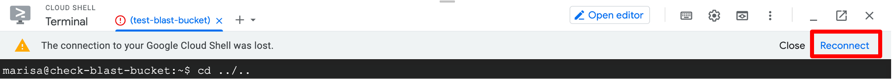
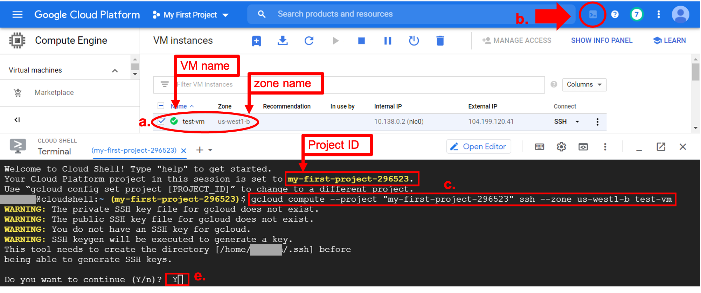

# Setting up a GCP instance

In this section, we'll create a project, configure a GCP virtual machine (VM) instance, and connect to the VM.

## Step 1: Create a project

- Click on the three vertical lines to open the navigation menu and scroll down to <span class="highlight_txt">IAM & Admin</span>, select the <span class="highlight_txt">Manage Resources</span> page.


- Click on <span class="highlight_txt">Create Project</span>, enter a unique project name ("My First Project" in the example below), and click <span class="highlight_txt">Create</span>. The "Location" entry can be left as "No organization" (if a centralized billing account is set up, there would be options to set an "Organization" and "Location" with the G Suite organization name.)


- The new project is now listed in the table, along with a project ID. *You'll need the project ID later to connect to a VM instance.*


## Step 2: Configure custom VM

- On the navigation menu, scroll down to <span class="highlight_txt">Compute Engine</span> and select <span class="highlight_txt">VM instances</span>. It may take a few minutes to load.


- Click the <span class="highlight_txt">Create</span> button in the middle of the page. There are several configuration steps to set up:


### a. Name your VM

Type your VM name in the text box. Names must be in lowercase letters or numbers. Use hyphens "-" instead of spaces. *You'll need the VM name to connect to it.*

### b. Choose a Region

Several regions are available from the dropdown menu. In general, select the region closest to your physical geographic region.

It is less important which zone you choose, and the interface automatically selects a zone based on the region you select. *You'll need the zone name to connect to the VM.* In this example, we selected the "us-west1 (Oregon)" region.

!!! note "Machine regions"

    This tool can help to choose the region closest to you (<http://www.gcping.com>). You may need to refresh several times.

### c. Choose machine type and configuration


For this tutorial, select Series "E2" and Machine type `e2-micro`. This machine type is recommended for day-to-day low cost computing. The estimated monthly cost for each machine type is shown on the top right side panel of the console page next to where you entered the VM name. Depending on the tasks you will use the VM for, you may need to choose a machine with more CPUs and memory.

!!! note "Machine types"

    See [GCP documentation](https://cloud.google.com/compute/docs/machine-types) for more information about machine type and [recommendations](https://cloud.google.com/compute/docs/machine-types#recommendations_for_machine_types) based on workload.

### d. Customize boot disk


Click on <span class="highlight_txt">Change</span>. The default operating system is Debian, change it to "Ubuntu" and select version "Ubuntu 20.04 LTS". For this tutorial, we'll leave the [persistent disk storage](https://cloud.google.com/persistent-disk) as the default 10Gb. Depending on the tasks you will use the VM for, you may need to increase the storage amount.

!!! note "Persistent disk storage"

    This type of block storage allows more flexibility for computing - for example, it can be resized or accessed even after a GCP VM instance is in use or deleted. Here's a quick GCP [youtube video](https://www.youtube.com/watch?v=zovhVfou-DI&vl=en) that highlights Google's persistent disk storage features.

### e. Firewall setting


Check the box by "Allow HTTP traffic" under the Firewall configuration, which opens port 80 (HTTP) and allows you to access the virtual machine. If this box is not checked, you may get an error message when trying to connect to the VM ("Insufficient Permission: Request had insufficient authentication scopes.").

### f. Complete configuration

When you're done configuring the VM, click <span class="highlight_txt">Create</span>. It may take a few seconds to complete; there will be a green check mark next to the VM name.

The VM can be refreshed, start/resumed, stopped, suspended, reset, or deleted using the icons at the top of the page:


=== "Refresh"

    Refresh the instance.

=== "Reset"

    "[Reset](https://cloud.google.com/compute/docs/instances/instance-life-cycle#resetting_an_instance) performs a hard reset on the instance, which wipes the memory contents of the machine and resets the virtual machine to its initial state."

=== "Suspend"

    [Suspending](https://cloud.google.com/compute/docs/instances/instance-life-cycle#suspending_an_instance) "the instance will preserve its running state, similar to closing a laptop. You'll be billed for storage of the suspended VM state and any persistent disks it uses."

=== "Stop"

    [Stopping](https://cloud.google.com/compute/docs/instances/instance-life-cycle#stopping_an_instance) the instance is similar to suspending it, but Google doesn't charge you for VM resources while it's stopped.

=== "Start/Resume"

    Start/resume a suspended or stopped instance to open it again.

=== "Delete"

    When you are completely finished working with the VM it can be deleted. This will remove all VM configurations and work you did in the VM.

!!! tip

    - If you need to pause during this tutorial and want to save your VM instance and any work you did in the instance (e.g., files downloaded), **stop** the VM. You'll be able to start/resume the instance when you come back and all your work should still be there.
    - If your connection times out, click the "Reconnect" button in the Google Cloud Shell.

    

## Step 3: Connect to your VM

For the next steps, refer to this screenshot:



### a. Check box by VM

### b. Open Google Cloud Shell

The GCP console provides a free Google Cloud Shell. This shell environment is useful for small tasks that do **not** require a lot of CPU or memory (as most bioinformatic analyses do). For example, it is a good place to learn how to use the Google shell environment without incurring cost or to access Google Cloud services (e.g., a Google Storage bucket or GCP virtual machine).

Click on the <span class="highlight_txt">Activate Cloud Shell</span> icon. A new panel will open on the bottom half of your screen. The first time you start the shell, you'll need to agree to the Google Cloud terms of service and privacy policy. After starting the shell, it may take a few minutes to connect. Go to the Google support [documentation](https://cloud.google.com/shell/docs/using-cloud-shell) for more information.

The Google Cloud Shell command prompt format will show: `<username>@cloudshell:~ (<project id>)$`.

### c. Connect to VM

Use the `gcloud compute` command to connect to your virtual machine (`gcloud` is a tool from the Google Cloud SDK toolkit). You'll need your project ID, zone, and instance name. In the example command below, the project ID is `"my-first-project-296523"`, the zone is `us-west1-b`, and the instance name is `test-vm`. The `ssh` flag indicates we are accessing the VM with ssh, which we'll set up below. **Replace these values** to run the command for your virtual machine:

=== "Input"

    Usage:
    ```
    gcloud compute --project "<your project ID>" ssh --zone <your zone> <your VM name>
    ```

    Example:

    ```
    gcloud compute --project "my-first-project-296523" ssh --zone us-west1-b test-vm
    ```

### d. Authorise Cloud Shell

The first time you open the shell to access a VM, you will need to authorise the cloud shell. Click on <span class="highlight_txt">Authorise</span>:


Then set up authorization:

- in the shell, enter:

  ```
  gcloud auth login
  ```


- click on the Google link. A new browser tab will open. Log in to the Google account you used to set up the GCP console. Click <span class="highlight_txt">Allow</span> to allow Google Cloud SDK to access your Google account. As a reminder, the SDK toolkit provides a number of important tools like `gcloud` that are used for accessing GCP services. The next page will provide a verification code. Copy/paste the code back in the shell next to "Enter verification code:".

### e. Set up SSH keys

Next, set up SSH public/private keys. This step provides an extra layer of security to protect access to your instance.

Follow the prompts in the terminal:

- "Do you want to continue (Y/n)?": type ++y++
- "Enter passphrase (empty for no passphrase)": you can create a passphrase or it can be left empty, type ++enter++ to move on
- "Enter same passphrase again": type passphrase if you created one, type ++enter++ to move on

When this process is complete, your command prompt in the terminal should switch to `<user name>@<VM name>:~$"`. You're now in the VM space! Check out the [next lesson](./gcp3.md) to run an example analysis using the VM we just configured.
