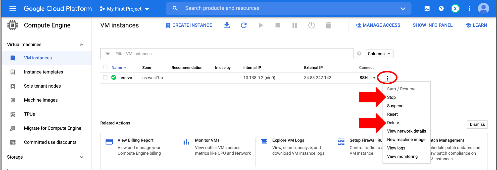

# Testing analysis in a GCP VM

You now have a custom configured VM! Let's test our new GCP virtual machine with a protein sequence BLAST search. This is a shortened version from the full [command-line BLAST tutorial](../Command-Line-BLAST/BLAST1.md), which ran the BLAST search on the Amazon AWS cloud platform.

## Step 1: Install BLAST
```
sudo apt-get update && sudo apt-get -y install python ncbi-blast+
```

- Check version:

=== "Input"

    ```
    blastp -version
    ```

=== "Expected Output"

    ```
    blastp: 2.9.0+
    Package: blast 2.9.0, build Sep 30 2019 01:57:31
    ```


## Step 2: Set up file permissions and temporary directory

`/mnt` is a temporary file system that is large enough to run data analysis in, but is deleted when the VM is shut down.

```
sudo chmod a+rwxt /mnt
cd /mnt
```

## Step 3: Download data

- Use the `curl` command to download data files stored on an OSF repository:

```
curl -o mouse.1.protein.faa.gz -L https://osf.io/v6j9x/download
curl -o zebrafish.1.protein.faa.gz -L https://osf.io/68mgf/download
```

- Type `ls -lht` to list the downloaded files:


- Uncompress the files

```
gunzip *.faa.gz
```

## Step 4: Blast search

- Make a smaller data subset

```
head -n 11 mouse.1.protein.faa > mm-first.faa
```

- Make a database to search query sequences against

```
makeblastdb -in zebrafish.1.protein.faa -dbtype prot
```

- Run protein `blastp` search and save output

```
blastp -query mm-first.faa -db zebrafish.1.protein.faa -out mm-first.x.zebrafish.txt -outfmt 6
```

- Look at output results:

=== "Input"
    ```
    less mm-first.x.zebrafish.txt
    ```

=== "Expected Output"

    Output file looks like:
    ```
    YP_220550.1     NP_059331.1     69.010  313     97      0       4       316     10      322     1.24e-150       426
    YP_220551.1     NP_059332.1     44.509  346     188     3       1       344     1       344     8.62e-92        279
    YP_220551.1     NP_059341.1     24.540  163     112     3       112     263     231     393     5.15e-06        49.7
    YP_220551.1     NP_059340.1     26.804  97      65      2       98      188     200     296     0.10    35.8
    ```

    Type ++q++ to go back to the terminal

## Step 5: Configure Google toolkit

To save output files or download local files from your computer to the VM environment, we will use the Google Cloud SDK toolkit, which provides tools to securely access the GCP platform. The GCP VM already has the toolkit installed, but it needs to be configured and linked to your Google account. We will be using the `gcloud` and `gsutil` tools in this tutorial. More information about this process is available in the GCP support documentation on [gcloud configuration and authorization steps](https://cloud.google.com/sdk/docs/initializing#:~:text=%20gcloud%20init%20performs%20the%20following%20setup%20steps%3A,active%20account%20from%20the%20step%20above%2C...%20More%20).

In the VM terminal, enter:
```
gcloud init --console-only
```

- "Choose the account you would like to use to perform operations for
this configuration": enter ++2++ to "Log in with a new account"
- "Do you want to continue (Y/n)?": enter ++y++
- Click on link under "Go to the following link in your browser". A new browser tab will open. Log in with the same Google account used to sign in to the GCP console.
- After sign in, a new page will open with a verification code. Copy this code and paste into the terminal after "Enter verification code:"
- "Pick cloud project to use": enter the number that corresponds to the option that lists your project ID
- "Do you want to configure a default Compute Region and Zone? (Y/n)?": enter ++n++

The `gcloud` configuration should now be complete. Run the following command to check:

```
gcloud config configurations list  
```

The output should list your GCP Google account email and project ID.

## Step 6: Create Google Storage bucket

Files are stored in buckets in the Google Storage service. Buckets can be managed from the graphical user interface (GUI) section of the GCP console and on the command line. We will create a bucket and move files on command line and then check them on the GUI. To ensure secure transfer of data to/from the cloud, we will use the `gsutil` tool.

- Make a bucket by using the `gsutil mb` command. Google bucket paths always begin with "gs://". You must enter a unique name for your bucket (do not use spaces in the name).

```
gsutil mb gs://<your bucket name>
```

- Bucket names, particularly auto-generated names, can get very long and complicated. To make it easier to type, we can create an alias for the bucket.

```
export BUCKET="gs://<your bucket name>""
```

## Step 7: Copy file to bucket <a name="files-to-bucket"></a>

- We will copy the blast output file to the bucket so it can be downloaded to your computer.

=== "Input"

    ```
    gsutil cp mm-first.x.zebrafish.txt $BUCKET
    ```

=== "Expected Output"

    ```
    Copying file://mm-first.x.zebrafish.txt [Content-Type=text/plain]...
    / [1 files][  268.0 B/  268.0 B]
    Operation completed over 1 objects/268.0 B.
    ```

- Now go to the navigation menu, scroll down to "Storage", and click "Browser". You should see your bucket listed ("my-bucket-blastresults" in this example). Click on the bucket name.


- You should see the file we copied over. Check the box in the file row to download the file to your computer or delete the file. There is a "Download" button above the table to download multiple files, or the download arrow icon at the end of the file row to download individual files. You can also select files to "Delete" from the storage bucket.


## Step 8: Upload files

Finally, you can upload files to the bucket to use in the VM. Click on "Upload Files", choose file(s) to upload from your computer and click "Open". You should now see them in the bucket file list. For this example, we uploaded an empty text file called "testfile.txt".


Back in the VM terminal, use the `gsutil cp` command again to copy the file to the VM home directory. Replace the values below for file/folder name and the location to save them.

=== "Input"

    ```
    # for 1 file
    gsutil cp $BUCKET/<file name> <location to copy file to>

    # for multiple files in a folder
    # the -r is a flag that tells gsutil to recursively copy all specified files
    # the * is a wildcard pattern that tells gsutil to copy all files in the folder
    gsutil cp -r $BUCKET/<folder name>/* <location to copy files to>
    ```

    For this example, we copy the "testfile.txt" file from the Google bucket to the current directory location we're in at the terminal, which is represented by "./":

    ```
    gsutil cp $BUCKET/testfile.txt ./
    ```

=== "Expected Output"

    ```
    Copying gs://my-bucket-blastresults/testfile.txt...
    / [1 files][    4.0 B/    4.0 B]
    Operation completed over 1 objects/4.0 B.
    ```

    Our VM terminal now has the test file! Check by typing `ls -lht`

    ```
    total 134M
    -rw-rw-r-- 1 <username> <username>  840 Nov 24 22:08 mm-first.faa
    -rw-rw-r-- 1 <username> <username>  268 Nov 24 22:12 mm-first.x.zebrafish.txt
    -rw-rw-r-- 1 <username> <username>  49M Nov 24 22:05 mouse.1.protein.faa
    -rw-rw-r-- 1 <username> <username>    4 Nov 24 23:17 testfile.txt
    -rw-rw-r-- 1 <username> <username>  41M Nov 24 22:05 zebrafish.1.protein.faa
    -rw-rw-r-- 1 <username> <username> 6.8M Nov 24 22:08 zebrafish.1.protein.faa.phr
    -rw-rw-r-- 1 <username> <username> 415K Nov 24 22:08 zebrafish.1.protein.faa.pin
    -rw-rw-r-- 1 <username> <username>  37M Nov 24 22:08 zebrafish.1.protein.faa.psq
    ```

## Step 9: Exit VM

To exit the VM, type "exit". Type "exit" again if a message says there are unfinished jobs, but you know nothing is running and you are done working in the shell. This brings you back to the Google Cloud Shell terminal. Type "exit" one more time to completely close the shell panel. Note that closing the VM does not stop the instance!

## Step 10: Stop or delete the instance

When you're finished using the virtual machine, be sure to stop or delete it, otherwise it will continue to incur costs.

There are two options (click on the three vertical dots):

- You can "Stop" the instance. This will pause the instance, so it's not running, but it will still incur storage costs. This is a good option if you want to come back to this instance (click "Start/Resume") without having to reconfigure and download files every time.

- If you're completely done with the instance, you can "Delete" it. This will delete all files though, so [download](#files-to-bucket) any files you want to keep!




## TO DO: want something here about checking billing...?
- but if you're on the free trial, nothing will show up (not even compute usage) until you run out of the trial period...
