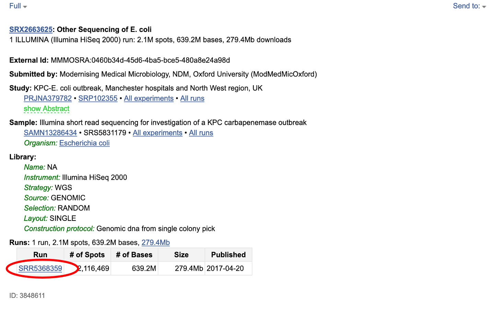
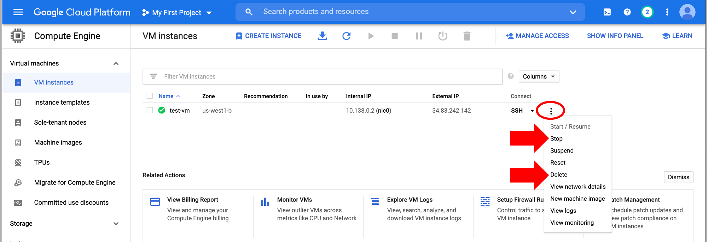

# Example 2: Download SRA data

In this example, we'll configure a new VM and learn how to download fastq files from the National Center for Biotechnology Information (NCBI) Sequence Read Archive (SRA) database.

## Step 1: Set up VM

We need a new VM for this example; you can use the same project. Follow the steps from the [previous section](./gcp2.md), with these modifications:

- choose a Region that begins with "us-" because the NCBI SRA data is located in the United States (any is fine, i.e., `us-west1 (Oregon)`)
- select an **`e2-medium`** instance. We need a machine with a bit more memory than the `e2-micro` we used in the previous example.
- for this example, do *not* check either box for the Firewall configuration.

[Connect](./gcp2.md) to the VM with the Google Cloud Shell (authorise shell and set up SSH keys if necessary).

## Step 2: Install conda for Linux

The VM we set up is using an Ubuntu operating system. We will use conda to install the SRA toolkit for Ubuntu.

In the cloud shell, enter the following to download and install Miniconda for Linux:

```
curl -LO https://repo.anaconda.com/miniconda/Miniconda3-latest-Linux-x86_64.sh
bash Miniconda3-latest-Linux-x86_64.sh
```

Follow the prompts to complete conda set up - answer `yes` to all the questions!

!!! note

    The [SRA Github installation instructions](https://github.com/ncbi/sra-tools/wiki/02.-Installing-SRA-Toolkit) downloads and installs the toolkit with a different approach, however it requires interactive configuration steps and as of February 2021 there is an error with data downloads, so we are showing the conda installation method.

## Step 3: Install SRA toolkit

We will create a conda environment and install SRA toolkit version 2.10.9 in it, where the conda channels and toolkit version are defined in a yaml file.

Make the "environment.yml" file:

```
nano environment.yml
```

Copy and paste the text below into the nano text editor:

```
channels:
 - conda-forge
 - bioconda
 - defaults
dependencies:
 - sra-tools=2.10.9
```

Save with ++ctrl++ ++o++ and exit with ++ctrl++ ++x++ the editor.

Create the conda environment:

```
conda env create -n sratest -f environment.yml
```

Activate the environment:

```
conda activate sratest
```

Let's check that the installation worked. The command `fasterq-dump` (a faster version of `fastq-dump`) is used to specify NCBI accessions to download.

=== "Input"

    Take a look at the help documentation for a list of the options associated with this command:

    ```
    fasterq-dump -h
    ```

=== "Expected Output"

    The top of the help documentation:

    ```
    Usage: fasterq-dump [ options ] [ accessions(s)... ]
    Parameters:
        accessions(s)                    list of accessions to process
    Options:
        -o|--outfile <path>              full path of outputfile (overrides usage
                                        of current directory and given accession)
    ...
    ```

## Step 4: Download fastq files

Let's download fastq data files from an [*E. coli* sample](https://www.ncbi.nlm.nih.gov/sra/SRR5368359). We need the "SRR" ID:



Download the file using the `fasterq-dump` command and specify the ouput (`-O`) directory as `./`, which sets it to save outputs in the current directory:

=== "Input"

    ```
    fasterq-dump SRR5368359 -O ./
    ```

=== "Expected Output"

    When the command completes, the output in the shell should look like this:
    ```
    spots read : 2,116,469
    reads read : 4,232,938
    reads written : 4,232,938
    ```

There should be two fastq files in our directory that can be used for analysis!

=== "Input"

    ```
    ls -lh
    ```

=== "Expected Output"

    ```
    total 1.5G
    -rw-rw-r-- 1 <username> <username> 767M Jan  5 02:40 SRR5368359_1.fastq
    -rw-rw-r-- 1 <username> <username> 767M Jan  5 02:40 SRR5368359_2.fastq
    ```

Take a look at the file!

=== "Input"

    ```
    head -n 4 SRR5368359_1.fastq
    ```

=== "Expected Output"

    ```
    @SRR5368359.1 1 length=151
    CTATATTGGTTAAAGTATTTAGTGACCTAAGTCAATAAAATTTTAATTTACTCACGGCAGGTAACCAGTTCAGAAGCTGCTATCAGACACTCTTTTTTTAATCCACACAGAGACATATTGCCCGTTGCAGT
    CAGAATGAAAAGCTGAAAAA
    +SRR5368359.1 1 length=151
    C@@FFEFFHHHHHJJGIIIIIJIJJJJJJJJJIJJJJJJGJJJJJJJJJJJJJJJJIIIJI=FHGIHIEHIJJHHGHHFFFFFDEEEDEDDDDCDDDDBDDCCCDDDDDDDDDDDDC@CCCDDD>ADDCDD
    DDCDDDDDDDDDDDDD@CDB
    ```

## Step 5: Exit VM

To exit the VM, type "exit". Type "exit" again if a message says there are unfinished jobs, but you know nothing is running and you are done working in the shell. This brings you back to the Google Cloud Shell terminal. Type "exit" one more time to completely close the shell panel. Note that closing the VM does not stop the instance!

## Step 6: Stop or delete the instance

When you're finished using the virtual machine, be sure to stop or delete it, otherwise it will continue to incur costs.

There are two options (click on the three vertical dots):

- You can "Stop" the instance. This will pause the instance, so it's not running, but it will still incur storage costs. This is a good option if you want to come back to this instance (click "Start/Resume") without having to reconfigure and download files every time.

- If you're completely done with the instance, you can "Delete" it. This will delete all files though, so [download](./gcp3.md#files-to-bucket) any files you want to keep!


