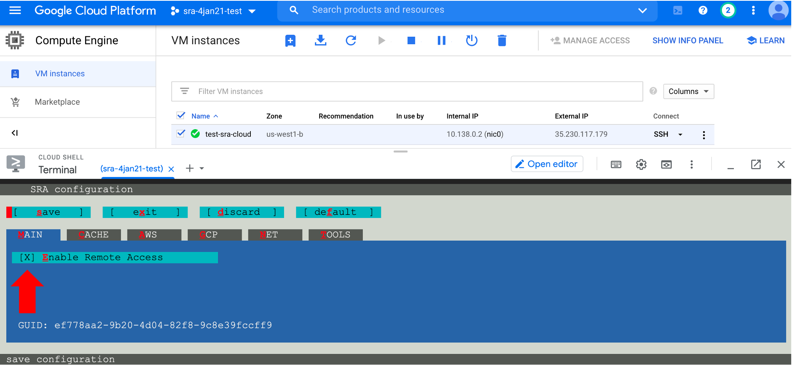
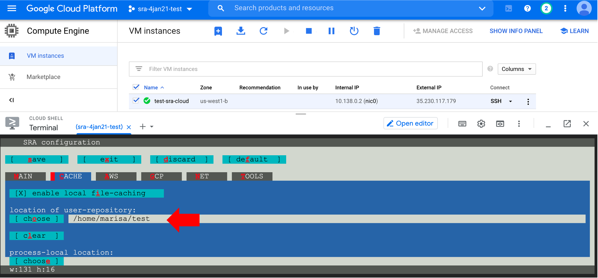
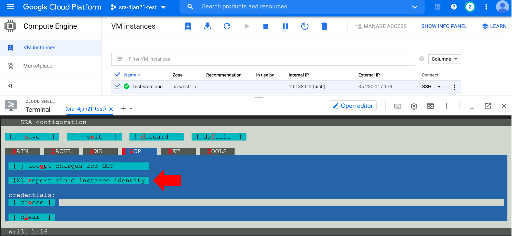

# Example 2: Download SRA data

In this example, we'll configure a new VM and learn how to download fastq files from the National Center for Biotechnology Information (NCBI) Sequence Read Archive (SRA) database.

## Step 1: Set up VM

As in the [previous section](./gcp2.md), create a new project and create a VM. This time, for the VM configurations:

- be sure to choose a Region that begins with "us-" because the NCBI SRA data is located in the United States (any is fine, i.e., `us-west1 (Oregon)`)
- do not check either box for the Firewall configuration.

Connect to the VM with the Google Cloud Shell (authorise shell and set up SSH keys if necessary).


## Step 2: Install SRA toolkit

The VM we set up is using an Ubuntu operating system. We will install the SRA toolkit for Ubuntu following the [SRA Github instructions](https://github.com/ncbi/sra-tools/wiki/02.-Installing-SRA-Toolkit).

In the cloud shell, enter:

```
wget --output-document sratoolkit.tar.gz http://ftp-trace.ncbi.nlm.nih.gov/sra/sdk/current/sratoolkit.current-ubuntu64.tar.gz
```

Uncompress the file:

```
tar -vxzf sratoolkit.tar.gz
```

## Step 3: Set path

The SRA toolkit tools are located in the `/bin` directory. Set the path to point to this location. We are installing version 2.10.9. If you install a different version, be sure to edit the command below:

```
export PATH=$PATH:$PWD/sratoolkit.2.10.9-ubuntu64/bin
```

Check the path works to call SRA tools:

=== "Input"

    ```
    which fasterq-dump
    ```

=== "Expected Output"

    ```
    /home/<username>/sratoolkit.2.10.9-ubuntu64/bin/fasterq-dump
    ```

## Step 4: Configure SRA toolkit

There are three configuration steps. The configuration instructions are detailed on the [SRA Github page](https://github.com/ncbi/sra-tools/wiki/03.-Quick-Toolkit-Configuration).

For the second step, we need an empty directory to store cached files. This makes a directory called "test":

```
mkdir test
```

Now, enter:

```
vdb-config -i
```

A new panel will open. The first configuration is to ensure there is an ++x++ in the brackets by "Enable Remote Access":



Second, type ++c++ to open the "Cache" tab. An ++x++ should be by “enable local file-caching”. If not, type ++i++ to select it. Type ++o++ to choose the “location of user-repository”. A green and yellow panel will open up. Use the up and down arrows on your keyboard or your mouse to navigate to the empty directory we made in the previous step.  When your directory is selected, click “OK”.


Check that the correct directory is printed under "location of user-repository":



Finally, type ++g++ to open the GCP tab. Type ++r++ to select “report cloud instance identity”.



Configuration is complete! Type ++s++ to save the settings and ++o++ to select ok. Then type ++x++ to exit the configuration page to return to the cloud shell.

## Step 5: Test run command

Let's check that the configuration was successful

=== "Input"

    ```
    fastq-dump --stdout SRR390728 | head -n 8
    ```

=== "Expected Output"

    ```
    @SRR390728.1 1 length=72
    CATTCTTCACGTAGTTCTCGAGCCTTGGTTTTCAGCGATGGAGAATGACTTTGACAAGCTGAGAGAAGNTNC
    +SRR390728.1 1 length=72
    ;;;;;;;;;;;;;;;;;;;;;;;;;;;9;;665142;;;;;;;;;;;;;;;;;;;;;;;;;;;;;96&&&&(
    @SRR390728.2 2 length=72
    AAGTAGGTCTCGTCTGTGTTTTCTACGAGCTTGTGTTCCAGCTGACCCACTCCCTGGGTGGGGGGACTGGGT
    +SRR390728.2 2 length=72
    ;;;;;;;;;;;;;;;;;4;;;;3;393.1+4&&5&&;;;;;;;;;;;;;;;;;;;;;<9;<;;;;;464262
    ```

## Step 6: Download fastq files

Let's download fastq data files from an [*E. coli* sample](https://www.ncbi.nlm.nih.gov/sra/SRR5368359). We need the "SRR" ID:


Download the file using the `fasterq-dump` command and specify the ouput (`-O`) directory (`./` sets it to the current directory):

=== "Input"

    ```
    fasterq-dump SRR5368359 -O ./
    ```

=== "Expected Output"

    When the command completes, the output in the shell should look like this:
    ```
    spots read : 2,116,469
    reads read : 4,232,938
    reads written : 4,232,938
    ```

There should be two fastq files in our directory that can be used for analysis!

=== "Input"

    ```
    ls -lh
    ```

=== "Expected Output"

    ```
    total 1.5G
    -rw-rw-r-- 1 <username> <username> 767M Jan  5 02:40 SRR5368359_1.fastq
    -rw-rw-r-- 1 <username> <username> 767M Jan  5 02:40 SRR5368359_2.fastq
    ```

## Step 7: Exit VM

To exit the VM, type "exit". Type "exit" again if a message says there are unfinished jobs, but you know nothing is running and you are done working in the shell. This brings you back to the Google Cloud Shell terminal. Type "exit" one more time to completely close the shell panel. Note that closing the VM does not stop the instance!

## Step 8: Stop or delete the instance

When you're finished using the virtual machine, be sure to stop or delete it, otherwise it will continue to incur costs.

There are two options (click on the three vertical dots):

- You can "Stop" the instance. This will pause the instance, so it's not running, but it will still incur storage costs. This is a good option if you want to come back to this instance (click "Start/Resume") without having to reconfigure and download files every time.

- If you're completely done with the instance, you can "Delete" it. This will delete all files though, so [download](./gcp3.md#files-to-bucket) any files you want to keep!


