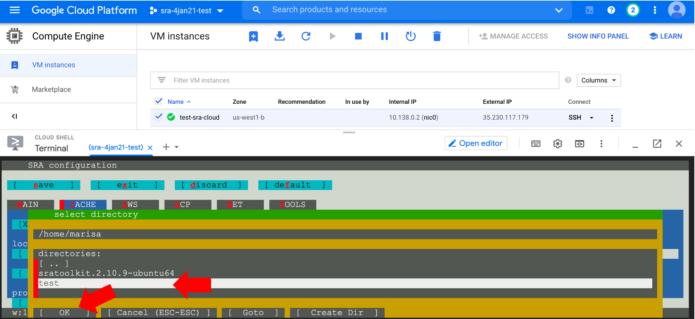

## Step 4: Configure SRA toolkit

There are three configuration steps. The configuration instructions are detailed on the [SRA Github page](https://github.com/ncbi/sra-tools/wiki/03.-Quick-Toolkit-Configuration).

For the second step, we need an empty directory to store cached files. This makes a directory called "test":

```
mkdir test
```

Now, enter:

```
vdb-config -i
```

A new panel will open.

### Enable remote access

This setting tells sra-tools to look for data from remote servers at NCBI, Amazon Web Services (AWS), or GCP.

The first configuration is to ensure there is an ++x++ in the brackets by "Enable Remote Access":


### Configure cache

This configuration sets up a persistent cache for downloaded files, so they do not need to be accessed remotely multiple times.

- Type ++c++ to open the "Cache" tab.
- An ++x++ should be by “enable local file-caching”. If not, type ++i++ to select it.
- Type ++o++ to choose the “location of user-repository”. A green and yellow panel will open up.
- Use the ++down++ on your keyboard or your mouse to navigate to the empty directory, "test", we made in the previous step, type ++enter++.
- When your directory is selected, click the “OK” button (a red bar will appear next to "OK") and type ++enter++.
- Type ++y++ to change the location to the "test" directory



Check that the correct directory is printed under "location of user-repository":


### Report cloud instance identity

This setting tells sra-tools that we are using a GCP instance. Using this setting also improves file download speed.

- Type ++g++ to open the GCP tab.
- Type ++r++ to select “report cloud instance identity”.


Type ++s++ to save the settings and ++o++ to select ok. Then type ++x++ to exit the configuration page to return to the cloud shell. Configuration is complete!
