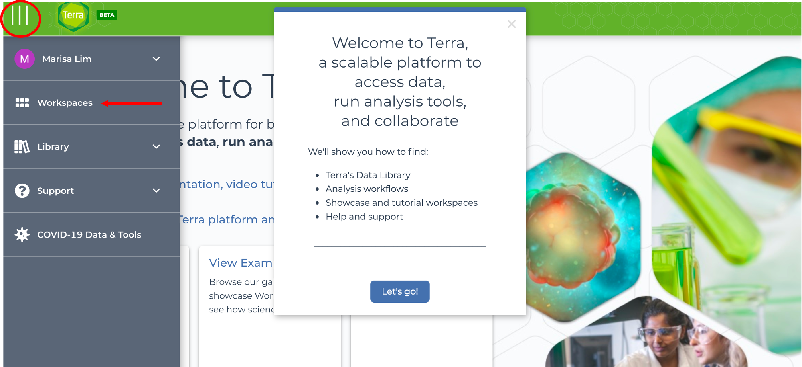
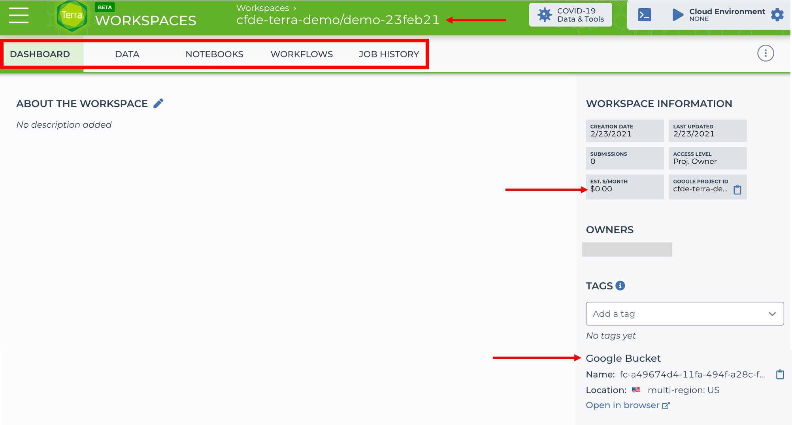

# Navigating Terra Workspaces

Let's learn the basics of Terra workspaces by creating one!

!!! important
    Remember that you need the following before you can use Terra workspaces:

    1. GCP billing account with Terra added as a "Billing Account User"
    2. Terra billing project linked to GCP billing account

    Go back to the [previous lesson](./1terra.md) if you need to set these up!

## Step 1: Navigate to Workspaces

Click on the three lines and click on the Workspaces tab:

## Step 2: Create a new workspace

Click on the + button to create a new workspace:

## Step 3: Enter workspace information

For the new workspace, enter:

1. A unique workspace name
2. Use the dropdown menu to select a Terra billing project (created [previously](./1terra.md))
3. Optional: add a short description for the workspace
4. Optional: select group(s) to give access to the workspace with [Authorization Domains permissions](https://support.terra.bio/hc/en-us/articles/360026775691-Managing-data-privacy-and-access-with-Authorization-Domains)

Click CREATE WORKSPACE. It may take a few seconds for the workspace to open.

## Basics of Terra workspaces

The Terra workspace is an organized repository with the following tabs:

- `Dashboard`: documenting analyses
- `Data`: uploading new or accessing existing datasets
- `Notebooks`: building Jupyter notebooks
- `Workflows`: running workflows
- `Job History`: checking workflow job status

When your workspace opens, you should see the Dashboard! Your <billing project/workspace name> is shown at the top of the page. In the screenshot below, we used a billing project called "cfde-terra-demo" and a workspace called "demo-23feb21":

### Workspace Information

The right-side panel of the Dashboard displays useful information about the workspace, including workspace cost per month. This rate is associated with data **storage**, *not* compute. Even if you are not running notebooks or workflows from a given workspace, the workspace continues to accrue storage costs for any associated data, input, or output files stored in the assigned Google Storage bucket. For this reason, it's a good habit to clean up workspaces that are not being used and can be safely deleted (see below for [deleting workspaces](#delete-worksp)).

Currently, Terra does not report workflow costs on the Terra interface. Users should go to the Google Cloud Platform (GCP) console to check billing account charges (see our GCP note on [monitoring billing account](../Introduction-to-GCP/gcp1.md)). The GCP console provides billing breakdowns and monthly invoices.

!!! tip

    However, the GCP does not track individual workflow or workspace costs. GCP charges are reported by Terra billing project.

    As you get started with GCP and Terra, it is best to carefully monitor how costs accrue from running demo or scaled down projects so you can better estimate cost patterns.

### Storage

A Google Storage bucket is automatically assigned to each workspace (the bucket path is displayed on the Dashboard). The bucket will hold any files you upload and all output files from workflows.

We'll discuss the `Data`, `Workflows`, and `Job History` tabs in more detail in the next lessons. For now, let's keep exploring workspace features.

## What else can you do with a workspace?

### Edit

You can edit any workspaces linked to your billing project(s) or workspaces that you have been given permission to edit.

### Clone

You can make a clone of an existing workshop and edit it. This feature is useful if you want to use a publicly available workspace that has analysis workflows or data you want to use for your own project.

For example, Terra maintains a few demo workspaces that you can clone to learn how to use data tables, workflows, and notebooks. Let's clone the workspace for data tables.

- In the workspace search bar, type "quickstart"
- Click on the three dots at the end of the row for "Terra-Data-Tables-Quickstart"
- Click Clone

- Select your Terra billing project from the dropdown menu
- Optional: edit the workspace name and description
- Click CLONE WORKSPACE

The cloned workspace should list your billing project and you as the owner of the workspace, but all the contents in the workspace will start out the same as the original one.

!!! tip

    You can use this space to add your own notes on the Dashboard, upload files in the Data tab, run notebooks or workflows, and of course, follow the quickstart tutorials and exercises!

    We recommend trying the Terra quickstart lessons to practice using the Terra interface.

### Share

- Similar to the clone steps, on the workspace you want to share, click the three dots and select Share

- Add the email address(es) of people you want to add or the name of a group if you've made one and type ++enter++
- The people you've added will be listed in the pop up box, where you can assign their permissions ("Reader", "writer", or "Owner") and decide whether they can share and/or use the workspace to compute.

### Delete 

It's good to clean up old workspaces. It helps to keep track of active workspaces and saves you from accruing storage costs on workspaces you do not need.

- Similar to the clone steps, on the workspace you want to delete, click the three dots and select Delete

!!! warning

    You cannot retrieve deleted workspaces or their contents!

- A pop up window will open checking to make sure you do want to delete the workspace. If this is true, type "Delete Workspace" and click DELETE WORKSPACE

In the next lesson, we'll run an existing workflow on Terra.
