In this lesson, we will learn to set-up an instance with Ubuntu, an open source software operating system and part of the Amazon Free Tier program.

Follow along with these steps and/or watch our [walk-through tutorial](./introtoaws2.md) to get started!

## Step 1: Log in to an AWS account

* Go to [Amazon Web Services](https://aws.amazon.com)
* Click on My Account
* Select  AWS Management Console from the drop down menu.
* Alternatively, click on Sign In to the Console.
* Log in with your username & password as a **Root user**.

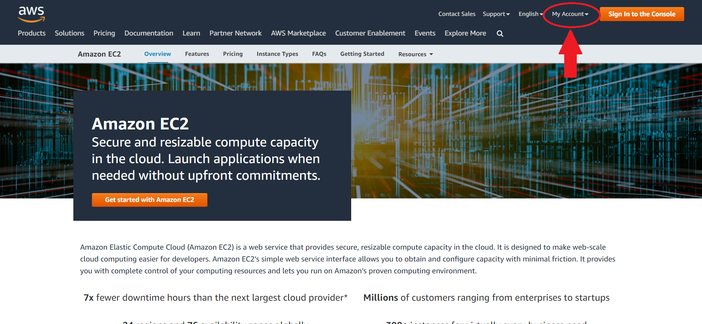

!!! info "Account Setup"

          If you need to create an account, please follow the [AWS instructions for creating an account](https://aws.amazon.com/premiumsupport/knowledge-center/create-and-activate-aws-account/). You will need a credit card to set up the account. New accounts could take up to 24 hours to be activated.

## Step 2: Select region

* Select the AWS region of your remote machine that is closest to your current geographic location. It is displayed on the top right corner.
* Click on it and choose the location that best describes the region you are currently located. In this tutorial, we have selected **N.California**.

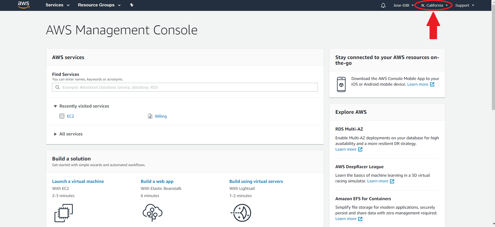

!!! note "AWS Region"

    The default region is automatically displayed in the AWS Dashboard. The [choice of region](https://docs.aws.amazon.com/emr/latest/ManagementGuide/emr-plan-region.html) has implications on fees, speed, and performance.

## Step 3: Choose virtual machine

* Click on Services (upper left corner):

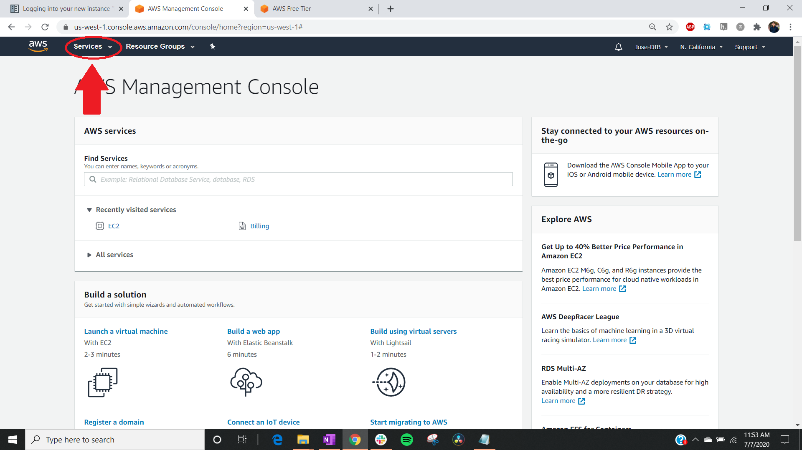

* Click on EC2:

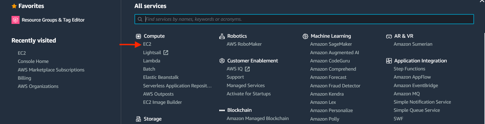

!!! Note "Amazon EC2"

         [Amazon Elastic Cloud Computing (Amazon EC2)](https://aws.amazon.com/ec2/?ec2-whats-new.sort-by=item.additionalFields.postDateTime&ec2-whats-new.sort-order=desc) features virtual computing environments called instances. They have varying combinations of CPU, memory, storage, and networking capacity, and give you the flexibility to choose the appropriate mix of resources for your applications.  

* Click on Launch Instance:

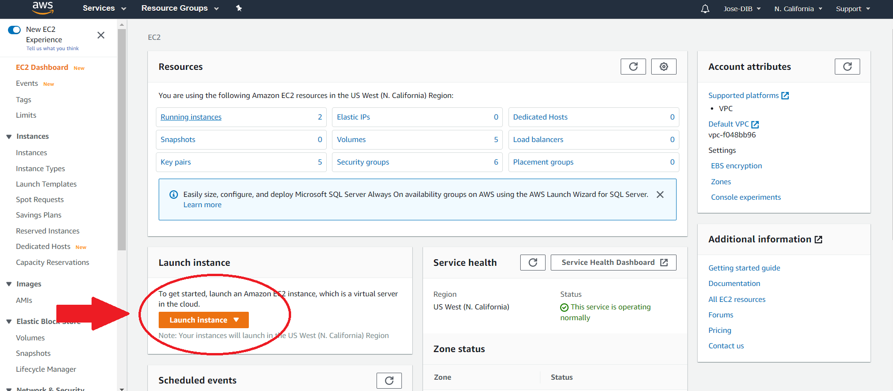

## Step 3: Choose an Amazon Machine Image (AMI)

An Amazon Machine Image provides the template for the root volume of an instance (operating system, application server, and applications). It is akin to the Operating Sytem (OS) on a computer.

* Select AWS Marketplace on the left hand side tab:

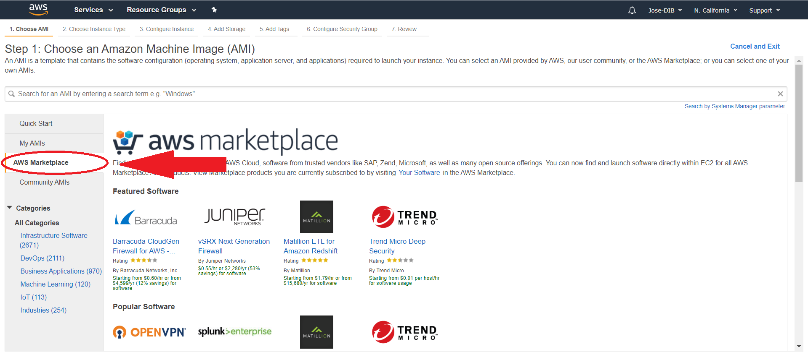

* Type `Ubuntu Pro` in the search bar. Choose `Ubuntu Pro 20.04 LTS` by clicking Select:

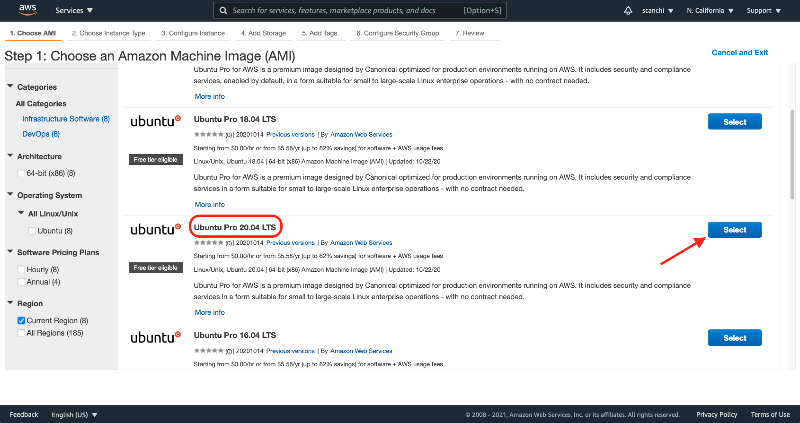

!!! info "Ubuntu 20.04 AMI"

     `Ubuntu 20.04` was released in 2020 and is the latest version. This is a **Long Term Support (LTS)** release which means it will be equipped with software updates and security fixes. Since it is a `Pro` version the support will last for ten years until 2030.   

* Click Continue on the popup window:

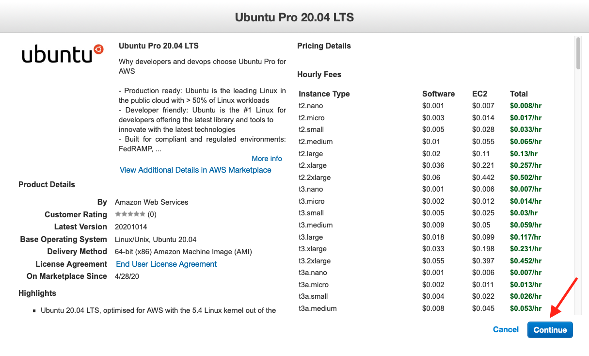

## Step 4: Choose an instance type

Amazon EC2 provides a wide selection of instance types optimized to fit different use cases. You can consider instances to be similar to the hardware that will run your OS and applications. [Learn more about instance types and how they can meet your computing needs](https://aws.amazon.com/ec2/instance-types/).

* For this tutorial we will select the row with `t2.micro` which is free tier eligible:

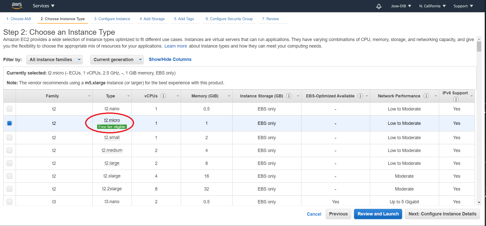

!!! Note "Free Tier Eligible"

    The Free tier eligible tag lets us know that this particular operating system is covered by the [Free Tier program](https://aws.amazon.com/free/?all-free-tier.sort-by=item.additionalFields.SortRank&all-free-tier.sort-order=asc) where you use (limited) services without being charged. Limits could be based on how much storage you have access to and/or how many hours of compute you can perform in a one month.

* You can proceed to launch the instance with default configurations by clicking on Review and Launch.

## Step 5: Optional configurations

There are several optional set up configurations.

* Start the first option by clicking Next: Configure Instance Details on the AWS page.

=== "Configure Instance"

    [Configure the instance to suit your requirements](https://docs.aws.amazon.com/AWSEC2/latest/UserGuide/Configure_Instance.html). You can

    * change number of instances to launch
    * select the subnet to use
    * modify the STOP and Terminate behavior
    * control if you would like the instance to update with any patches when in use.
    * request Spot instances

    !!! info "Spot Instance"

        A [Spot Instance](https://aws.amazon.com/ec2/spot/?cards.sort-by=item.additionalFields.startDateTime&cards.sort-order=asc) is an unused EC2 instance that is available for less than the On-Demand price. Because Spot Instances enable you to request unused EC2 instances at steep discounts, you can lower your Amazon EC2 costs significantly.

=== "Add Storage"

    * Your instance comes with a in built storage called **instance store** and is useful for temporary data storage. The default root volume on a `t2.micro` is 8 GB.
    * For data you might want to retain longer or use across multiple instances or encrypt it is best to use the [**Amazon Elastic Block Store volumes (Amazon EBS)**](https://docs.aws.amazon.com/AWSEC2/latest/UserGuide/AmazonEBS.html).
    * Attaching EBS volumes to an instance are similar to using external hard drives connected to a computer.
    * Click on Add New Volume for additional storage.

    !!! info "Free Storage"

        You can get upto 30 GB of EBS general purpose (SSD) or Magnetic storage when using Free tier instances.

=== "Add Tags"

    * Tags are useful to categorize your AWS resources: instances and volumes.
    * A tag consists of a case-sensitive key-value pair. Some examples: GTEx-RNAseq, General-GWAS, KF-GWAS.
    * [Learn more about tagging your Amazon EC2 resources](https://docs.aws.amazon.com/AWSEC2/latest/UserGuide/Using_Tags.html).

=== "Configure Security Group"

    * Similar to setting up a firewall through which we would modify connection of external world and the EC2 instance.
    * Blocks/allow connections based on port number and IP.
    * You can create a new security group or select from an existing one.
    * [Learn more about Security groups for EC2 instances](https://docs.aws.amazon.com/AWSEC2/latest/UserGuide/ec2-security-groups.html).   

## Step 6: Review and launch instance

The last tab in setup is **Review** which summarizes all the selected configurations for the instance.

* Click Launch after review.

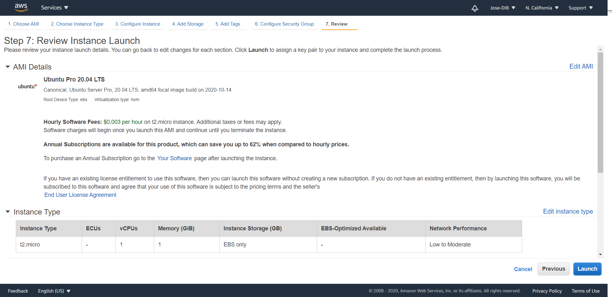

### Step 6a: Key pair
If you are launching an AWS instance for the first time, you will need to generate a key pair.

* Choose the Create a new key pair option from the drop down menu.
* Type any name under **Key pair name**. In this tutorial we are naming it `amazon.pem`.
* Click Download Key Pair to obtain the `.pem` file to your local machine. You can access the `.pem` file from the `Downloads` folder which is typically the default location for saving files. Next time you launch an instance, you can reuse the key pair you just generated.
* If you have a previously generated key pair, you can reuse it to launch an instance using Choose an existing key pair option.

!!! warning

    Do not select **Proceed without a key pair** option since you will not be able to connect to the instance.

* Check the acknowledgement box, and click Launch Instances.

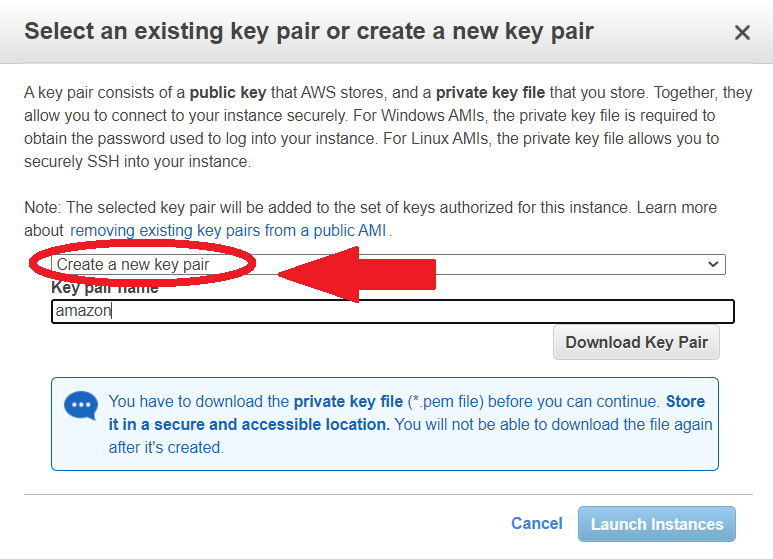

!!! Note "Why do I need a key pair?"

    For security purposes, the SSH (Secure Shell) protocol uses encryption to secure the connection between a client and a server. All user authentication, commands, output, and file transfers are encrypted to protect against attacks in the network. With SSH protocol (secure Shell) public key authentication improves security as it frees users from remembering complicated passwords.

### Step 6b: Launch status

You will be directed to the **Launch Status** page where the green colored box on top indicates a successful launch!

* Click on this first hyperlink, which is the instance ID. Your hyperlink may be different.

### Step 6c: Public DNS

The instance console page shows you a list of all your active instances. Users may launch as many instances as they wish. Just remember that every instance costs money if you don't qualify for the Free Tier.

* Obtain the **Public DNS** address with the format `ec2-XX-XX-X-XXX.us-yyyy-y.compute-1.amazon.aws.com` located under the Details tab.

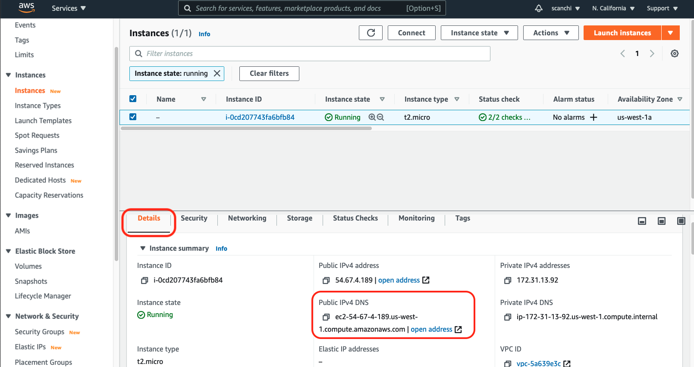

You have now successfully launched your AWS instance! You will need the Public DNS address from this amazon webpage to access your AWS instance, so do not close the page yet.

If you happen to close the webpage on accident, [click on this link](https://us-west-1.console.aws.amazon.com/ec2/v2/home?region=us-west-1#Instances:sort=instanceId).

Continue on to the next lesson to learn how to connect to your AWS instance!
