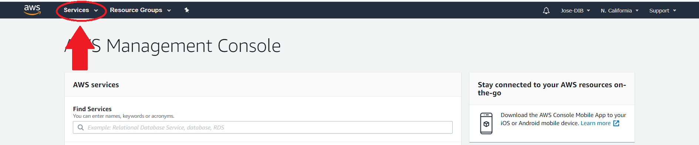
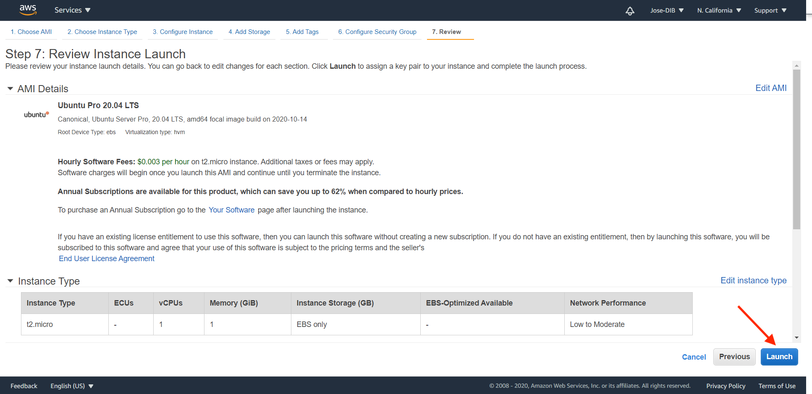

To start, we will learn how to set-up Ubuntu 20.04 Pro LTS open source software operating system. Ubuntu 20.04 Pro LTS is one of the programs offered in the Amazon Free Tier as well as one of the most popular open source operating systems.

Follow along with these steps and/or watch our [walk-through tutorial](./introtoaws2.md) to get started!

### Step 1: Log in to an AWS account

Go to [Amazon Web Services](https://aws.amazon.com), click on My Account and select  AWS Management Console from the drop down menu.
 Alternatively, click on Sign In to the Console. Log in with your username & password as a **Root user**.

!!! info "Account Setup"

          If you need to create an account, please follow the [AWS instructions for creating an account](https://aws.amazon.com/premiumsupport/knowledge-center/create-and-activate-aws-account/). You will need a credit card to set up the account. New accounts could take up to 24 hours to be activated.

### Step 2: Choose virtual machine
**Select region**

Select the AWS region of your remote machine that is closest to your current geographic location. It is displayed on the top right corner. Click on it and choose the location that best describes the region you are currently located. In this tutorial, we have selected **N.California**.

!!! note "AWS Region"

    The default region is automatically displayed in the AWS Dashboard. The [choice of region](https://docs.aws.amazon.com/emr/latest/ManagementGuide/emr-plan-region.html) has implications on fees, speed, and performance.

Click on Services (upper left corner):

Click on EC2:

!!! Note "Amazon EC2"

         Amazon Elastic Cloud Computing (Amazon EC2) features virtual computing environments called instances. These instances can vary in configurations of CPU, memory, storage, networking capacity. For the purposes of future tutorials, we will launch Ubuntu 20.04 Pro LTS. LTS releases are the ‘enterprise grade’ releases of Ubuntu and are utilized the most.

Click on Launch Instance:

### Step 3: Choose an Amazon Machine Image (AMI)

An Amazon Machine Image is a special type of virtual appliance that is used to create a virtual machine within the Amazon EC2. It is a template for the root volume of an instance (operating system, application server, and applications).

Select AWS Marketplace on the left hand side tab:

Type `Ubuntu 20.04` in the search bar. Choose `Ubuntu 20.04 LTS - Focal` by clicking Select:

Click Continue

### Step 4: Choose an instance type

Amazon EC2 provides a wide selection of instance types optimized to fit different use cases. Instances are virtual servers that can run applications. They have varying combinations of CPU, memory, storage, and networking capacity, and give you the flexibility to choose the appropriate mix of resources for your applications. [Learn more about instance types and how they can meet your computing needs](https://aws.amazon.com/ec2/instance-types/).

Select the row with `t2.micro` which is free tier eligible:

!!! Note "Free Tier Eligible"

    The Free tier eligible tag lets us know that this particular operating system is covered by the [Free Tier program](https://aws.amazon.com/free/?all-free-tier.sort-by=item.additionalFields.SortRank&all-free-tier.sort-order=asc) where you use (limited) services without being charged. Limits could be based on how much storage you have access to and/or how many hours of compute you can perform in a one month.

### Step 5: Optional configurations

There are several optional set up configurations. You can proceed to launch the instance we have configured thus far in the tutorial by clicking on Review and Launch. Alternatively, click on the following tabs to continue configuring. Start the first option by clicking Next: Configure Instance Details on the AWS page.

=== "Configure Instance"

    Configure the instance to suit your requirements. You can launch multiple instances from the same AMI, request Spot instances to take advantage of the lower pricing, assign an access management role to the instance, and more.

    !!! info "Spot Instance"

    A [Spot Instance](https://aws.amazon.com/ec2/spot/?cards.sort-by=item.additionalFields.startDateTime&cards.sort-order=asc) is an unused EC2 instance that is available for less than the On-Demand price. Because Spot Instances enable you to request unused EC2 instances at steep discounts, you can lower your Amazon EC2 costs significantly.

=== "Add Storage"

    Your instance will be launched with the following storage device settings. You can attach additional EBS volumes and instance store volumes to your instance, or edit the settings of the root volume. You can also attach additional EBS volumes after launching an instance, but not instance store volumes. Learn more about storage options in Amazon EC2.

=== "Add Tags"

    A tag consists of a case-sensitive key-value pair. For example, you could define a tag with key = Name and value = Webserver. A copy of a tag can be applied to volumes, instances or both. Tags will be applied to all instances and volumes. Learn more about tagging your Amazon EC2 resources.

=== "Configure Security Group"

    A security group is a set of firewall rules that control the traffic for your instance. On this page you can add rules to allow specific traffic to reach your instance. You can create a new security group or select from an existing one.

### Step 6: Review and launch instance

The last tab in setup is **Review** which summarizes all the selected configurations for the instance. Click Launch after review. If you are launching an AWS instance for the first time, you will need to generate a key pair.

Choose the Create a new key pair option from the drop down menu. You can type any name under **Key pair name**. In this tutorial we are naming it `amazon.pem`. Click Download Key Pair to obtain the `.pem` file to your local machine. The default location for saving files on a Mac is the Downloads folder -- that's where your key pair can be found. Next time you launch an instance, you can reuse the key pair you just generated.

If you have a previously generated key pair, you can reuse it to launch an instance using Choose an existing key pair option.

Check the acknowledgement box, and click Launch Instance.

!!! Note "Why do I need a key pair?"

    For security purposes, the SSH (Secure Shell) protocol uses encryption to secure the connection between a client and a server. All user authentication, commands, output, and file transfers are encrypted to protect against attacks in the network. With SSH protocol (secure Shell) public key authentication improves security as it frees users from remembering complicated passwords.

You will be directed to the **Launch Status** page where the green colored box on top indicates a successful launch! Click on this first hyperlink, which is the instance ID. Your hyperlink may be different.

The instance console page shows you a list of all your active instances. Users may launch as many instances as they wish. Just remember that every instance costs money if you don't qualify for the Free Tier. Obtain the **Public DNS** address with the format `ec2-XX-XX-X-XXX.us-yyyy-y.compute-1.amazon.aws.com` located under the Details tab.

You have now successfully launched your AWS instance! You will need the Public DNS address from this amazon webpage to access your AWS instance, so do not close the page yet.

If you happen to close the webpage on accident, [click on this link](https://us-west-1.console.aws.amazon.com/ec2/v2/home?region=us-west-1#Instances:sort=instanceId).

Continue on to the next lesson to learn how to connect to your AWS instance!
