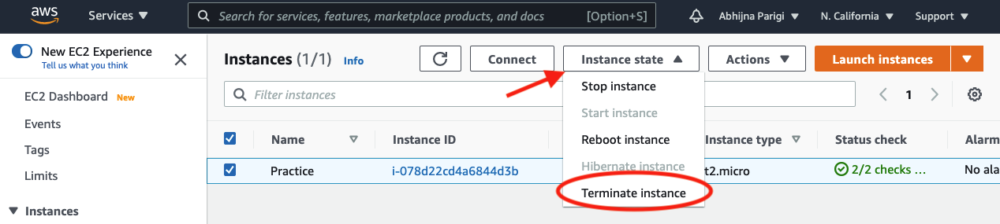

# Terminate Instance

Once you have completed your tasks and are sure you do not need the instance any longer, you may terminate the instance by returning to [AWS Management Console](https://us-west-1.console.aws.amazon.com/console/home?region=us-west-1).

!!! warning

        If you simply close the MobaXterm terminal, the instance will continue to run and incur cost; it has not been terminated. You must go the instance on the AWS webpage to terminate it.

        Terminating an instance will erase all the work you have done on the instance! Be sure to download files from the remote instance to your local computer or other storage space before terminating the instance.

- Click onServices
- Click EC2
- Click Instance on the Instances tab of the left side bar menu and it should bring you to the list of running instances on your account.
- Select the instance you would like to terminate
- ClickInstance state
- SelectTerminate instance

