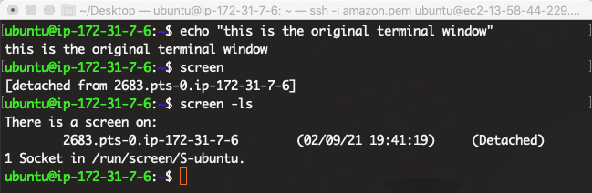

# The Screen Command

Screen or GNU Screen is a terminal multiplexer. You can start a terminal session and then open multiple screens inside that session. Processes running in Screen will continue to run when their window is not visible, even if you get disconnected. The goal of this tutorial is for users to learn how to run and switch between multiple screen sessions. Check out the [screen cheat sheet](../Bioinformatics-Skills/Introduction_to_Amazon_Web_Services/introtoaws5_Screen.md) for some quick help.

## Video Walkthrough
<iframe id="kaltura_player" src="https://cdnapisec.kaltura.com/p/1770401/sp/177040100/embedIframeJs/uiconf_id/29032722/partner_id/1770401?iframeembed=true&playerId=kaltura_player&entry_id=1_lkmj4ful&flashvars[mediaProtocol]=rtmp&amp;flashvars[streamerType]=rtmp&amp;flashvars[streamerUrl]=rtmp://www.kaltura.com:1935&amp;flashvars[rtmpFlavors]=1&amp;flashvars[localizationCode]=en&amp;flashvars[leadWithHTML5]=true&amp;flashvars[sideBarContainer.plugin]=true&amp;flashvars[sideBarContainer.position]=left&amp;flashvars[sideBarContainer.clickToClose]=true&amp;flashvars[chapters.plugin]=true&amp;flashvars[chapters.layout]=vertical&amp;flashvars[chapters.thumbnailRotator]=false&amp;flashvars[streamSelector.plugin]=true&amp;flashvars[EmbedPlayer.SpinnerTarget]=videoHolder&amp;flashvars[dualScreen.plugin]=true&amp;flashvars[Kaltura.addCrossoriginToIframe]=true&amp;&wid=1_w9g5trvw" width="400" height="285" allowfullscreen webkitallowfullscreen mozAllowFullScreen allow="autoplay *; fullscreen *; encrypted-media *" sandbox="allow-forms allow-same-origin allow-scripts allow-top-navigation allow-pointer-lock allow-popups allow-modals allow-orientation-lock allow-popups-to-escape-sandbox allow-presentation allow-top-navigation-by-user-activation" frameborder="0" title="Kaltura Player"></iframe>

## Installing the Screen

To install screen, run the following command:

=== "AWS Instance Code"
    ```
    sudo apt update
    sudo apt-get install screen
    ```

=== "Expected Output"
    ```
    ubuntu@ip-172-31-7-6:~$ sudo apt-get install screen
    Reading package lists... Done
    Building dependency tree       
    Reading state information... Done
    screen is already the newest version (4.8.0-1).
    0 upgraded, 0 newly installed, 0 to remove and 7 not upgraded.
    ```

The first line of code updates your instance to all latest software configurations. The second line of code does the actual installing.

## Running Screen

To help yourself tell the different terminal screen apart, type this command on the original terminal window (before you try out screen):

=== "AWS Instance Code"

    ```
    echo "this is the original terminal window"
    ```

!!! Warning
    Do not clear the screen. We want to make sure the "this is the original terminal window" text lingers when we toggle back to this window later.


Then type the command `screen` into the same AWS instance to start a new screen session.

=== "AWS Instance Code"
    ```
    screen
    ```
=== "Expected Output"
    ```
    GNU Screen version 4.08.00 (GNU) 05-Feb-20

    Copyright (c) 2018-2020 Alexander Naumov, Amadeusz Slawinski
    Copyright (c) 2015-2017 Juergen Weigert, Alexander Naumov, Amadeusz Slawinski
    Copyright (c) 2010-2014 Juergen Weigert, Sadrul Habib Chowdhury
    Copyright (c) 2008-2009 Juergen Weigert, Michael Schroeder, Micah Cowan,
    Sadrul Habib Chowdhury
    Copyright (c) 1993-2007 Juergen Weigert, Michael Schroeder
    Copyright (c) 1987 Oliver Laumann

    This program is free software; you can redistribute it and/or modify it under
    the terms of the GNU General Public License as published by the Free Software
    Foundation; either version 3, or (at your option) any later version.

    This program is distributed in the hope that it will be useful, but WITHOUT
    ANY WARRANTY; without even the implied warranty of MERCHANTABILITY or FITNESS
    FOR A PARTICULAR PURPOSE. See the GNU General Public License for more details.

    You should have received a copy of the GNU General Public License along with
    this program (see the file COPYING); if not, see

                  [Press Space for next page; Return to end.]
    ```
Press Space (twice) or Return to get to the command prompt. You are now on a new screen

!!! Note
    If you plan to work with multiple screens, it might be best to give each screen a unique name in order to tell them apart easily. You can name your screen by typing into your original terminal window:
    ```
    screen -S <name>
    ```

## Using screen

Let's run a program in the new screen window to test it out.

=== "AWS Instance Code"
    ```
    top
    ```
The `top` command is used to show the Linux processes. It provides a dynamic real-time view of the running system. Usually, this command shows the summary information of the system and the list of processes or threads which are currently managed by the Linux Kernel.

While the top command is still running, create another screen by clicking ++ctrl+a+c++. You should see a new blank terminal.

Let's run yet another command on the blank terminal:

=== "AWS Instance Code"
    ```
    ping google.com
    ```
=== "Expected Output"
    ```
    PING google.com (172.217.4.206) 56(84) bytes of data.
    64 bytes from ord37s19-in-f14.1e100.net (172.217.4.206): icmp_seq=1 ttl=100 time=17.4 ms
    64 bytes from ord37s19-in-f14.1e100.net (172.217.4.206): icmp_seq=2 ttl=100 time=17.4 ms
    64 bytes from ord37s19-in-f14.1e100.net (172.217.4.206): icmp_seq=3 ttl=100 time=17.5 ms
    64 bytes from ord37s19-in-f14.1e100.net (172.217.4.206): icmp_seq=4 ttl=100 time=17.5 ms
    .....
    ```

A ping test is a method of checking if the computer is connected to a network. It is used to ensure that a host computer which your computer tries to access is operating. It is run for troubleshooting to know connectivity as well as response time.

Please note that you now have three running screens:
 Screen 1) The original ssh terminal you saw at login. You typed the echo command in it.
 Screen 2) A screen that's running the `top` command.
 Screen 3) A screen that's running the `ping google.com` command.

### Switching between screens

 To switch between the two new screens, i.e. screen 2 and screen 3, type ++ctrl+a+p++. You cannot toggle to the original terminal screen (i.e. screen 1) with this shortcut.

### Detaching screens

 To detach a screen session and return to your original SSH terminal, type ++ctrl+a+d++. You will be taken back to the terminal window with the `echo` command:



To list your current screen sessions type:

=== "AWS Instance Code"
    ```
    screen -ls
    ```
=== "Expected Output"
    ```
    ubuntu@ip-172-31-7-6:~$ screen -ls
    There is a screen on:
	   2683.pts-0.ip-172-31-7-6	(02/09/21 19:41:19)	(Detached)
     1 Socket in /run/screen/S-ubuntu.
    ```
!!! Note
    Typing `ls` on the original terminal shows you only one screen ID because you have one screen (i.e. browser window) with two screen tabs. You can open another screen window by typing `screen` into the original terminal.

You can use the screen id to reconnect to your screen. Like this:

=== "AWS Instance Code"
    ```
    screen -r 2683.pts-0.ip-172-31-7-6
    ```
    or
    ```
    screen -r 2683
    ```

You should see Screen 2 that you previously created. Once again you can toggle between screen 2 and screen 3 by typing ++ctrl+a+p++

!!! Note
    Think of the first screen command entered into your original terminal as opening a new browser window.

    - After starting a screen, you can open multiple tabs within the same window using ++ctrl+a+c++.

    - You can now toggle between the multiple screens (tabs) using ++ctrl+a+p++. You can have commands running in each tab.

    - Detaching the screen allows you to go back to the original window/panel.

    - If you start another screen from the original terminal window, it would be like opening another browser window instead of adding a tab to an existing window.

## Quitting screens

You can quit the `top` output by typing `q` or ++ctrl+c++

To end a screen session, toggle into the session and type:

=== "AWS Console Code"
    ```
    exit
    ```

If no other screen sessions are open, you will fall back to the original SSH terminal (screen 1). If another screen session is open, you will enter that screen session. You can type `exit` until all screen sessions are closed.

!!! Warning
    - Typing `exit` into a screen permanently closes that screen session and all the analyses that are conducted in it.

    - You may need to type `exit` twice to get the "screen is terminating" message. But be sure to check!

    ```
    exit
    There are stopped jobs.

    exit
    [screen is terminating]
    ```
    Typing `exit` too many times will exit the entire terminal!

Don't forget to check out our [screen cheat sheet](../Bioinformatics-Skills/Introduction_to_Amazon_Web_Services/introtoaws5_Screen.md) if you need a quick reference to screen commands.
