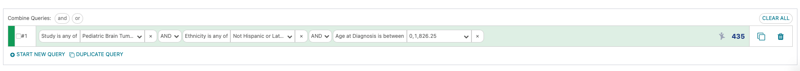

ANDs and ORs
===============================

All of your filters are automatically connected by "AND"s,
but that might not always be what you want.

If we wanted to see the participants that meet at least one of the filters, but not all of them,
we can click on an "AND" and change it to "OR", which dramatically
changes my results:

!!! Note
    When you change one AND/OR selection, it changes *all* of the
    AND/OR boxes in that query line.
