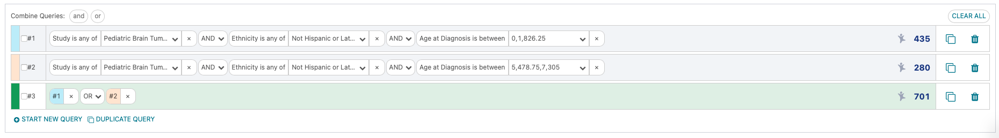
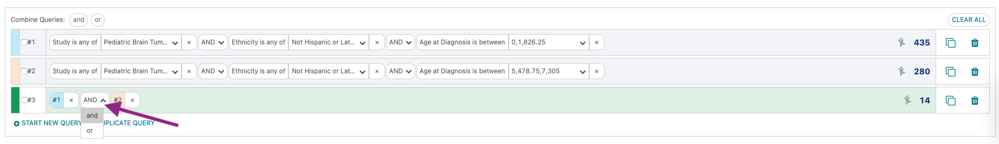
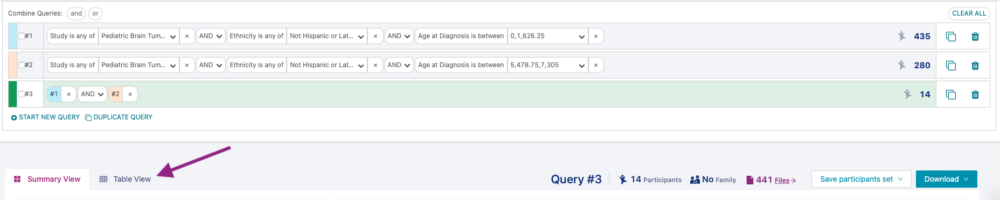
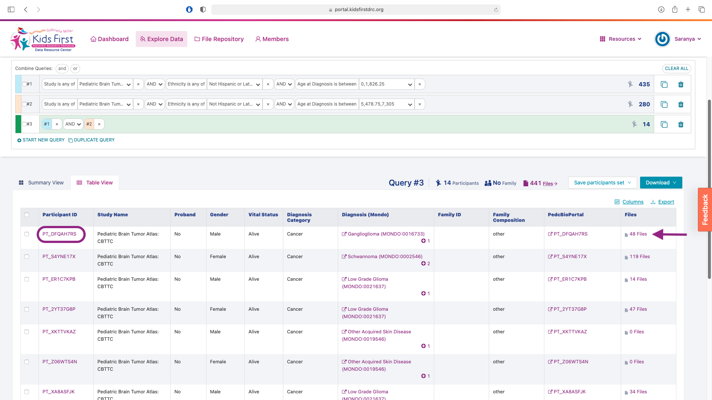
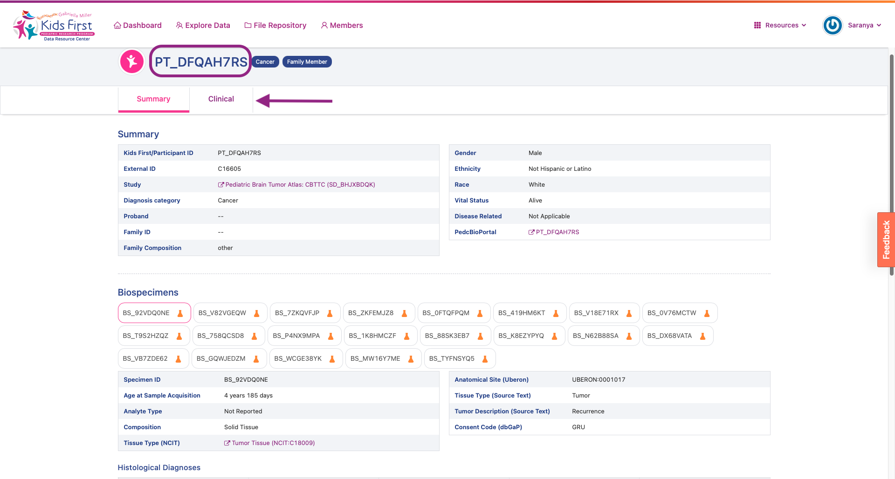
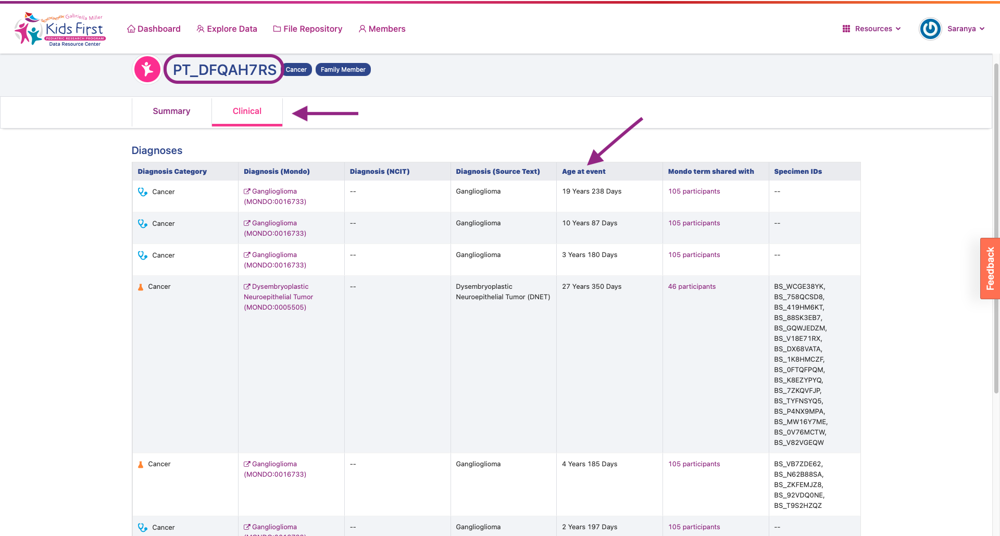

Checking Queries
================

Note that our query has an unexpected result:

We had 435 participants in the 1st query, and 280 participants in the 2nd query,
but only 701 in our combined query. This discrepancy suggests that the remaining fourteen participants must satisfy
both queries!

To see which participants occur in both the queries, edit query 3 to be an "AND"
statement:

To learn more about these participants, let's look at a more detailed
view of their public metadata by clicking on the "Table View" link:

In this new view, we can see the individual participant information, which shows multiple files for some participants. Click the first Participant ID to explore:

Clicking on a Participant ID takes you to a summary page that lists all the associated
Clinical and Biospecimens data for that Participant. Click on the Clinical tab.

We can see that multiple biospecimens were collected over time from this participant
explaining their occurrence in both the queries.

Now that we've learned how to create data subsets on the portal, in the next sections, we'll show you how to work with Kids First data in Cavatica.
