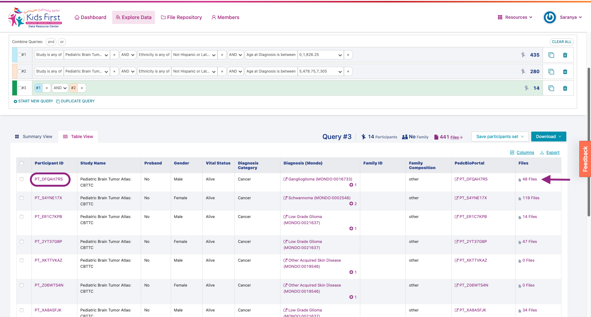

Checking Queries
================

Note that our query has an unexpected result:

We had 222 participants in query one, and 124 participants in query two,
but only 345 in our combined query. One of the participants must be in
both queries!

To see which participant it is, edit query 3 to be an "AND"
statement:

To learn more about this participant, let's look at a more detailed
view of their public metadata by clicking on the "Table View" link:

In this new view, we can see that there is a "+4" icon in
her "Age at Diagnoses"

Clicking on the "+4" icon in her "Age at
Diagnoses", we see that she was diagnosed multiple times:

