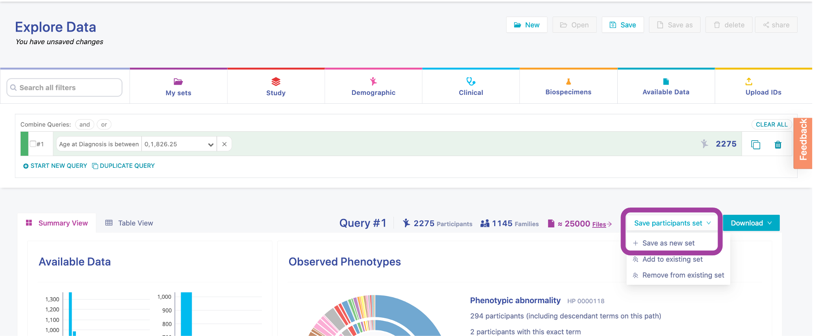
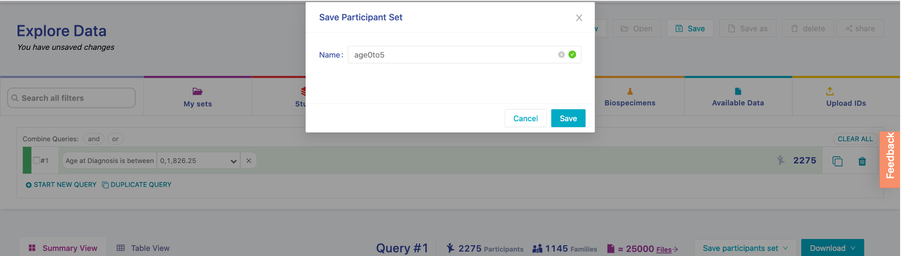
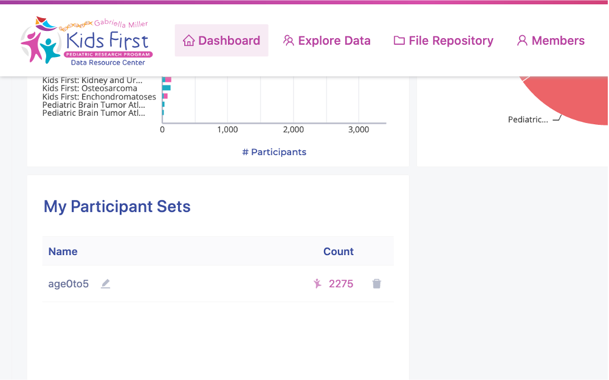
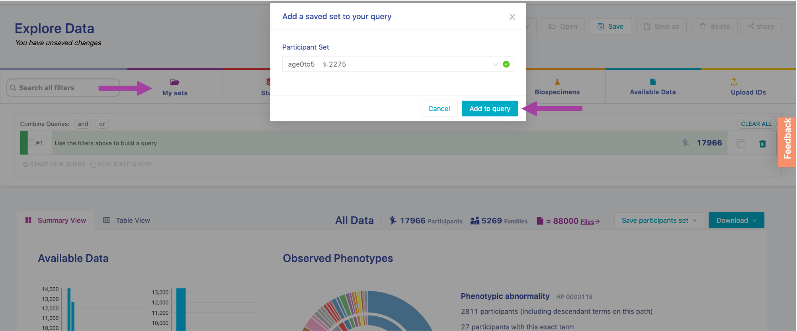
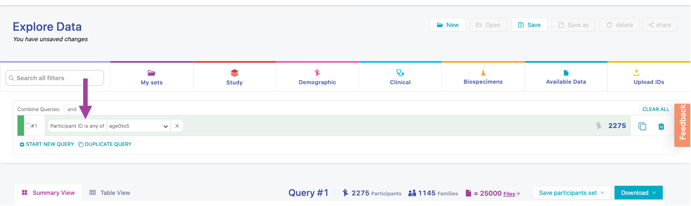
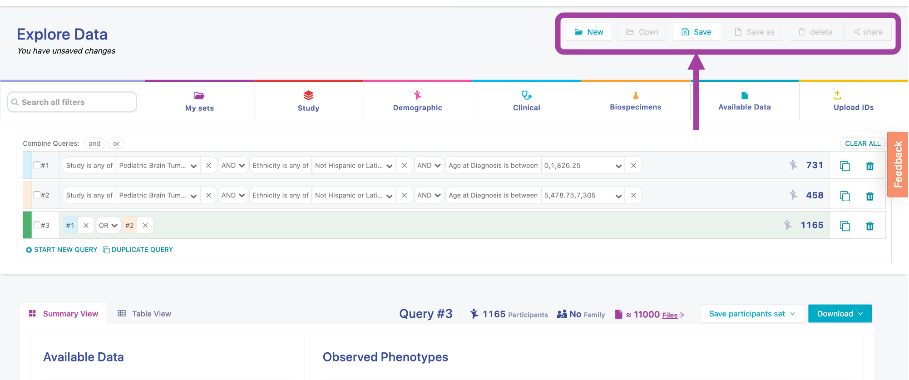
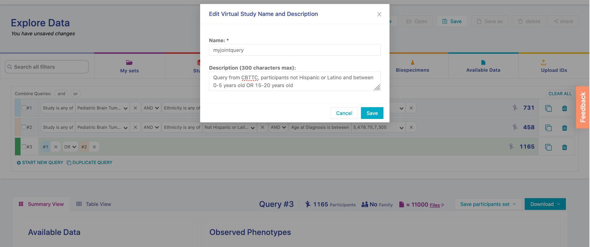
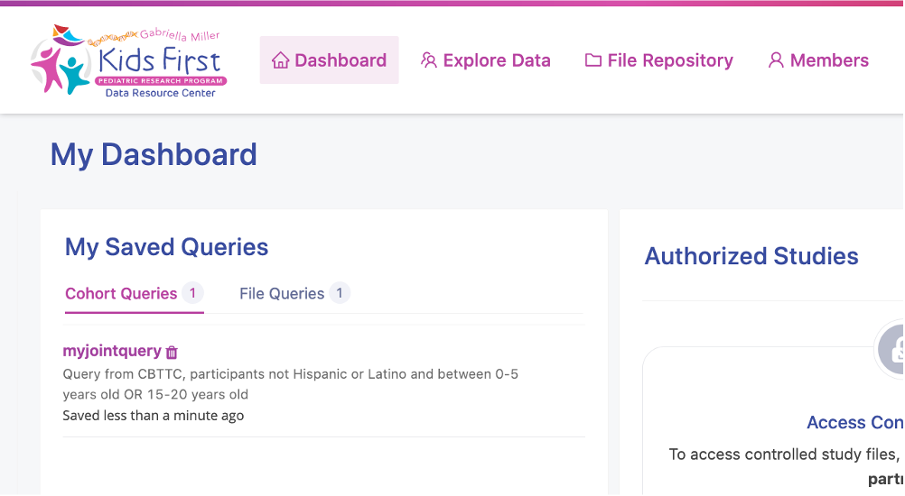
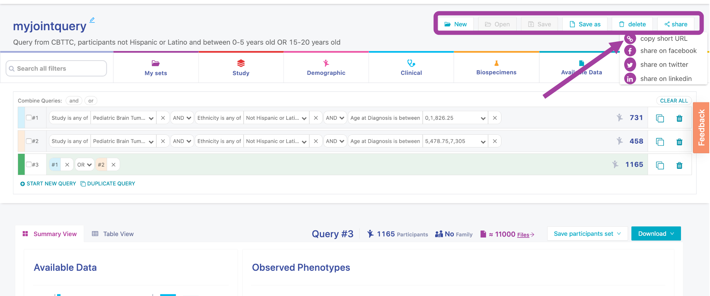

Saving Queries
================

There are a few options for saving and sharing your query searches. These options save time re-entering filters and are great for sharing search results with collaborators!

!!! note

    We ran these queries in January 2021. If you are doing this tutorial later, you may see more participants.

## Save participant sets

On the Explore Data section of the portal, you can save specific **lists of participants**. These lists can be applied in future queries as filters. Since this option saves a particular set of participants, it **does not update** with new data automatically.

For example, select all participants between 0 and 5 years of age at the time of their diagnosis:

- Click Clinical tab
- Select Age at Diagnosis filter, enter 0 and 5 in the value fields with year as unit and click Apply
- To save this particular set of participants, click Save participants set and Save as new set

Give your set a name (here, "age0to5") and click Save:

The saved set will be added to the My Participants Sets panel on the portal Dashboard:

The saved participants set are useful if you want to add this particular list of participants to a query. Remember that if new data is added to the portal, the saved set will not be updated. To include new participants between 0-5 years old, we would have to redo the Age at Diagnosis filter.

To add the saved participants list to a query in the Explore Data page:

- First clear all existing filters by clicking :fontawesome-solid-trash-alt: and subsequently click DELETE.
- Select My sets, use the dropdown menu to select the saved set ("age0to5")
- Click Add to query

The filter field is now updated. Instead of saying "Age at Diagnosis", it says the filter is for "Participant ID is any of age0to5".

## Save virtual studies

On the Explore Data page, we can save query searches as a **virtual study**. This option will save all the filters in your query. Unlike the participant sets, this virtual study **will update** if new data is added to the portal and fits the query filters.

For example, let's save a joint query virtual study that [we built in our previous lesson](./KF_11_JointQuery.md). After entering query terms, click on Save:

Give the virtual study a name and description, then click Save:    

The saved virtual study will be added to the My Saved Queries panel on the portal Dashboard:

## Share virtual studies

On the Explore Data page, we can also share a URL for virtual studies! This is a great way to share queries with collaborators. In order to view the URL, collaborators also need an [account on the Kids First portal](../Portal-Setup-And-Permissions/KF_3_KF_Registration.md).

Click on share and copy short URL

