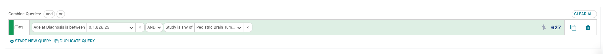

Advanced Querying
=================

Now that we've made some simple queries, let's check your
understanding of the basic interface.

=== "Exercise"

    Build a query to only include data from non-Hispanic or Latino patients from the Pediatric Brain Tumor Atlas: CBTTC study
    who were between 0 and 5 years old when they were diagnosed.

=== "Answer"

    
