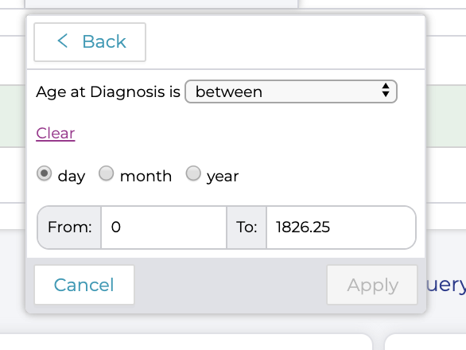
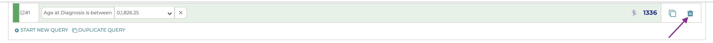

Clearing and Changing Queries
=============================

There are several ways to change your query.

Change the parameters of a filter
---------------------------------

If we still want to filter by age range, but use different ages, we
could do so in the query bar by clicking the small arrow next to the age
range. A pop up with the same selection box we saw before will appear,
and let us change our selections:

-----------------

To remove a single filter from your query by clicking the
`x` to the right of the filter description:

Removing an Entire Query
------------------------

To remove the entire query and start over by clicking the trash can icon
at the far right of the query line:

