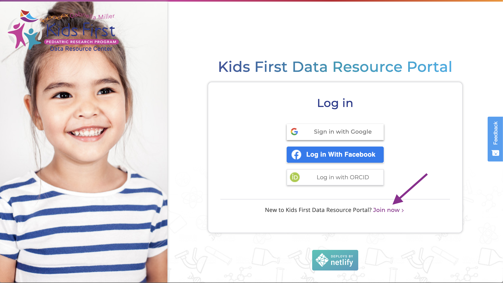
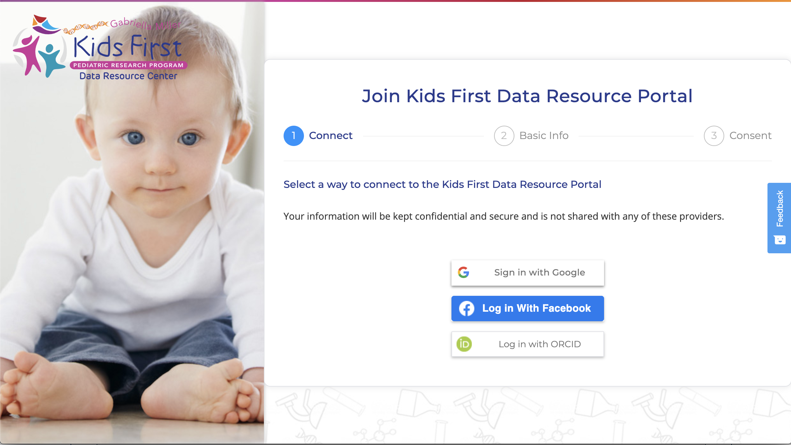
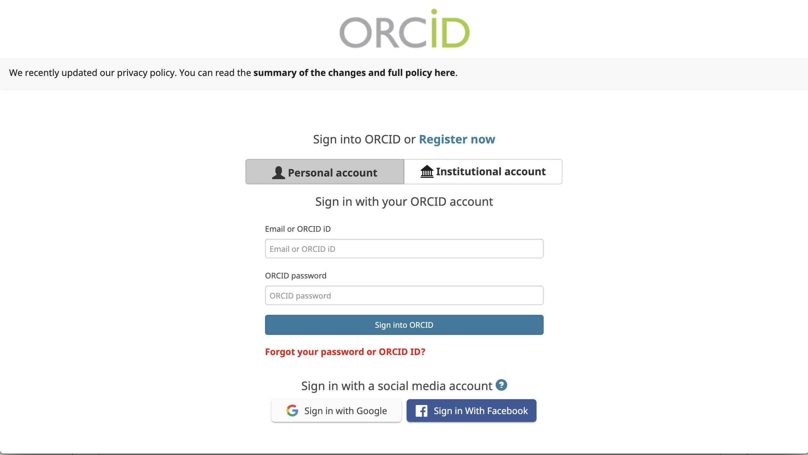

# Register for the Kids First DRC Portal

### Step 1: Go to the portal website

First, we'll set up our accounts at the Kids First DRC Portal by going
to the portal link:

[https://portal.kidsfirstdrc.org/](https://portal.kidsfirstdrc.org/)

!!! Tip

    Open the link in a new tab by right clicking the link and selecting
    `open in a new tab`; or by holding `command` while you
    click the link (MacOS); or by holding ++ctrl++ while you click
    the link (Windows)

### Step 2: Click the Join link

This should take you to the Kids First Portal website. Please click on
the "Join now" indicated with the purple arrow below:

### Step 3: Choose your login system

You should see three options for creating a new account: Google,
Facebook, or with an ORCID:

Select the platform you wish to use for your sign up.

#### Connect with Google or Facebook

The preferred method is to login with a Google account. Click the corresponding icon to link KF to either your Google or Facebook account. A pop-up window will appear and you will be asked to provide your user information and password. Enter the information and click "Next". You'll then be asked to enter basic user information and accept the Terms and Conditions for using data on the portal. If log in is successful, the pop-up window will disappear and you will be routed back to the KF portal dashboard.

#### Connect your ORCID

!!! Important
    Skip this part if you decide to sign up for the KF portal using Google or Facebook     

Clicking on "Log in with ORCID" will take you to a login
page:

Depending on your role, your ORCID may be personal, or tied to an
institution. If you don't already have an ORCID, you can also register
for one on [this page](https://orcid.org/register).

!!! Tip

    New ORCIDs

    If you are registering for an ORCID today, be sure to choose
    "Everyone" or "Trusted Parties" in the
    Visibility settings. You can always change this setting later, but you
    won't be able to link your ORCID account to the Kids First DRC portal
    if you choose "Only me:

!!! Error

    Error with existing ORCIDs

    If you already have an ORCID, and are getting a login error, then you
    will need to change your ORCID Visibility settings. To do this, go to
    <https://orcid.org/account> and edit your Visibility settings to
    `Everyone` or `Trusted Parties`

### Step 4: Go back to the Portal

Once you have signed in with your ORCID, you should be re-directed back
to the Kids First DRC Portal and automatically logged in.
