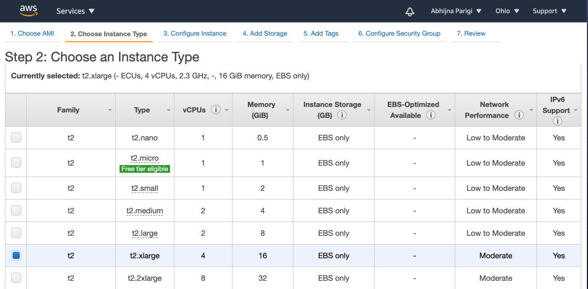
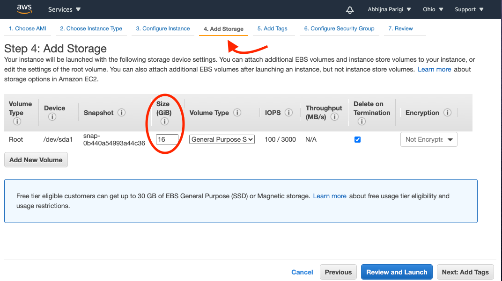
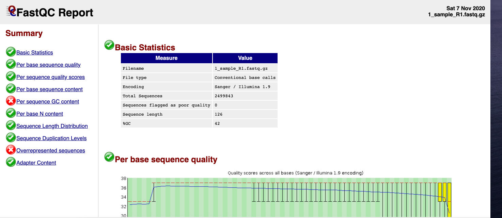

# Simulating Illumina Reads

[InSilicoSeq](https://insilicoseq.readthedocs.io/en/latest/) is a software that simulates Illumina reads from genomes, and was especially built to simulate reads from metagenomes. InSilicoSeq is written in Python, is fairly well-documented and easily installed via Python’s package manager `pip(3)`.

## Why use simulated data?

There are a myriad of bioinformatics tools currently available to users. Before use, every tool must be tested for general usability and suitability for a given task. Simulated data can be ideal for the purposes of testing bioinformatics tools because the user can model the data set based on their specified parameters. With simulated data, the user knows the final answer, and so they know when the tool doesn't work. For example, when using fastq data that was simulated from a "normal" human reference genome (with no mutation parameters specified), the final answer should be the absence of any detectable variants. If a variant calling pipeline detects variants using this simulated data set, the pipeline doesn't work correctly. Simulated data sets are also great for use in the classroom, especially when protected (human) data can't be distributed.


!!! note "Learning Objectives"

    - Simulate fastq files

    - Check the quality of simulated files

=== "Est. Time"

    ~ 60 min to run entire tutorial

=== "Est. Cost"
    < $1.00

=== "Prerequisites"

    - AWS account

    - Basic command line


=== "Tutorial Resources"

    - [Gourlé, H., Karlsson-Lindsjö, O., Hayer, J., & Bongcam-Rudloff, E. (2019). Simulating Illumina metagenomic data with InSilicoSeq. Bioinformatics, 35(3), 521-522](https://academic.oup.com/bioinformatics/article/35/3/521/5055123)

    - [InSilicoSeq Documentation](https://insilicoseq.readthedocs.io/en/latest/index.html)

    - [InSilicoSeq GitHub Repo](https://github.com/HadrienG/InSilicoSeq)

    - [Human reference genome download](https://www.ncbi.nlm.nih.gov/genome/guide/human/)

    - [Recommended read dept and coverage for NGS applications](https://genohub.com/recommended-sequencing-coverage-by-application/)

    - [What is FastQC](http://www.bioinformatics.babraham.ac.uk/projects/fastqc/)

    - [FastQC video tutorial](https://www.youtube.com/watch?v=bz93ReOv87Y)


## Selecting the right AWS instance to run InSilicoSeq

To run [InSilicoSeq](https://github.com/HadrienG/InSilicoSeq), you will need to launch a 64 bit Ubuntu Server 20.04 LTS (HVM), SSD Volume Type instance as described in [the AWS tutorial](Introduction_to_Amazon_Web_Services/introtoaws3.md) with a **few modifications**:

 ### Step 1)
 You must select the the `t2.xlarge` instance (instead of the default t2.micro instance selection described in the tutorial):



!!! Warning
    t2.xlarge machine is not part of AWS's free tier. Running this instance costs money to all users, including those who have free tier access. Check the estimated cost section at the top of this page.

 ### Step 2)
 After choosing t2.xlarge, click on the "4.Add Storage" tab on the instance launch page and then changing the number on the "Size (GB)" tab to read "16", as shown in the image below:



  You need to add more storage because, while the output fastq files themselves are small (<20MB), temporary files generated during the simulation take up a lot of space.


 ### Step 3)
 Click "Review and launch"

 ### Step 4)
 Then go back to the [AWS tutorial](Introduction_to_Amazon_Web_Services/introtoaws3.md) and follow instructions on how to access the instance via the MacOS terminal window

## Installing InSilicoSeq

!!! Important

    You must run all these commands and installations on your AWS Ubuntu instance and **not** your local terminal


InSilicoSeq can be installed using Python's package manager `pip3`. However, `AWS's Ubuntu 20.04` instance does not come pre-installed with `pip3`. Let's begin by updating the instance and installing `pip3`.

=== "AWS Instance Code"

    ```
    sudo apt update
    sudo apt install python3-pip
    ```
=== "Expected Output"

    ```
    1 upgraded, 50 newly installed, 0 to remove and 32 not upgraded.
    Need to get 46.8 MB of archives.
    After this operation, 200 MB of additional disk space will be used.
    Do you want to continue? [Y/n]
    ```

    Type Y and hit `ENTER`

Now you can install InSilicoSeq:

=== "AWS Instance Code"

    ```
    pip3 install InSilicoSeq
    ```
=== "Expected Output"

    ```
    ubuntu@ip-172-31-20-244:~$ pip3 install InSilicoSeq
    Collecting InSilicoSeq
      Downloading InSilicoSeq-1.5.1-py3-none-any.whl (1.5 MB)
         |████████████████████████████████| 1.5 MB 4.5 MB/s
    Collecting future
      Downloading future-0.18.2.tar.gz (829 kB)
         |████████████████████████████████| 829 kB 19.7 MB/s
    Collecting numpy
      Downloading numpy-1.19.4-cp38-cp38-manylinux2010_x86_64.whl (14.5 MB)
         |████████████████████████████████| 14.5 MB 29.3 MB/s
    Collecting joblib
      Downloading joblib-0.17.0-py3-none-any.whl (301 kB)
         |████████████████████████████████| 301 kB 64.3 MB/s
    Collecting biopython
      Downloading biopython-1.78-cp38-cp38-manylinux1_x86_64.whl (2.3 MB)
         |████████████████████████████████| 2.3 MB 65.1 MB/s
    Requirement already satisfied: requests in /usr/lib/python3/dist-packages (from InSilicoSeq) (2.22.0)
    Collecting scipy
      Downloading scipy-1.5.4-cp38-cp38-manylinux1_x86_64.whl (25.8 MB)
         |████████████████████████████████| 25.8 MB 65.7 MB/s
    Collecting pysam>=0.15.1
      Downloading pysam-0.16.0.1-cp38-cp38-manylinux1_x86_64.whl (10.2 MB)
         |████████████████████████████████| 10.2 MB 66.2 MB/s
    Building wheels for collected packages: future
      Building wheel for future (setup.py) ... done
      Created wheel for future: filename=future-0.18.2-py3-none-any.whl size=491058 sha256=1312269d5247af1a692f235f4f4c9b420664bcdaea4a96816d2d37995e0d8872
      Stored in directory: /home/ubuntu/.cache/pip/wheels/8e/70/28/3d6ccd6e315f65f245da085482a2e1c7d14b90b30f239e2cf4
    Successfully built future
    Installing collected packages: future, numpy, joblib, biopython, scipy, pysam, InSilicoSeq
      WARNING: The scripts futurize and pasteurize are installed in '/home/ubuntu/.local/bin' which is not on PATH.
      Consider adding this directory to PATH or, if you prefer to suppress this warning, use --no-warn-script-location.
      WARNING: The scripts f2py, f2py3 and f2py3.8 are installed in '/home/ubuntu/.local/bin' which is not on PATH.
      Consider adding this directory to PATH or, if you prefer to suppress this warning, use --no-warn-script-location.
      WARNING: The script iss is installed in '/home/ubuntu/.local/bin' which is not on PATH.
      Consider adding this directory to PATH or, if you prefer to suppress this warning, use --no-warn-script-location.
    Successfully installed InSilicoSeq-1.5.1 biopython-1.78 future-0.18.2 joblib-0.17.0 numpy-1.19.4 pysam-0.16.0.1 scipy-1.5.4
    ```

## Set the path variable

For the Ubuntu machine to recognize the InSilicoSeq executable, we need to add the bin (where InSilicoSeq was downloaded) to Ubuntu's search path.

=== "AWS Instance Code"

    ```
    export PATH=$PATH:~/.local/bin
    ```

Now your Ubuntu machine should be able to find InSilicoSeq. You can check to see if it was properly installed like this:

=== "AWS Instance Code"

    ```
    iss --version
    ```
=== "Expected output"

    ```
    iss version 1.5.1
    ```
If you see the version number printed on the screen, you are good to go!

## Download the human reference genome

InSilicoSeq simulates reads based on one or more input reference genomes. You will use the human reference genome GRCh38.

First, make a directory called "reference_genome" using the command `mkdir`. Then download the compressed (".gz" extension) human reference genome inside the new folder and unzip the ".fna" file.

=== "AWS Instance Code"

    ```
    mkdir reference_genome
    cd reference_genome
    curl -LO ftp://ftp.ncbi.nlm.nih.gov/refseq/H_sapiens/annotation/GRCh38_latest/refseq_identifiers/GRCh38_latest_genomic.fna.gz
    gunzip GRCh38_latest_genomic.fna.gz
    ```
The human genome should be 3.1 Gb when uncompressed. You can check its size using the `ls -th` command.

## Running InSilicoSeq

Make a directory called "fastq" in which the simulated fastq files can be saved.

=== "AWS Instance Code"

    ```
    mkdir fastq
    cd fastq
    ```

Finally, run the code to make your simulated fastq file.

=== "AWS Instance Code"

    ```
    iss generate --genomes ../reference_genome/GRCh38_latest_genomic.fna --model hiseq --n_reads 5M --cpus 4 --output my_sim
    ```

=== "Expected Output"

    ```
    ubuntu@ip-172-31-26-57:~/fastq$ iss generate --genomes ../reference_genome/GRCh38_latest_genomic.fna --model hiseq --n_reads 5M --output 1_sample
    INFO:iss.app:Starting iss generate
    INFO:iss.app:Using kde ErrorModel
    INFO:iss.util:Stitching input files together
    INFO:iss.app:Using lognormal abundance distribution
    INFO:iss.app:Using 2 cpus for read generation
    INFO:iss.app:Generating 5000000 reads
    INFO:iss.app:Generating reads for record: NC_000001.11
    INFO:iss.app:Generating reads for record: NT_187361.1
    INFO:iss.app:Generating reads for record: NT_187362.1
    INFO:iss.app:Generating reads for record: NT_187363.1
    INFO:iss.app:Generating reads for record: NT_187364.1
    INFO:iss.app:Generating reads for record: NT_187365.1
    ....
    ```

!!! note "What are all these flags?"

    `--model` lets you input an error model file. The default is None. You're using hiseq for a pre-computed error model suitable for simulating data generated from a HiSeq sequencing run. Other available options are NovaSeq and MiSeq. If you do not wish to use a model, use –mode basic. The name of the built-in models is case insensitive.

    `--n_reads` specifies the number of reads to be simulated. The default is 1 million (1M).

    `--cpus` specifies the number of CPUs that should be used. Default is 2.

    `--output` specifies the name of the output files. You're calling it my_sim, but you can change it to whatever suits your needs.


If your run is successful, you will see two ".fastq" files, "my_sim_R1.fastq" and "my_sim_R2.fastq", and an abundance file called "my_sim_abundance.txt". The abundance file is more meaningful in the context of simulating metagenomic data. It is a tab-delimited file containing the abundance of each genome supplied to the command. The 5 M reads generated per simulation are split between the R1 and R2 files.

## Looping InSilicoSeq

If you want to repeat the simulation multiple times, modify the following code block by changing the `n` to an integer corresponding to the number of time you wish to run the simulation. Your output files will be named 1_my_sim_R1 and 1_my_sim_R2, 2_my_sim_R1 and 2_my_sim_R2, ..., n_my_sim_R1 and n_my_sim_R2.

=== "AWS Instance Code"

    ```
    for i in {1..n};
    do iss generate --genomes ../reference_genome/GRCh38_latest_genomic.fna --model hiseq --n_reads 5M --cpus 4 --output ${i}_my_sim;
    done
    ```

!!! Warning
    Depending on how many times you run the simulation and/or how many reads you simulate, the code may take a really long time to complete! You can start out by running a small set of reads (2-3) to test the code before scaling up.


## Quality control

With real data, one must always perform quality control to ensure that the raw data looks good. With simulated data, you can do some simple quality control to make sure nothing went terribly wrong with the simulation itself and that you have the desired read length.

Let's use FastQC to generate a quality control report.

### Install FastQC

To install FastQC run this code:

=== "AWS Instance Code"

    ```
    sudo apt install fastqc
    ```

### Run FastQC

Now run FastQC on your fastq files:

=== "AWS Instance Code"

    ```
    cd fastq
    fastqc *.fastq
    ```
You are using the `*` wildcard to help specify all of the .fastq files here.


### Transfer to Local Computer

The easiest way to visualize the output is to transfer it to your local computer. First, let's list all the files and pull out the report summaries (.html) using ls:

=== "AWS Instance Code"

    ```
    ls *fastqc.zip
    ls *.html
    ```

Now you can move the ".html" files to your local computer to visualize:

=== "Local Machine Code"

    ```
    scp -i ~/Desktop/amazon.pem ubuntu@ec2-??-???-???-??.us-east-2.compute.amazonaws.com:/home/ubuntu/fastq/\*.html ~/Desktop/fastqc/.
    ```

=== "Expected Output"
    You might need to confirm the download by typing "yes" if prompted:

    ```
    Are you sure you want to continue connecting (yes/no/[fingerprint])? yes"
    ```

!!! Important

    This code block must be run on your local terminal window and not on the AWS terminal. You can start a new terminal by typing `cmd+N`

    Remember to replace:

    - `~/Desktop/amazon.pem` with the [path to your amazon.pem](GWAS-in-the-cloud/aws_instance_setup.md)

    - `??-???-???-??.us-east-2.compute.amazonaws.com` with your specific instance. For more details on how to connect to an instance, visit the [AWS set up page of the "GWAS in the Cloud" tutorial](GWAS-in-the-cloud/download_accessAWS.md).


Here is an image of the top of an example FastQC report.




### Interpretation

**Watch this [YouTube video](https://www.youtube.com/watch?v=bz93ReOv87Y) on how to interpret FastQC results**:

[](https://www.youtube.com/watch?v=bz93ReOv87Y "FastQC Interpretation")

All simulated reads are 126 bp long :)

!!! note "AWS Instance Termination"

    - To avoid unnecessary charges, remember to [terminate your AWS instance](Introduction_to_Amazon_Web_Services/introtoaws4.md) once you are done using it.

    - It is important to remember that terminating the instance causes all the data in that instance to be lost forever. If you wish to keep the fastq files, please remember to transfer them to your local machine or analysis platform. Check out our [tutorial on transferring files from AWS to Cavatica](Kids-First/Upload_Data.md).
