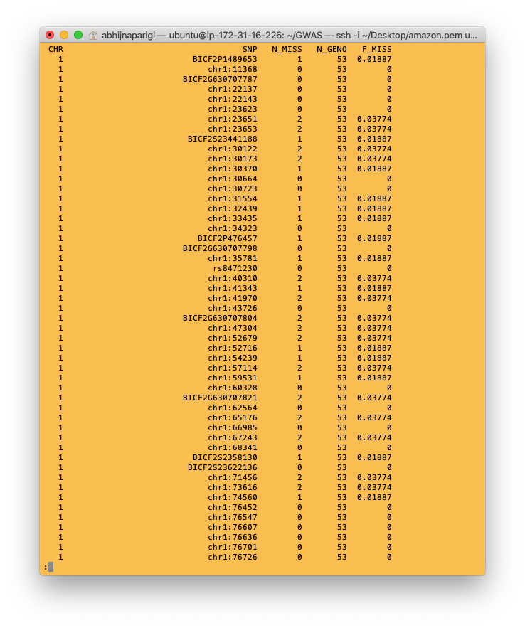
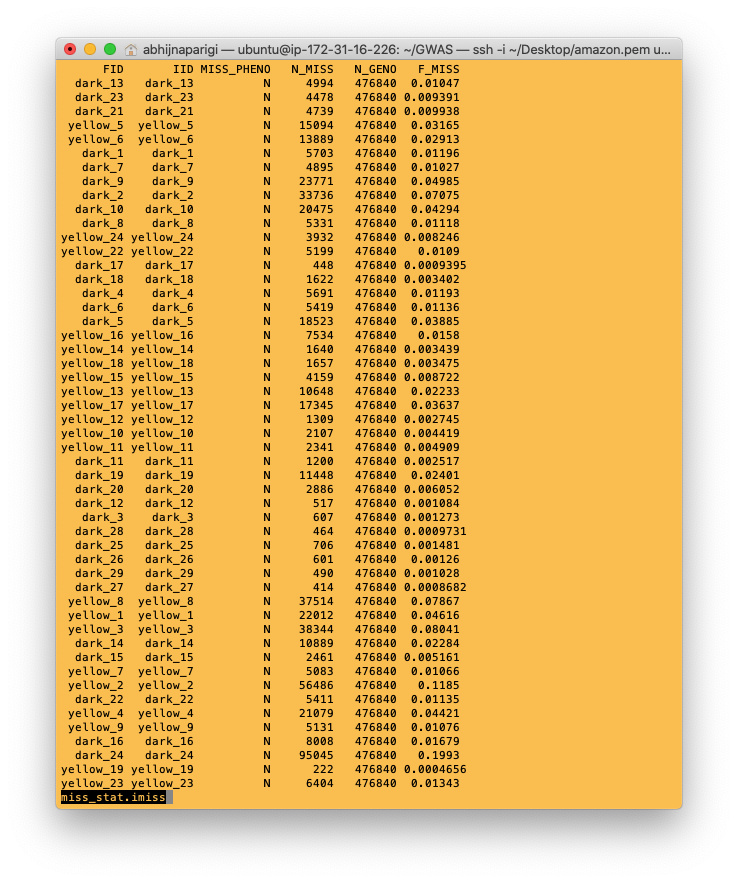

Summary Statistics and Association Analysis
===========================================

## Convert VCF into PLINK readable format

Now convert the .vcf into PLINK readable format: map and ped. [PED and MAP files](http://zzz.bwh.harvard.edu/plink/data.shtml) are plain text files; PED files contain genotype information (one person per row) and MAP files contain information on the name and position of the markers in the PED file.


```
 vcftools --vcf pruned_coatColor_maf_geno.vcf --plink --out coatColor

```

!!! Error
    If you get a vcftools install error, follow the directions in the error message to install vcftools.

the --plink options outputs the genotype data in PLINK PED format. Two files are generated, with suffixes ".ped" and ".map"


## Create list of alternative alleles

In order to specify the minor allele (A1), you must create a list of these alternative alleles. To do so, run:

```
cat pruned_coatColor_maf_geno.vcf | awk 'BEGIN{FS="\t";OFS="\t";}/#/{next;}{{if($3==".")$3=$1":"$2;}print $3,$5;}'  > alt_alleles
```

where the file `alt_alleles` contains a list of SNP IDs and the allele to be set as A1, e.g.


## Some summary statistics: Missing rates

Now generate some simple summary statistics on rates of missing data in the file, using the [--missing option](http://www.cog-genomics.org/plink/1.9/basic_stats#missing):

```
plink --file coatColor --make-pheno coatColor.pheno "yellow" --missing --out miss_stat --noweb --dog --reference-allele alt_alleles --allow-no-sex --adjust
```

### What are all these PLINK tags?

--file: tells it the name of PLINK readable files

--missing: produces sample-based and variant-based missing data reports

--out: name of the output file.

--dog: tells PLINK to look at the dog genome.

--make-pheno: tells PLINK to look at the coatColor.pheno file for phenotype information and sets the alternative phenotype to "yellow".

--reference-allele: sets the A1 or alternative allele using the file alt_alleles

--allow-no-sex: since our dataset does NOT have a "sex" field, this option allows plink to ignore the missing sex field.

--noweb: each time PLINK runs, it checks for an update. On a slow network this sometimes causes delays and the --noweb option disables this.


Output:


There's a lot of information here, but the relevant bits:

`476840 (of 476840) markers to be included from [coatColor.map]` indicates that all markers can be included.

 There are `53 individuals with ambiguous sex codes` - There is no column for sex in our dataset. That's fine, you told PLINK to ignore sex.


`Test value is [yellow] and missing value is [-9]
53 of 53 individuals assigned to 2 cluster(s)
Set 24 cases and 29 controls, 0 missing, 0 not found` This means there are 24 yellow coat color and 29 dark coat color individuals.

The per individual and per SNP rates are then output to the files miss_stat.imiss and miss_stat.lmiss, respectively. If you had not specified an --out option, the root output filename would have defaulted to "plink".

Look at the per SNP rates by running:

```
less miss_stat.lmiss
```

Output:




**NEed SOME HELP INTERPRETTING THIS PART!**
That is, for each SNP, you see the number of missing individuals (N_MISS) and the proportion of individuals missing (F_MISS).
For examples, the SNP BICF2P1489653 is missing in 1 out of 53 individuals, giving it a missing(?) frequency of 0.01886792452 (i.e. 1/53)


Similarly, look at the per individual rates in the `miss_stat.imiss` by typing

```
less miss_stat.imiss
```

Output:



The final column is the actual genotyping rate for that individual. Looking at the first row, the individual dark_13 has 4994 missing SNPs out of 476840, producing a genotype rate of 0.01047.


## PLINK binary format

Next, convert the output file (coatColor) to PLINK binary format (fam,bed,bim) for downstream analysis:

```
 plink --file coatColor --allow-no-sex --dog --make-bed --noweb --out coatColor.binary

```

--make-bed: creates a new PLINK binary fileset, after applying sample/variant filters and other operations. Click [here](http://www.cog-genomics.org/plink/1.9/data) for more details


## Run a simple association analysis

Learn more about association tests [here](https://journals.plos.org/ploscompbiol/article?id=10.1371/journal.pcbi.1002822#s7)

```
  plink --bfile coatColor.binary --make-pheno coatColor.pheno "yellow" --assoc --reference-allele alt_alleles --allow-no-sex --adjust --dog --noweb --out coatColor
```

--bfile: takes .binary file as input.

--assoc: performs a standard case/control association analysis which is a chi-square test of allele frequency.

--adjust: enables correction for multiple analysis and automatically calculates the genomic inflation factor
