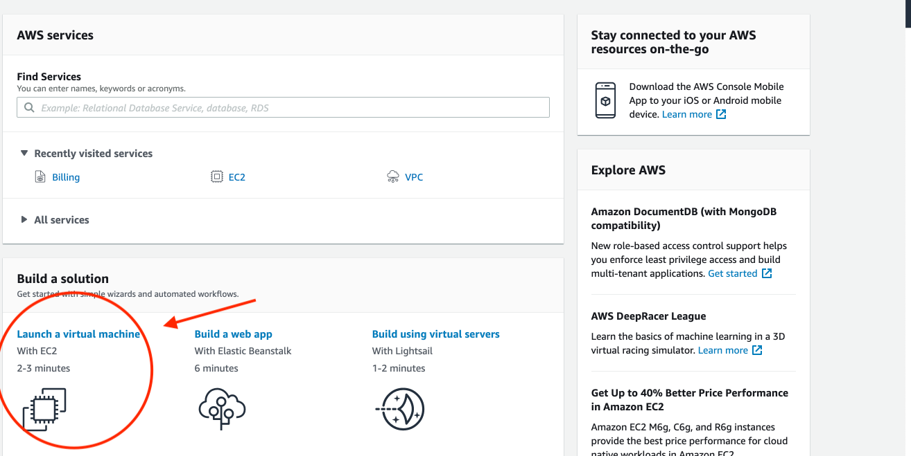

Setting up an AWS Instance
==========================

Amazon offers a cloud computing platform called Amazon Web Services (AWS). AWS is not free, however, you receive the benefits of the Free Tier automatically for 12 months after you sign up for an AWS account. If you are no longer eligible for the Free Tier, you're charged at the [standard billing rate](https://docs.aws.amazon.com/awsaccountbilling/latest/aboutv2/free-tier-eligibility.html) for your AWS usage.

## Free Tier AWS Ubuntu Instance

Let's set up a Free Tier AWS Ubuntu instance:

* Go to <http://aws.amazon.com/> and click on the create an AWS account button located on the top right. If you have an existing AWS account, click the "Sign in to an existing AWS account" below the "continue" option on the sign-up page and log in to your account as a root user.

!!! New-Account

    * To create a new account, fill in your email, (create a) password and choose a name for your AWS account. Click "Continue".

    * On the next page, fill in your name, phone number and address. Check the AWS customer agreement box.

    * Once you click "Create Account and Continue", you will be redirected to a payment info page. This step requires two factor authentication and may take a few mins. When you receive the code, enter it and click "Verify Code"

    * You can now log in and launch an instance!

* Next, click on the 'Launch a virtual machine' option as shown in the image:

* On the left navbar, check the Free tier only option, then select this Ubuntu machine: Ubuntu Pro 20.04 LTS (provided through 2030).

!!! Important
    Please select the Ubuntu Pro 20.04 LTS. Choosing a different machine will result in error messages during various installation steps.

* Make sure the free tier version is selected. Shown here:

Then click review and launch --> launch. You should see a pop-up window like this:

* Choose the 'Create a new key pair' option from the drop down menu. Under key pair name, type 'amazon'. Save it on your Desktop. Check the acknowledgement box and click "Launch Instance". Next time you launch an instance, you can reuse the key pair you just generated.

* After you click 'Launch Instance', you should see this:

* Click on this first hyperlink: i-038c58bfbe9612c57. Your page should look like this:

* You have now successfully launched your AWS instance. DO NOT CLOSE THIS PAGE YET.
