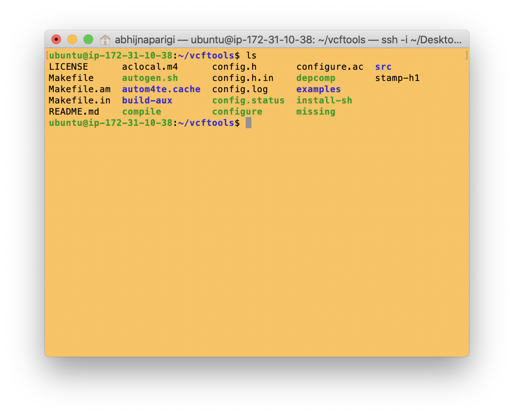

Install VCFtools
================

## What is VCF?

VCF stands for Variant Call Format. It is a standardized text file format for representing SNP, indel, and structural variation calls. Read more about VCF files at the [GATK forum](https://gatkforums.broadinstitute.org/gatk/discussion/1268/what-is-a-vcf-and-how-should-i-interpret-it).

[VCFtools](http://vcftools.sourceforge.net/man_latest.html#EXAMPLES) is a program package designed for working with VCF files. The aim of VCFtools is to provide easily accessible methods for working with complex genetic variation data in the form of VCF and BCF files. In this tutorial, you will use vcftools to convert the .vcf file into a format that PLINK likes.

## Installation

To install vcf tools in the home directory, run the following lines of code:

```
cd ## this takes us to the home directory
git clone https://github.com/vcftools/vcftools.git ## this line downloads the vcftools package from github
cd vcftools

```

Now let's install autoconf, g++, pkg-config and other dependencies. Run the following code and type `Y + enter` when prompted.

```
sudo apt-get install autoconf autogen
sudo apt-get update
sudo apt-get install g++
sudo apt install gcc make autoconf automake pkg-config zlib1g-dev curl
sudo apt-get update
sudo apt-get install pkg-config
```

Finally, compile vcftools using `./autogen.sh`, `./configure` and `make`

```
./autogen.sh
./configure
make
sudo make install
```

If there are no errors at this point, you are good to go! Look inside the vcftools folder to see what's in it by typing `ls`


