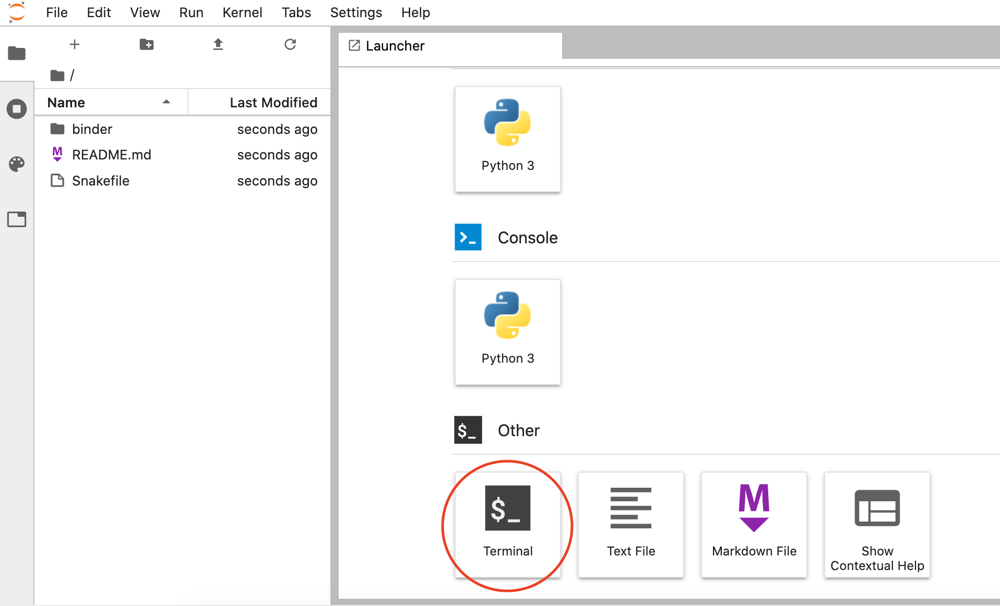
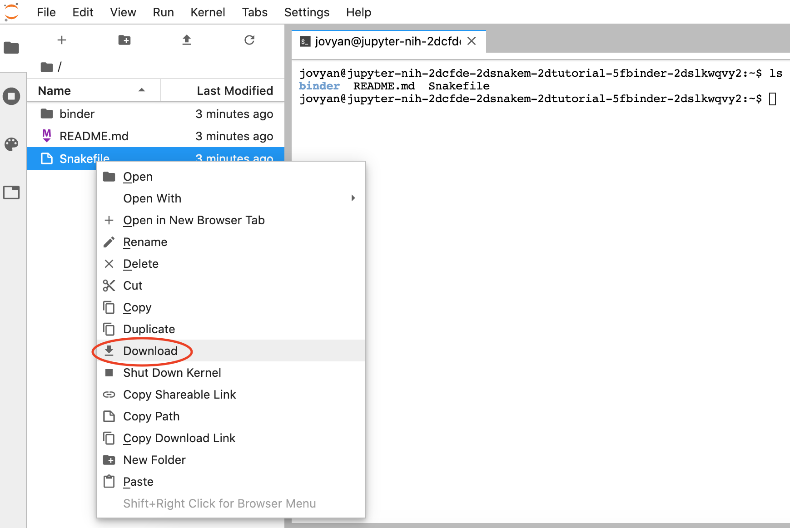

# Set up

## Choose computing environment

There are two ways to follow this tutorial:

**A) Use the pangeo binder.** This is a good option if you don't have access to a Unix/Linux computer.

- Open the binder environment with the 'Launch binder' button below in a **new tab**. It will take a few minutes to build:

    [](https://binder.pangeo.io/v2/gh/nih-cfde/training-snakemake-binder/stable-binder)

- Click on the `Terminal` button to launch it:

    

- Then, follow the set up instructions below starting at **step 2**. The Snakefile and necessary conda environment files are already installed in the binder.

!!! warning
    When you close the binder, it does NOT save your work so download any files you want to keep.

- To download files, right-click the file you want to save, and select 'Download':
    
    
    
- To close the binder, go to 'File' and click 'Shut Down':

    
    
**B) Use a Unix or Linux environment (e.g., with a Mac or High Performing Computing environment).**

- For this option, please follow **all** the set up instructions below.

## Set up computing environment

We will use conda to create an computer software for this tutorial. If you don't have conda installed, please see the [Set up computing environment with conda on MacOS tutorial](../../General-Tutorials/install_conda_tutorial.md).

!!! Tip

    Please refer to the [conda command cheatsheet](./conda_cheatsheet.md) for commonly used conda commands!

### 1. Download tutorial files:

First, create a new directory for this tutorial, e.g.,:

```
(base) $ mkdir learn_snakemake
```

We need two files for this tutorial. Click the links and save them in the directory you created above: 1) [environment.yml](./snakemake_tutorial_docs/environment.yml) and 2) [Snakefile](./snakemake_tutorial_docs/Snakefile.py).

Rename the `Snakefile.py` to `Snakefile`. There should be no file extension (we just added it so you'd be able to download the file!).

### 2. Create new conda environment:

The environment.yml file tells conda 1) where to look for the software installations under 'channels' and 2) what software to install under 'dependencies'. You can also specify specific software versions, otherwise conda will download the most up-to-date version. Here are the specifications we'll use for this tutorial:
```
channels:
    - conda-forge
    - bioconda
    - defaults
dependencies:
    - bwa
    - snakemake-minimal=5.8.1
    - samtools=1.10
    - bcftools
```

Create environment:
```
(base) $ conda env create -n snaketest -f environment.yml
```

### 3. Activate conda environment:

```
(base) $ conda activate snaketest
```

### 4. Test that your environment is ready to go

You should have several software installed in your `snaketest` environment now. Check it out!

```
(snaketest) $ samtools --version
```

The output should say:

```
samtools 1.10
Using htslib 1.10.2
Copyright (C) 2019 Genome Research Ltd.
```

If you get an error, the software installation may have failed. You can check the software that is installed in your conda environment: `conda list`.

You can leave the conda environment with: `conda deactivate`.

Later in the tutorial, we'll use `wget` to download data. Installing `wget` on MacOS can be achieved by using `Homebrew`, a handy package installation manager. This step will take a few minutes and the installation should be done in the `base` conda environment:

```
# go back to base environment
(snaketest) $ conda deactivate

# install Homebrew
(base) $ /bin/bash -c "$(curl -fsSL https://raw.githubusercontent.com/Homebrew/install/master/install.sh)"

# use brew command to install wget
(base) $ brew install wget

# test installation
(base) $ wget --version
```

Alternatively, we can also use conda to install `wget`, which will work in both Unix and Linux based systems:

```
conda install -c anaconda wget
```
