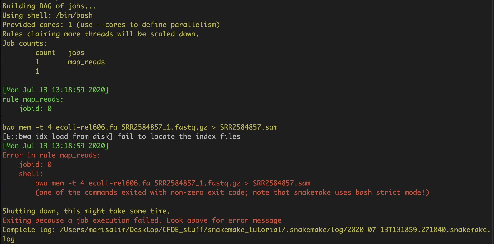

# The Snakefile

Snakemake uses a file called 'Snakefile' to configure the steps, or rules, of your pipeline. The basic Snakefile consists of several rules defining the inputs, outputs, and rule commands. 

!!! tip

    The written contents of the tutorial are demonstrated in three short videos. We recommend watching the videos first and referring to the tutorial text for additional help. 

Part 1: Introducing the Snakefile and Snakemake

<iframe id="kaltura_player" src="https://cdnapisec.kaltura.com/p/1770401/sp/177040100/embedIframeJs/uiconf_id/29032722/partner_id/1770401?iframeembed=true&playerId=kaltura_player&entry_id=1_t0putehi&flashvars[mediaProtocol]=rtmp&amp;flashvars[streamerType]=rtmp&amp;flashvars[streamerUrl]=rtmp://www.kaltura.com:1935&amp;flashvars[rtmpFlavors]=1&amp;flashvars[localizationCode]=en&amp;flashvars[leadWithHTML5]=true&amp;flashvars[sideBarContainer.plugin]=true&amp;flashvars[sideBarContainer.position]=left&amp;flashvars[sideBarContainer.clickToClose]=true&amp;flashvars[chapters.plugin]=true&amp;flashvars[chapters.layout]=vertical&amp;flashvars[chapters.thumbnailRotator]=false&amp;flashvars[streamSelector.plugin]=true&amp;flashvars[EmbedPlayer.SpinnerTarget]=videoHolder&amp;flashvars[dualScreen.plugin]=true&amp;flashvars[Kaltura.addCrossoriginToIframe]=true&amp;&wid=0_og159i3p" width="608" height="402" allowfullscreen webkitallowfullscreen mozAllowFullScreen allow="autoplay *; fullscreen *; encrypted-media *" sandbox="allow-forms allow-same-origin allow-scripts allow-top-navigation allow-pointer-lock allow-popups allow-modals allow-orientation-lock allow-popups-to-escape-sandbox allow-presentation allow-top-navigation-by-user-activation" frameborder="0" title="Kaltura Player"></iframe>

### Editing the Snakefile

Let's take a look at the Snakefile using the nano text editor:
```
(snaketest) $ nano -ET4 Snakefile
```

This is the skeleton of our Snakefile for calling variants. The command above tells nano to open the Snakefile and to create 4 spaces when you hit the `tab` key. The Snakefile is written in the Python programming language, which uses specific indentation formatting to interpret the code. Incorrect indentation will result in syntax errors.

There are several rules defined with commands to run, but we'll need to add a few more details by editing with nano.

!!! note "Practice"
    Add a comment to the Snakefile:

    1. open Snakefile in `nano`

    2. on a new line, add a comment with `#`, e.g., `# This is my first edit!`

    3. save the change by hitting `control` key and `o` key. `nano` will ask if you want to save the file as 'Snakefile'. We want to keep the same file name, so hit `return` key.

    4. exit `nano` by hitting `control` key and `x` key.

    5. view the Snakefile in Terminal with: `less Snakefile`.

    6. if you can see your comment, it worked! Exit the `less` view by hitting `q` key.

!!! Tip

    Please refer to the [bash command cheatsheet](./bash_cheatsheet.md) for commonly used `nano` commands and other shortcuts for navigating your Terminal!

Ok, let's move on and take a look at the structure of the Snakefile rules.

### Snakefile rules

Each step in a pipeline is defined by a rule in the Snakefile. The components of each rule are indented 4 spaces. The most basic structure of a rule is:

```
rule <rule name>:
    shell:
        # for single line commands
        # command must be enclosed in quotes
        "<command>"
```

There are several rules in the Snakefile. Let's do a search for all the rules in the file:

```
(snaketest) $ grep rule Snakefile
```

The output is a list of the lines in the Snakefile with the word 'rule' in them. There are 11 rules in this pipeline.

```
rule download_data:
rule download_genome:
rule uncompress_genome:
rule index_genome_bwa:
rule map_reads:
rule index_genome_samtools:
rule samtools_import:
rule samtools_sort:
rule samtools_index_sorted:
rule samtools_mpileup:
rule make_vcf:
```

## Snakemake & Snakefile

Let's try running a Snakemake rule:

```
(snaketest) $ snakemake -p map_reads
```

The `-p` means 'show the command that you're running'.

!!! tip
    
    The placement of snakemake flags must follow the `snakemake` command, but otherwise the location does not matter. Thus, `snakemake -p map_reads` will run the same as `snakemake map_reads -p`.

Oops, this will fail! Why?


As the error message in red states, the rule failed because we don't have any of the input files required to run this rule yet! For the mapping rule to work, we need the raw read (`.fastq.gz`) file and reference genome (`.fa.gz`) that should be indexed.

Let's start with the first rule in the Snakefile:
```
(snaketest) $ snakemake -p download_data
```

Snakemake runs the shell command listed under the `download_data` rule. In this case, the shell command downloads the raw read file from a public repository on [osf.io](https://osf.io).

It worked!


Check the working directory. There should now be a `.fastq.gz` file:
```
(snaketest) $ ls -lht
```

This command shows you the file permissions, number of links, owner name, owner group, file size in bytes, time of last modification, and file/directory name.

Next run some more rules sequentially – one at a time:
```
(snaketest) $ snakemake -p download_data
(snaketest) $ snakemake -p download_genome
(snaketest) $ snakemake -p uncompress_genome
(snaketest) $ snakemake -p index_genome_bwa
(snaketest) $ snakemake -p map_reads
```

Check the working directory again. The directory is populated by many output files including reference genome (`.fa`), genome index (`.fa.sa`, `.fa.amb` etc) and mapped reads (`.sam`) files. **The `map_reads` rule ran without any error!**. In the next section, we'll cover how to connect the rules so Snakemake can recognize rules that depend on each other and run them in the correct order.


!!! recap

    In this section we explored the basic template of a Snakefile which contains rules with all the necessary commands for variant calling.

    - each rule can be run individually using `snakemake -p <rule_name>`.
    - each rule encompasses shell commands, with a bit of “decoration”. You could run them yourself directly in the terminal if you wanted!
    - while the written order of the rules in Snakefile doesn’t matter, the order in which the rules are run on the terminal does matter! More on this in the next section!
    - by default, if you don't specify a rule, Snakemake executes the first rule in the Snakefile (this is actually the only case where the order of rules in the Snakefile matters!)
    - output Snakemake message is in red if it fails
    - the code is case-sensitive
    - tabs and spacing matters

!!! Tip

    Please refer to the [Snakemake command cheatsheet](./snakemake_cheatsheet.md) for commonly used Snakemake commands!
