# Functional Genetic Variation in Blood Cancer

Acute Myeloid Leukemia (AML) is a type of blood cancer. In AML, the affected myeloid cells which are a type of white blood cells, are not functional and build up in the bone marrow leaving reduced capacity for healthy white and red blood cells. While
risk factors for developing AML exist, often times the underlying cause remains unknown. Gene mutations and chromosomal abnormality in the leukemia cells occur sporadically. Characterization of the wide spectrum of genetic events involved in AML will aide in better
understanding of AML etiology and ultimately in development of improved therapy.

Combining whole genome sequencing (WGS) data with global transcriptomic profiling using RNA-sequencing (RNA-seq) can help elucidate functional dysregulation for genes of interest.
In this use case, we demonstrate the utility of the [CFDE portal](https://app.nih-cfde.org) in identifying and extracting suitable AML WGS and RNA-seq datasets from across the
CF programs.

A video walk through demonstrating the cohort selection for AML.

<iframe id="kaltura_player" src="https://cdnapisec.kaltura.com/p/1770401/sp/177040100/embedIframeJs/uiconf_id/29032722/partner_id/1770401?iframeembed=true&playerId=kaltura_player&entry_id=1_2xx7dwci&flashvars[mediaProtocol]=rtmp&amp;flashvars[streamerType]=rtmp&amp;flashvars[streamerUrl]=rtmp://www.kaltura.com:1935&amp;flashvars[rtmpFlavors]=1&amp;flashvars[localizationCode]=en&amp;flashvars[leadWithHTML5]=true&amp;flashvars[sideBarContainer.plugin]=true&amp;flashvars[sideBarContainer.position]=left&amp;flashvars[sideBarContainer.clickToClose]=true&amp;flashvars[chapters.plugin]=true&amp;flashvars[chapters.layout]=vertical&amp;flashvars[chapters.thumbnailRotator]=false&amp;flashvars[streamSelector.plugin]=true&amp;flashvars[EmbedPlayer.SpinnerTarget]=videoHolder&amp;flashvars[dualScreen.plugin]=true&amp;flashvars[Kaltura.addCrossoriginToIframe]=true&amp;&wid=1_uoyyydlh" width="608" height="402" allowfullscreen webkitallowfullscreen mozAllowFullScreen allow="autoplay *; fullscreen *; encrypted-media *" sandbox="allow-forms allow-same-origin allow-scripts allow-top-navigation allow-pointer-lock allow-popups allow-modals allow-orientation-lock allow-popups-to-escape-sandbox allow-presentation allow-top-navigation-by-user-activation" frameborder="0" title="Kaltura Player"></iframe>

## Step 1: Access the Biosample information

From the main landing page for the [CFDE portal](https://app.nih-cfde.org) there are two
options to access the "Biosample" view of the CFDE data browser.

By using the "Biosample" link under the "Or browse by feature" section listed
under "Explore our Repository" or by selecting the "Biosample" option under the "Browse" option in the top left navigation bar.

   

The default page shows a total of 289,320 records.

## Step 2: Apply Anatomy Filter

Access the "Anatomy" filter listed under the Refine Search panel. Search for "blood" in the
search box within "Anatomy" filter.

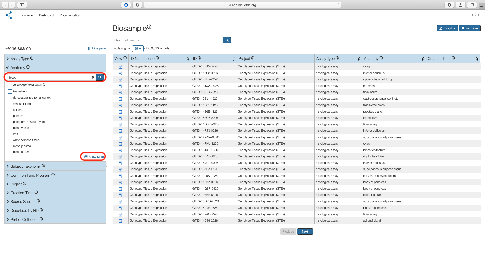   

Click on the "Show More" option which opens a pop up window with all search results.
Select "blood" and "venous blood" options and choose "Submit".

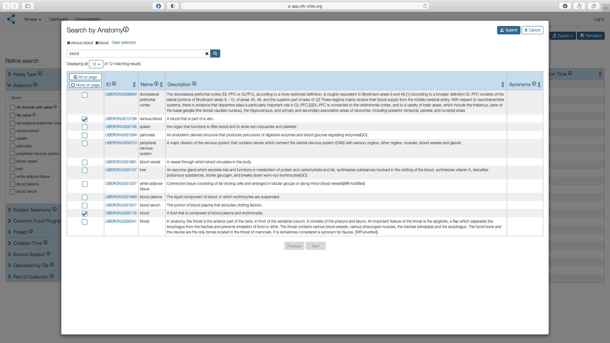   

This results in 10,229 results.

## Step 3: Apply Assay Filter

Next use the "Assay" filter listed under the Refine Search panel to select the boxes
for whole genome sequencing assay (WGS) and RNA-seq assay values.
This results in 7693 records.

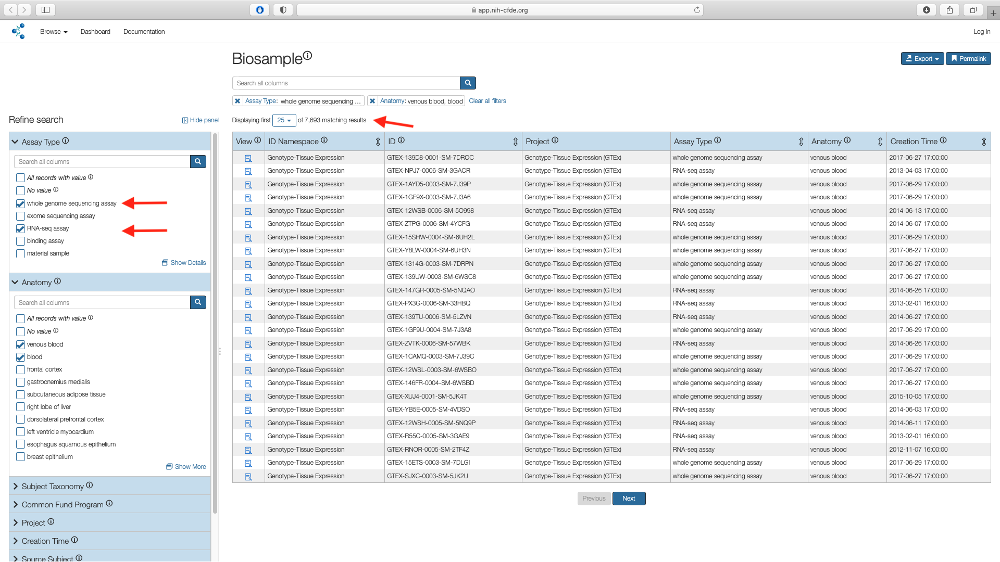   

## Step 4: Apply Project Filter

To select only the datasets pertaining to AML, use the "Project" filter under the Refine
Search panel and click on "Show More".
This results in 17 projects stemming from three separate CF programs listed under the
"ID Namespace column" i.e Genotype-Tissue Expression (GTEx), The Gabriella Miller Kids First
Pediatric Research Program (KF) and Molecular Transducers of Physical Activity
Consortium (MoTrPAC).

!!! note "MoTrPAC data "
    Although MoTrPAC will eventually include human data, the current release contains test data from experiments conducted on rats. Thus, this dataset is excluded from the current cohort.

Check the boxes corresponding to "Genotype-Tissue Expression (GTEx)" and "TARGET: Acute Myeloid Leukemia" in the "Name" column and "Submit".

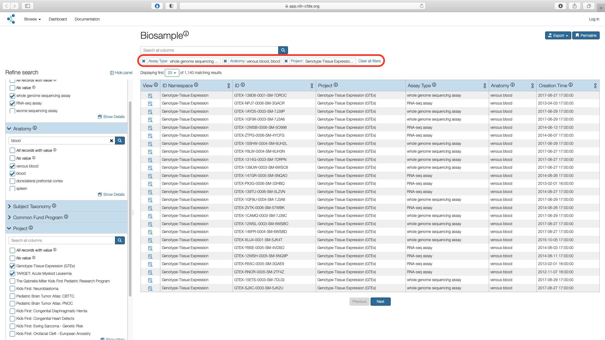   

This results in 1,140 matching records.

## Step 5: Export Cohort

The filtered cohort can now be exported as a `csv` file to further investigate using the data portals of the originating CF program i.e. GTEx and KF respectively.

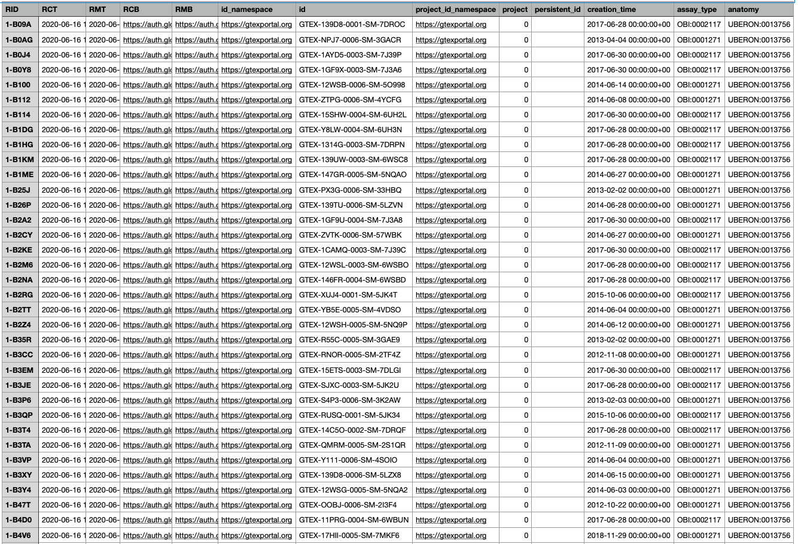   

The exported `csv` file has thirteen columns. The `anatomy` columns lists the [UBERON](http://uberon.github.io/about.html) values for venous blood (UBERON:0013756) and blood (UBERON:0000178). The `assay_type` lists the [Ontology for Biomedical Investigations (OBI)](http://obi-ontology.org) IDs for WGS (OBI:0002117) and RNA-seq (OBI:0001271).
The `id` column lists the unique sample IDs within the cohort and will be key in obtaining the associated files from data portals for GTEx and KF respectively.

## Step 6: KF Data Portal

[The Gabriella Miller Kids First Data Resource Center](https://kidsfirstdrc.org/) provides researchers access to data collected from children affected with cancer and structural birth defects to enable new discoveries and treatment strategies. [Follow our guide to login into the KF data portal](../../Kids-First/Portal-Setup-And-Permissions/KF_3_KF_Registration.md) which is via one of the three routes including ORCID, Google or Facebook.

After login, select the "File Repository" and in the "Clinical Filters" tab, scroll all the way to the bottom to choose the "Search Files by Biospecimen ID". Click on "upload your list of ids".

  

You can either paste the comma separated list of IDs which is same as the values in the `id` column of the exported file from the portal or upload a file. Choose "View Results" to view all the associated metadata data.

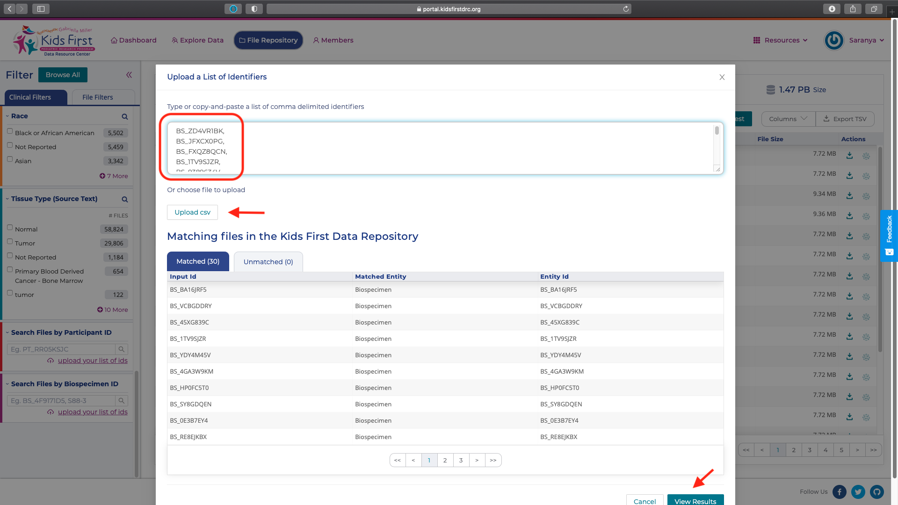

The resulting view in the portal lists all the participants and files associated with the study. Using the "File Filters" tab the details of the experimental strategy, data type and file formats can also be viewed. The lock icon under the "Actions" column implies protected data and access has to be requested.

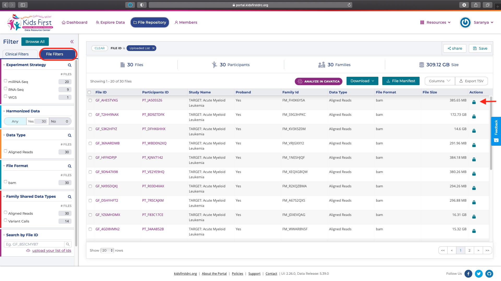

The data access request can be applied through [National Cancer Institute's Cancer Research Data Commons](https://datascience.cancer.gov/data-commons).

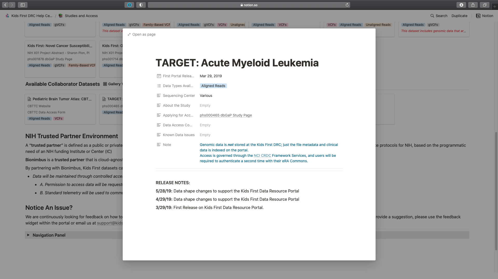

## Step 7: GTEx Data Portal

[The GTEx project](https://gtexportal.org/home/) is an ongoing effort to build a comprehensive public resource to study tissue-specific gene expression and regulation. Data was collected from over 1000 individuals across 54 non-diseased tissue sites and thus represent baseline values.

!!! note "GTEx"
    The portal website address is listed in the exported csv file for the CFDE portal in both the `id_namespace` and in the `project_id_namespace` columns.

Login in to the portal is via Google.

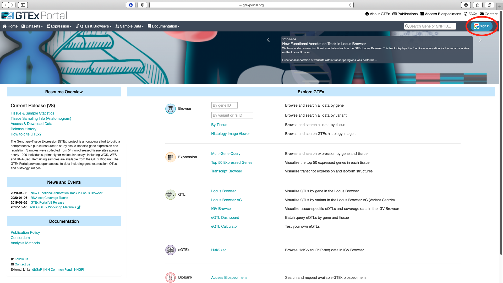     

The relevant data available for download can be accessed via the `Datasets` option in the main menu bar.

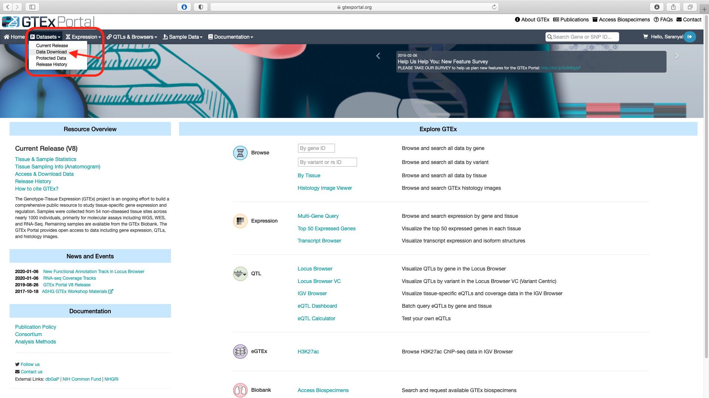

The subject and sample level metadata are listed under the `Annotations` tab on the latest data release page. The plain text files ending in `.txt` contain the sample and subject annotations while the excel files ending in `.xlsx` contain the dictionary for all the columns listed in the sample and subject annotations files.

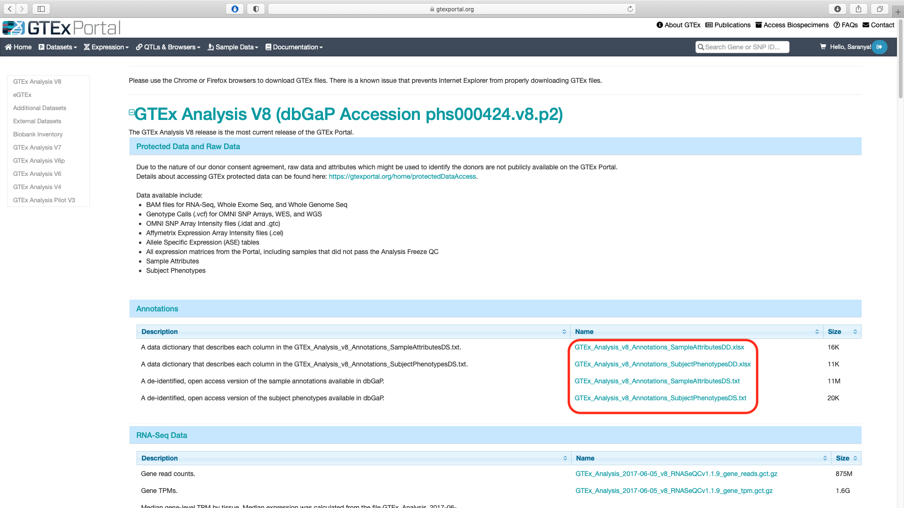

The sample annotations file contains the `SAMPID` that correspond to the `ID` column in the exported `csv` file from the CFDE portal.

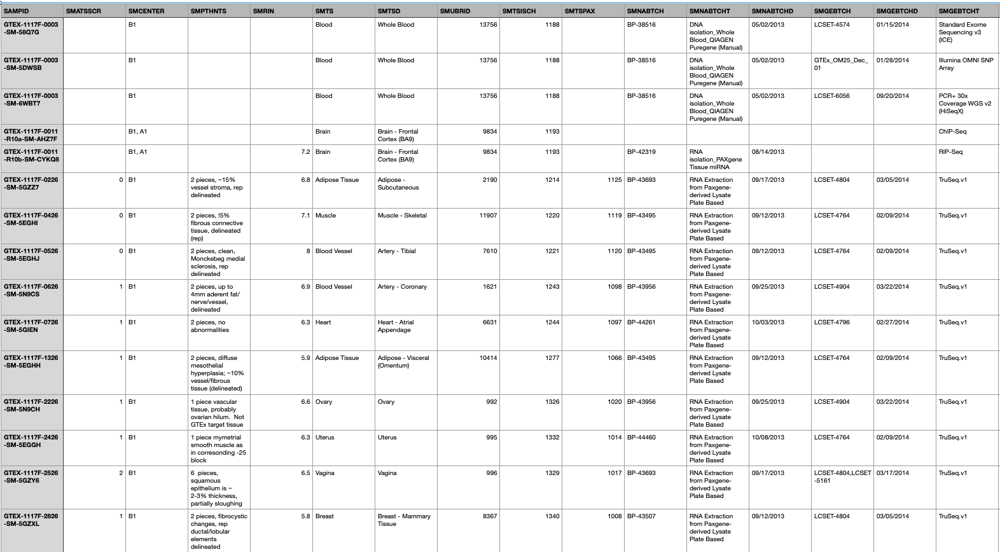

The subject annotations file contains `SUBJID` which corresponds to the first ten characters of the `SAMPID`.

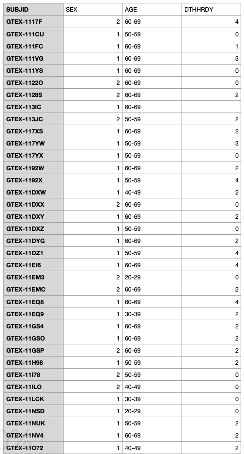

These lists can be combined and filtered to obtain subjects and data corresponding to blood DNA and RNA samples from individuals in the youngest age bracket to make comparable analysis with the KF AML data.

Based on the filtered cohort, a researcher can access the [GTEx data](https://gtexportal.org/home/protectedDataAccess) after approval of dbGAP controlled access application.
