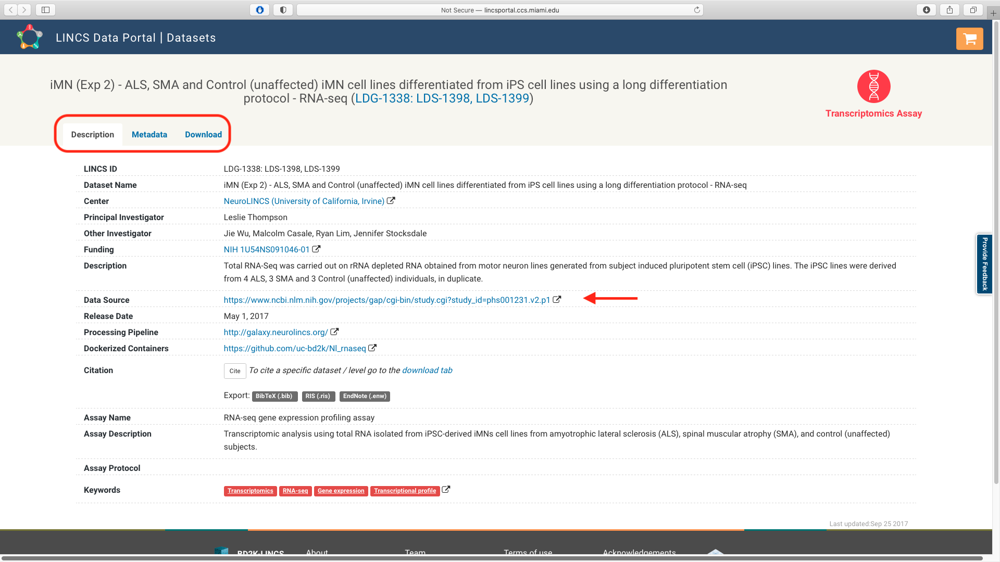

Using the details in the [CFDE portal exported `csv` manifest](./movement-disorders-portal-export.md), the associated data files can be accessed from data portals of the individual Common Fund programs, [Metabolomics]((https://www.metabolomicsworkbench.org) and [LINCS]((http://lincsportal.ccs.miami.edu/datasets/) data portals respectively.

## Metabolomics WorkBench

The details of each Metabolomics study can be viewed, analyzed and downloaded using the [Metabolomics WorkBench](https://www.metabolomicsworkbench.org). The `persistant_id` for each study is associated with a summary page which lists all the available analyzed and raw data, metadata associated with study design, experimental conditions, sample preparation details and analysis techniques along with   contributor information and creation date.

The associated metadata for the different fields can be listed as tabs. Study data can be downloaded as `zip` files. Selecting the `Perform statistical analysis` lists multiple options for statistical tests, clustering, pathway mapping and visualization that can be run on the study data.

## LINCS Data Portal

The `persistant_id` for each LINCS dataset is linked to the study page in the [LINCS data portal](http://lincsportal.ccs.miami.edu/datasets/) which list the Description, Metadata and Download tabs. The associated metadata and analyzed data are available for direct download.

The "Data Source" lists the link to the dbGaP study which all relevant study description, sequencing details, associated published literature along with information to apply for access to the controlled experimental data.

