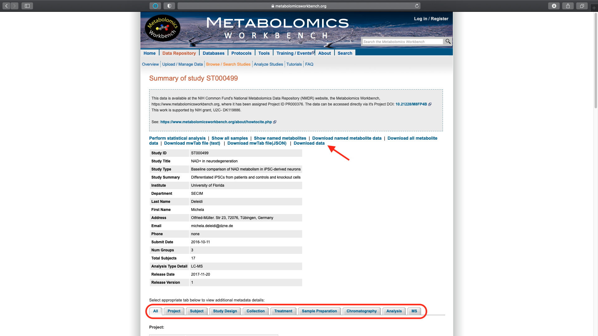

# Integrated Analysis of Movement-Related Disorders

Movement-related disorders affect the neuromuscular system, disrupting the ability of the nervous and muscular systems to work together. There are several known movement-related disorders, including Amyotrophic Lateral Sclerosis (ALS) or Lou Gehrig’s disease, Parkinson's disease, Spinal Muscular Atrophy (SMA) and Multiple Sclerosis (MS). 

Amyotrophic Lateral Sclerosis (ALS): is a motor neuron disease which involves the loss of neurons in the brain and spinal cord that control voluntary movement of the muscles. ALS is not heritable.

Spinal Muscular Atrophy (SMA): is a heritable motor neuron disease with known genetic causes. 

Parkinson's disease: is a degenerative condition which results from the death of dopamine producing neurons. 

Multiple Sclerosis (MS): is an autoimmune disorder in which the protective sheath covering some neurons (called myelin) is damaged. Neurons with damaged myelin disrupt electrical communications that are necessary for normal movement and coordination. 

A few common features of these neuromuscular disorders are that they all involve brain neurons, they share many symptoms, and they are all difficult to diagnose in their early stages. Identifying key genomic, genetic, transcriptomic or proteomic differences between these movement-related disorders may help identify underlying disease mechanisms or biomarkers to aide in early diagnosis and/or targeted drug development. 

In this use case, we demonstrate the utility of the [CFDE portal](https://app.nih-cfde.org) in identifying and extracting suitable datasets of human origin spanning the spectrum of movement-related disorders from across the CF programs.

A video walk through demonstrating the cohort selection for Movement-Related Disorders.

<iframe id="kaltura_player" src="https://cdnapisec.kaltura.com/p/1770401/sp/177040100/embedIframeJs/uiconf_id/29032722/partner_id/1770401?iframeembed=true&playerId=kaltura_player&entry_id=1_b89l89ba&flashvars[mediaProtocol]=rtmp&amp;flashvars[streamerType]=rtmp&amp;flashvars[streamerUrl]=rtmp://www.kaltura.com:1935&amp;flashvars[rtmpFlavors]=1&amp;flashvars[localizationCode]=en&amp;flashvars[leadWithHTML5]=true&amp;flashvars[sideBarContainer.plugin]=true&amp;flashvars[sideBarContainer.position]=left&amp;flashvars[sideBarContainer.clickToClose]=true&amp;flashvars[chapters.plugin]=true&amp;flashvars[chapters.layout]=vertical&amp;flashvars[chapters.thumbnailRotator]=false&amp;flashvars[streamSelector.plugin]=true&amp;flashvars[EmbedPlayer.SpinnerTarget]=videoHolder&amp;flashvars[dualScreen.plugin]=true&amp;flashvars[Kaltura.addCrossoriginToIframe]=true&amp;&wid=1_j485yhqf" width="608" height="402" allowfullscreen webkitallowfullscreen mozAllowFullScreen allow="autoplay *; fullscreen *; encrypted-media *" sandbox="allow-forms allow-same-origin allow-scripts allow-top-navigation allow-pointer-lock allow-popups allow-modals allow-orientation-lock allow-popups-to-escape-sandbox allow-presentation allow-top-navigation-by-user-activation" frameborder="0" title="Kaltura Player"></iframe>

## Step 1: Access the Collection information

From the main landing page for the [CFDE portal](https://app.nih-cfde.org) there are two
options to access the "Collection" view of the CFDE data browser.

By using the "Collection" link under the "Or browse by feature" section listed
under "Explore our Repository" or by selecting "Collection" under the "Browse" option in the top left navigation bar.

   

The default page shows a total of 2,990 records.

## Step 2: Search all columns: IPSC

Use the **IPSC** (induced pluripotent stem cell) keyword in the Search all columns box.

!!! note "Case-insensitive"
    The search is case-insensitive. One will obtain the same results for "IPSC" or "ipsc" or any combination of the two.

   

This results in 19 records.

## Step 3: Subset using Part of Collection

Use the "Part of Collection" filter listed under the Refine Search panel to select the desired datasets ["ID" values : ST000499, ST000554, LDG-1296, LDG-1297, LDG-1298, LDG-1393, LDG-1394,
LDG-1338, LDG-1339].

   

This results in 9 matching records from Metabolomics and Library of Integrated Network-Based Cellular Signatures (LINCS). The subset cohort is exported to a `csv` file using the "Export" option.

## Step 4: Search all columns: Stem Cell

Use "Clear all filters" to remove the previous selection and use **stem cell neu** keyword. Use the "Part of Collection" filter listed under the Refine Search panel to select the desired datasets ["ID" values : ST000688, ST000768].

!!! note "Duplicated studies"
    The two LINCS datasets (LDG-1338, LDG-1393) in the subset are not selected as they are already included in the previous filtered list.

This results in two records and are exported to a `csv` file using the "Export" option.

## Step 5: Merge Cohort

The two exported `csv` files are merged to obtain the final dataset.

   

The exported `csv` file has twelve columns. The relevant individual study details are in the `id`, `name` and `description` columns. The `persistant_id` column lists the permanent URL which can be used to access each of the studies in Metabolomics and LINCS data portals respectively.

## Step 6: Metabolomics WorkBench

The details of each Metabolomics study can be viewed, analyzed and downloaded using the [Metabolomics WorkBench](https://www.metabolomicsworkbench.org). The `persistant_id` for each study is associated with a summary page which lists all the available analyzed and raw data, metadata associated with study design, experimental conditions, sample preparation details and analysis techniques along with   contributor information and creation date.

  

The associated metadata for the different fields can be listed as tabs. Study data can be downloaded as `zip` files. Selecting the `Perform statistical analysis` lists multiple options for statistical tests, clustering, pathway mapping and visualization that can be run on the study data.

  

## Step 7:  LINCS Data Portal

The `persistant_id` for each LINCS dataset is linked to the study page in the [LINCS data portal](http://lincsportal.ccs.miami.edu/datasets/) which list the Description, Metadata and Download tabs. The associated metadata and analyzed data are available for direct download.

  

The "Data Source" lists the link to the dbGaP study which all relevant study description, sequencing details and associated published literature.

  
