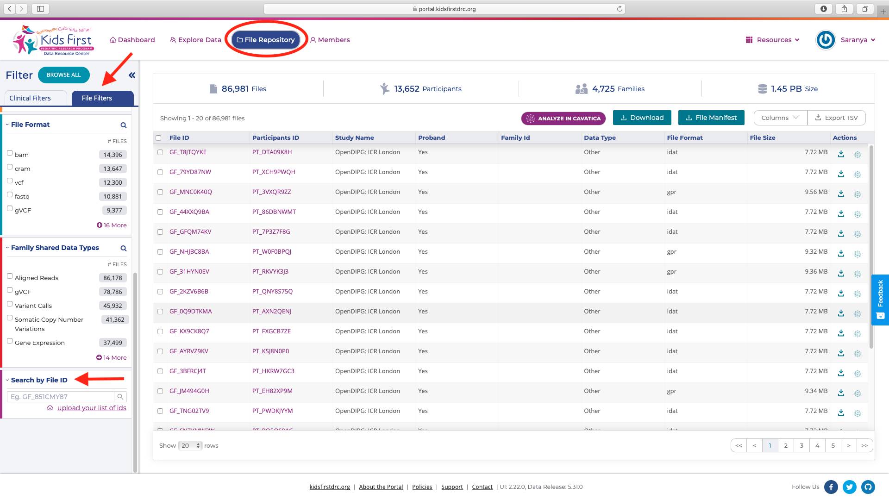
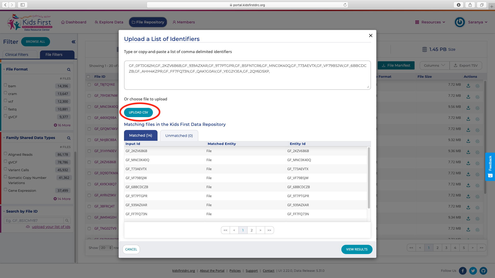

Example Data Files
===================

For this tutorial there are two options to obtain the example files. You can either use example files compiled using open access data from multiple repositories or use open access data from Kids First, a Common Fund program.

General Example Files
-----------------------
Download the compressed data and extract to view the files.

```
curl -L https://osf.io/erj8n/download -o MIME_example_files.tar.gz
tar -zxvf MIME_example_files.tar.gz
```
The directory structure of the resulting `example_files_MIME`:

```
.
├── 6285633006_R03C01_Red.idat
├── ERR458493.fastq
├── HCM-BROD-0028-C71.json
├── MANIFEST.txt
├── TARGET_NBL_ClinicalData_Discovery_20200507.xlsx
├── TCGA.UCS.varscan.a35f9f72-e4da-4d93-ad40-11cbd417b037.DR-10.0.somatic.maf
├── annotations.txt
├── coatColor.pheno
├── commit-detached.svg
├── nationwidechildrens.org_clinical.TCGA-AA-A00L.xml
├── pruned_coatColor_maf_geno.vcf
├── wa.BG02.rep-1.J7.hg19.pks.bed
├── wgEncodeUwRepliSeqBg02esG1bAlnRep1.bam
├── wgEncodeUwRepliSeqBg02esS3AlnRep1.bam.bai
└── wgEncodeUwRepliSeqBg02esS3PctSignalRep1.bigWig
```

Kids First Files
------------------

For this tutorial, you can also use open access files from the [Kids First Data Portal](https://kidsfirstdrc.org) (KF Data Portal).

!!! note "KF Data Portal Login"
    Downloading the files requires an account on the [KF data portal](https://kidsfirstdrc.org). You can choose one of three available options (Google, ORCID, Facebook) to setup an account, although we recommend using ORCID if you have one. For more details can be found on the [Registration tutorial for Kids First](../../Bioinformatics-Skills/Kids-First/Portal-Setup-And-Permissions/KF_3_KF_Registration.md).

Download the [KF_File_ID.csv](./mime_supplementary_files/KF_File_ID.csv). Login to [Kids First Data Portal](https://kidsfirstdrc.org), select `File Repository` and `File Filters`. Scroll all the way down to `Search by File ID` field and click on `upload your list of ids`.



One can either copy paste the File IDs in the box or upload the KF_File_ID.csv. To obtain a local copy, select `View Results` and for each individual file click on download button under the `Actions` column.



The directory structure of `KF_data` with all the files should include:

```
.
├── 254ca234-b7f2-4305-ab93-d7e15f4a530d.rsem.isoforms.results
├── 32503692.gpr
├── 801039e0-8675-452f-86bf-474297f17cbf.mutect2_somatic.vep.maf
├── 80c5a306-15a0-4241-bedb-cf153a1fb866.rsem.isoforms.results
├── 86d75258-8a3a-4f6c-b108-fd26d1bcabf4.arriba.fusions.pdf
├── 9969477031_R02C01_Red.idat
├── ad45e585-d356-4d8b-97cd-4e050418754c.mutect2_somatic.vep.maf
├── ba6f060d-582b-46c1-833a-9c0d6e68ccc5.STAR.fusion_predictions.abridged.coding_effect.tsv
├── c133da79-1f7c-41e1-a081-e3aa0d39e764.rsem.isoforms.results
├── dfe951a5-0b00-42e3-81f2-99aaaf54b898.CNVs.p.value.txt
├── e7adf495-d7da-4b85-8f27-e1f7ecbe45a3.png
├── ee49988d-8ab8-4902-9e4e-dfc2face240d.somaticSV.vcf
├── f06987bc-aca3-4f7e-8e77-6e2cf9ce28a0.STAR.fusion_predictions.abridged.coding_effect.tsv
└── f6bc4b78-280b-420a-8af4-1a6d85304e37.png    
```
