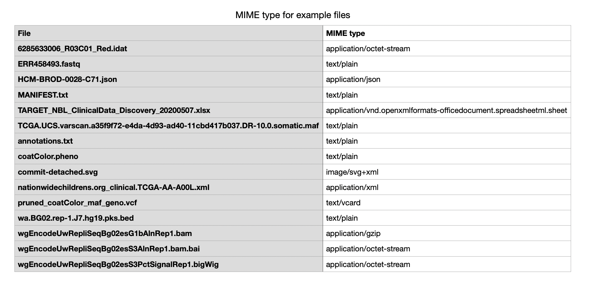

MIME type of many files
========================

To obtain MIME type for multiple files, we can script the utility commands in a for loop. As an example, here is one possible script using the `xdg-mime` command to obtain the MIME type for each file and store the results as a tab-separated-values file.

```
for file in {.,}*; do      # For all files in the current directory with all the Kids First data files
  mime_type=`xdg-mime query filetype $file`        # Obtain MIME type
  echo "$file   $mime_type" >> example_mime_types.tsv   # Write to output file
done
```



Siegfried has a built-in option to obtain the file format information for files in a directory.

=== "Usage"

    ```
     sf <path to the directory>
    ```

=== "Input"

    ```
    # Example code combined with other flags
    sf -sig custom.sig -csv example_files_MIME/ > example_files_MIME.csv

    # View the results in table format on command line
    cat example_files_MIME.csv | column -t -s, | less -S
    ```
