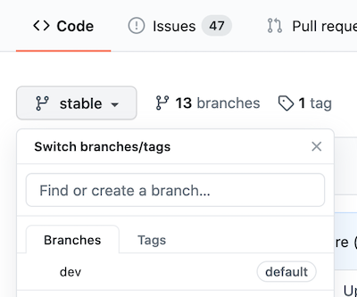

# Editing MkDocs Websites with cfde-bot

This is a tutorial on how to edit MkDocs websites from Github repos that use the cfde-bot robot. The cfde-bot handles changes in each website GitHub repo to check  edits and most importantly, prevent changes that could break the website.

!!! note "Learning Objectives"

    - learn how to edit Mkdocs website docs on Github using the cfde-bot

=== "Est. Time"

    ~20 mins (depending on the website, it make take longer for all the bot's checks to complete)

=== "Prerequisites"

    The cfde-bot was constructed for managing CFDE websites. To edit any of these websites, you must be onboarded to the CFDE to gain access to the nih-cfde Github repo files.

## General steps for editing CFDE websites with cfde-bots

For the CFDE, the key websites we maintain are built from the following Github repositories: `welcome-to-cfde`, `training-and-engagement`, `use-case-library-build`, and `published-documentation`. *See section [below](#published-docs) for specific instructions on editing the `published-documentation` website.*

The `welcome-to-cfde` and `use-case-library-build` CFDE websites currently have a single PR and review stage to merge changes to the public-facing website. These public-facing websites are rendered from the `stable` or `latest` branch, respectively. The `published-documentation` website involves more layers of PR review - please see details [below](#published-docs).

The `training-and-engagement` repo has a 2-stage PR and review stage. Changes are initially pushed to a development branch `dev` and then merged to `stable` for new releases of the public-facing website. Consequently, the steps of the PR process are slightly different compared to the other CFDE websites. The details are available in the website repo's style guide and release plan.

In this tutorial, we lay out the general steps for the single stage PR process.

### Step 1: Go to website's GitHub repository.

### Step 2: Create a new branch

If working from Github, type a new branch name (e.g., `my_branch`) in the `Branch:stable` dropdown button and hit ++enter++. The new branch should be created with the `stable` branch as its base.

### Step 3: Make edits

You should now be on your new branch, otherwise click `Branch:stable` and switch to your new branch.

Find the file(s) you want to change and make changes directly in the web interface (while not necessary, you can also make changes via a local copy of the repo with `git` commands). When you’re done editing, scroll to the bottom of the page to commit the changes; Github knows to commit the changes to your branch.

### Step 4: Create pull request

Push your changes from `my_branch` to the `stable` branch by clicking on "Compare & pull request". Add a description about the pull request (PR) and submit it. Depending on the website, follow style guidelines for the PR and review process.

### Step 5: Wait for cfde-bot checks

The cfde-bot will now make sure the website can build with these changes. The PR page will update the progress as the bot goes through its checks, starting with a yellow circle and "Some checks haven't completed yet". If the checks complete successfully, the circle turns green with a check mark and the message switches to "All checks have passed". If any checks failed, there will be a red circle with an "X" mark and the message "Some checks were not successful". In the latter case, check the build logs to track the error.

### Step 6: Check rendered changes

If the checks pass, changes should be automatically merged into a preview version of the readthedocs website. Click on the "Details" button of the "docs/readthedocs.com:<Github repo> — Read the Docs build succeeded!" check to view the rendered preview (the website is rendered for the specific PR).

### Step 7: Request reviews

If you are satisfied with the edits, request reviewers to check, request changes, and approve the changes.

### Step 8: Merge changes

When the PR has been approved, click "Merge pull request" and confirm merge. Be sure to delete your branch. Your edits should now be viewable on the public-facing website!

## Specific steps for editing the CFDE documentation website 

The website created by the `published-documentation` repo pulls some docs that are in its repo AND some from two sub-module repositories (`the-fair-cookbook` and `specifications-and-documentation`). There are two ways to make changes to this website that are detailed in the repo's [README](https://github.com/nih-cfde/published-documentation/blob/dev/README.md) documentation. The steps are summarized below:

### A) **To edit documents that are *in* the `published-documentation` repo**

Follow the general steps above, with the following additional steps:

- Push your changes to the `preview` branch first to check the rendered website
- If the changes look as you expected, make a PR of your branch to `dev` and tag the admin team, who will check the changes and approve. Approved changes will periodically be promoted to the `stable` branch to be rendered on the public website.

### B) **To edit documents that are in the sub-module repos**

The cfde-bot's process for checking changes to the sub-module repos (`the-fair-cookbook` and `specifications-and-documentation`) is slightly different:

- The `published-documentation` cfde-bot checks hourly for changes to the sub-module repo's `master` branch. Thus, changes should be made directly in these repositories.

- It pulls any changes into the `preview` branch of the `published-documentation` repo as a PR.

- If the website build checks pass, the bot auto-merges changes into the `preview` branch and renders the preview website.

- The cfde-bot simultaneously creates a PR of the changes to the `published-documentation` `master` branch so you can request a reviewer to merge to the `master` branch if you decide the preview looks good.

#### Step 1: Go to the sub-module's Github repository

- `the-fair-cookbook` repo: https://github.com/nih-cfde/the-fair-cookbook
- `specifications-and-documentation` repo: https://github.com/nih-cfde/specifications-and-documentation

#### Step 2: Make changes *directly* on the `master` branch.

#### Step 3: Check progress from the cfde-bot.

The bot will automatically create preview branches (`update-<repo>-preview`) if it detects changes in either of the sub-module repos.

#### Step 4: Check preview website

If the website build checks all pass, the bot will then automatically merge:

- `update-fair-preview` into `cookbookpreview`, and will build a preview site for you to browse at: https://cfde-published-documentation.readthedocs-hosted.com/en/cookbookpreview/
- `update-specsdocs-preview` into `specspreview`, and will build a preview site for you to browse at: https://cfde-published-documentation.readthedocs-hosted.com/en/specspreview/

#### Step 5: Publishing your changes

The bot will also automatically create branches (`update-<repo>-docs`) if it detects changes in either of the sub-module repos. If the preview looks as you expected, approve this matching PR. After approved, the admin team will merge changes and they will be viewable on the public version of the website!
