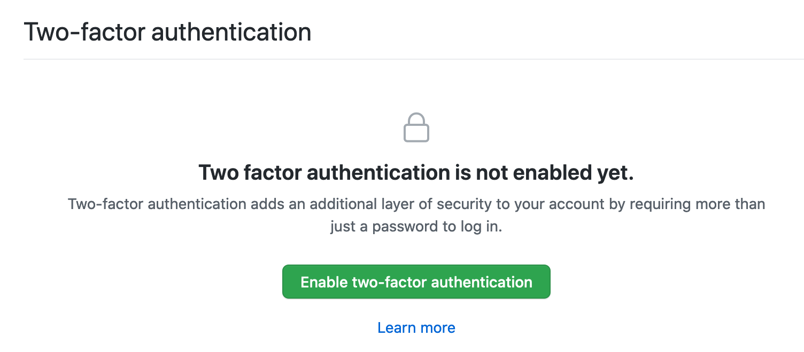
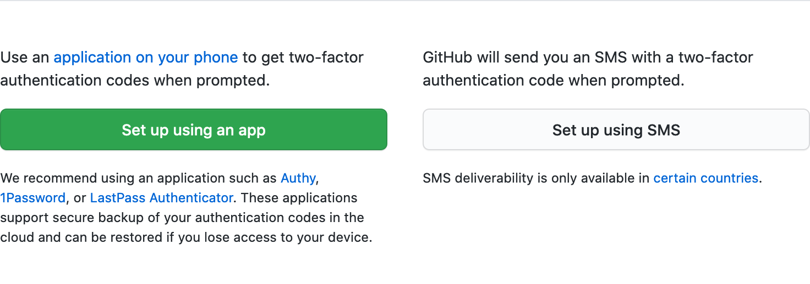
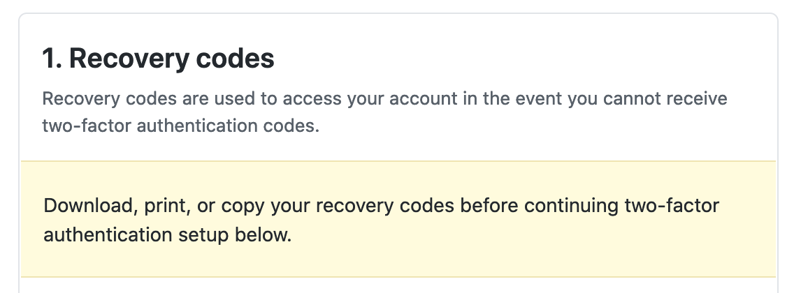
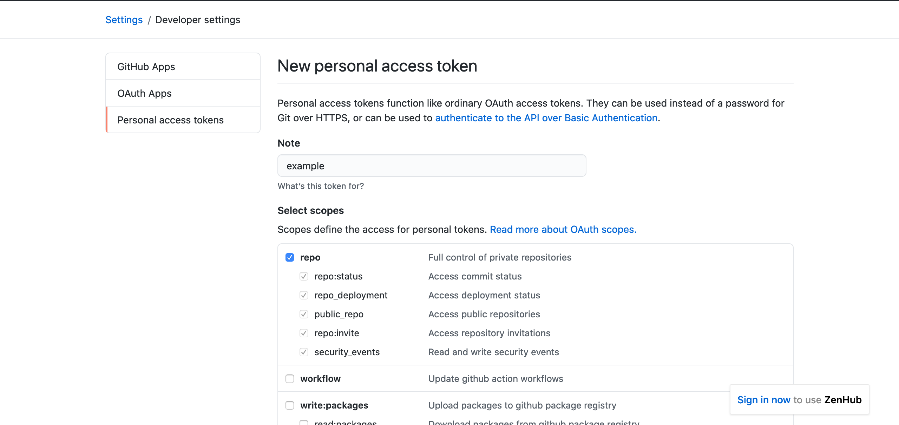
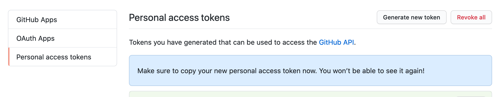

# Setting up Github Authentication


By mid-2021, Github will complete its [transition](https://github.blog/2020-12-15-token-authentication-requirements-for-git-operations/) to requiring a personal access token (PAT) key instead of a password to connect to Github remotely (e.g., using `git` on your local computer to work on remote branches).

In this tutorial, we will show you how to enable two-factor authentication (optional) and generate a PAT.

!!! note "Learning Objectives"

    - learn how to set up two-factor authentication
    - learn how to set up a personal access token

=== "Est. Time"

    30 mins

=== "Prerequisites"

    - GitHub account
    - Git installed on your computer
    - Access to a Unix shell
    - Basic command line skills

=== "Tutorial Resources"

    - [Github documentation on two-factor authentication](https://docs.github.com/en/free-pro-team@latest/github/authenticating-to-github/configuring-two-factor-authentication)
    - [Github documentation on personal access token](https://docs.github.com/en/free-pro-team@latest/github/authenticating-to-github/creating-a-personal-access-token)
    - [Github documentation on updating credentials](https://docs.github.com/en/free-pro-team@latest/github/using-git/updating-credentials-from-the-macos-keychain)

### Step 1: Go to Github account settings

- Click on <span class="highlight_txt">Settings</span> from the top-right dropdown menu on your Github profile picture.

- Click on <span class="highlight_txt">Account security</span> to go to the [security page](https://github.com/settings/security).

### Step 2: Set up two-factor authentication

While this step is optional, it is a good security measure to protect your account.

Click <span class="highlight_txt">Enable two-factor authentication</span>.



### Step 3: Choose how to receive codes

There are two options for receiving the two-factor authentication code.



The recommended method is to receive the code from a phone app, such as Authy, 1Password, or LastPass Authenticator. The Duo Security app also works. For this option, click <span class="highlight_txt">Set up using an app</span>.

The second option is to receive the code via text message to your phone. This option is only available in certain countries. For detailed steps on this method, see the Github [documentation](https://docs.github.com/en/free-pro-team@latest/github/authenticating-to-github/configuring-two-factor-authentication#configuring-two-factor-authentication-using-text-messages).

### Step 4: Save recovery codes

The next page will show a series of recovery codes; you will need these codes to regain access to your account if it is ever lost. Download, print, or copy these codes to a safe place, then click <span class="highlight_txt">Next</span>.



### Step 5: Enable two-factor authentication

If you chose to set up two-factor authentication with a phone app, open the app and scan the QR code. Enter the six-digit code from the app on Github in the text box below the QR code. After you click <span class="highlight_txt">Enable</span>, the two-factor authentication set up is complete!

You can test by logging out of Github and logging back in - the phone app should send you a six-digit code to enter as part of login.

### Step 6: Generate a PAT

Navigate to <span class="highlight_txt">Developer settings</span> located on the left panel of Account settings. This will take you to a new page, on the left panel, click on <span class="highlight_txt">Personal access tokens</span>.

Click on <span class="highlight_txt">Generate new token</span>. Give it a name in the **Note** text box.
Scopes enable setting permissions for user access to the various functionality of a repo. To set the scope for your user account, check the box next to **repo** and select all the tasks pertaining to a private repo that apply. Then scroll down and click <span class="highlight_txt">Generate token</span>.

!!! info "Update Scope"

    You can run into OAuth error with tasks if the original PAT doesn't include the correct scope. For example:

    ```
    refusing to allow a Personal Access Token to create or update workflow `....` without workflow scope
    ```

    To update the scopes associated with your PAT, you can do so by:

    - generating a new PAT key with the updated repo scopes
    - delete the GitHub credentials in keychain (on MacOS) or in Git Credential manager (on Windows)
    - delete and update the git credentials (Step 7)

    Alternatively, you can use the [**Git Credential Manager Core**](https://github.com/microsoft/Git-Credential-Manager-Core) which is a cross platform git credential helper which will request the correct scopes.




The token will look like a string of letters and numbers. **Keep this page open - we will need to use the PAT key instead of our password to login at the command line.**



!!! warning

    Be sure to save the token somewhere safe (e.g., password manager). After you leave this page, the token will no longer be viewable.

### Step 7: Update keychain with PAT

If you have saved your Github password with a password manager (e.g., `osxkeychain` on MacOS) to work on Github repositories remotely, it needs to be updated to the PAT we generated.

!!! note

    If you normally enter your user name and password when you `git push` local changes to Github, you'll need to enter the PAT key instead of your password

From the terminal, check whether the `credential.helper` is set on your `git` configurations:

=== "Input"

    ```
    git config --list
    ```

=== "Expected Output"

    On a MacOS, it may show:
    ```
    credential.helper=osxkeychain
    ```

In this example, we will delete the saved password from `osxkeychain`, so that it can be updated with the PAT key. Type ++enter++ after each of the commands below at the terminal. After entering `protocol=https` you need to press ++enter++ **twice**. If the commands are successful, there should be no output in the terminal. 

```
git credential-osxkeychain erase
host=github.com
protocol=https
```

The next time you `git push` changes from your local computer to a remote Github repository, enter your user name and the PAT key from Step 6 as the password.

!!! tip

    You may want to `git push` a test change (that can be deleted later) to a remote repository you work on now, so that you do not lose the PAT key!

If you have a password manager, it should "remember" the PAT key so it will not need to be entered the next time you use `git`.

For other options to update your Github credentials with the PAT key, see the Github [documentation](https://docs.github.com/en/free-pro-team@latest/github/using-git/updating-credentials-from-the-macos-keychain).
