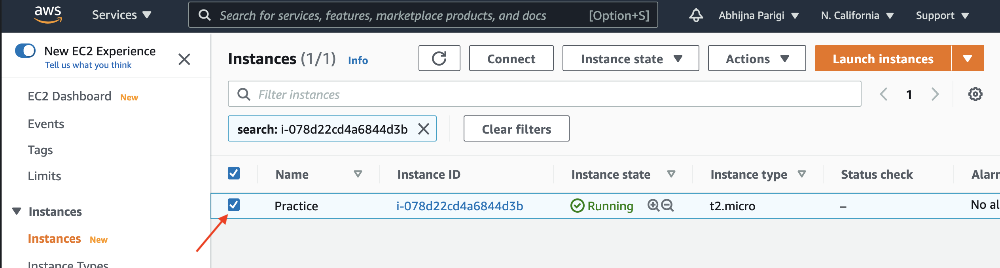
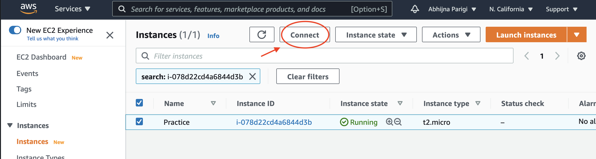
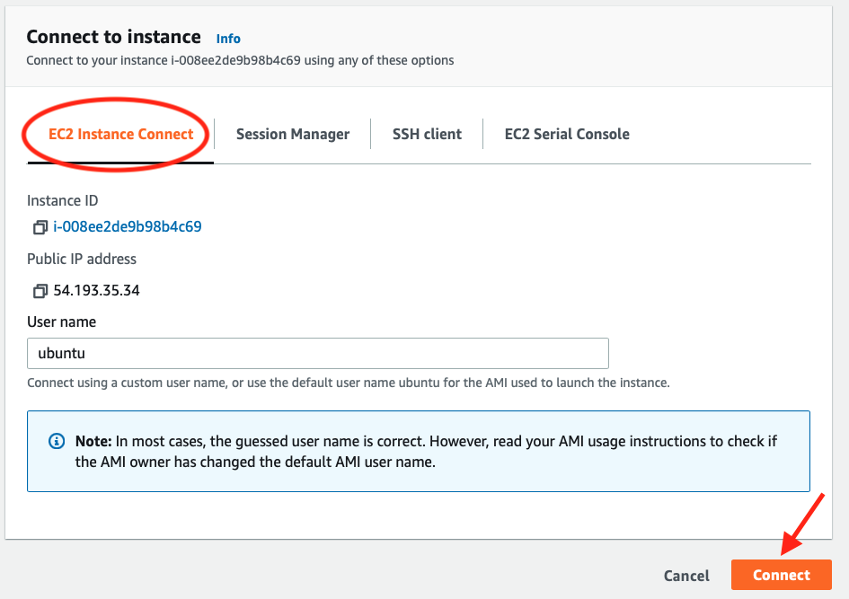
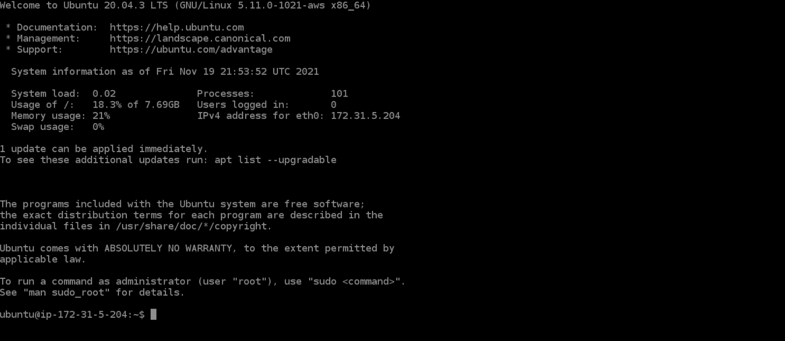
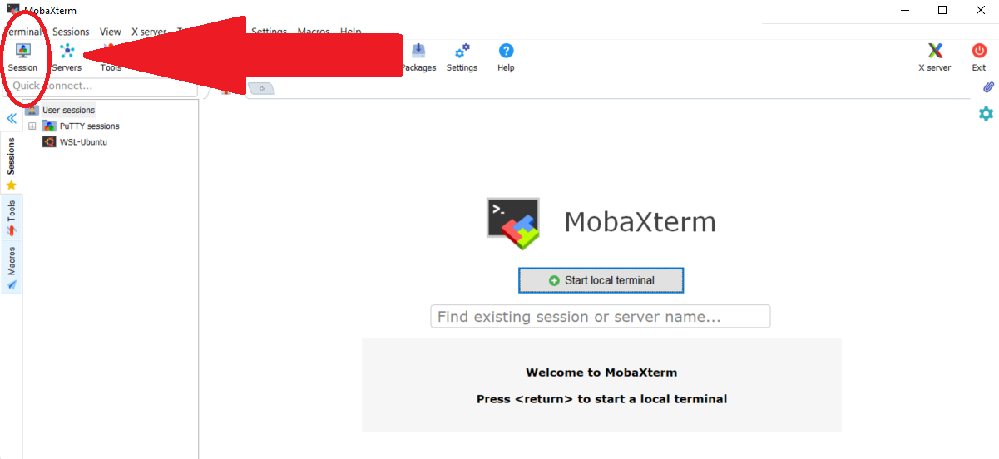
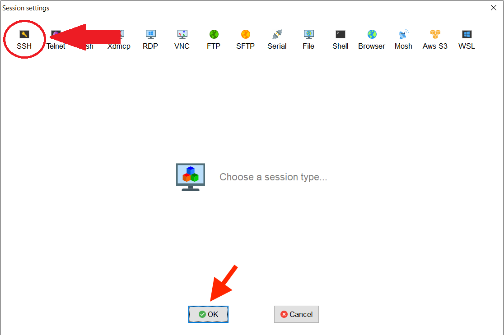
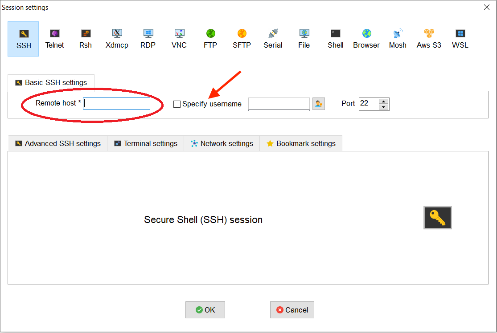
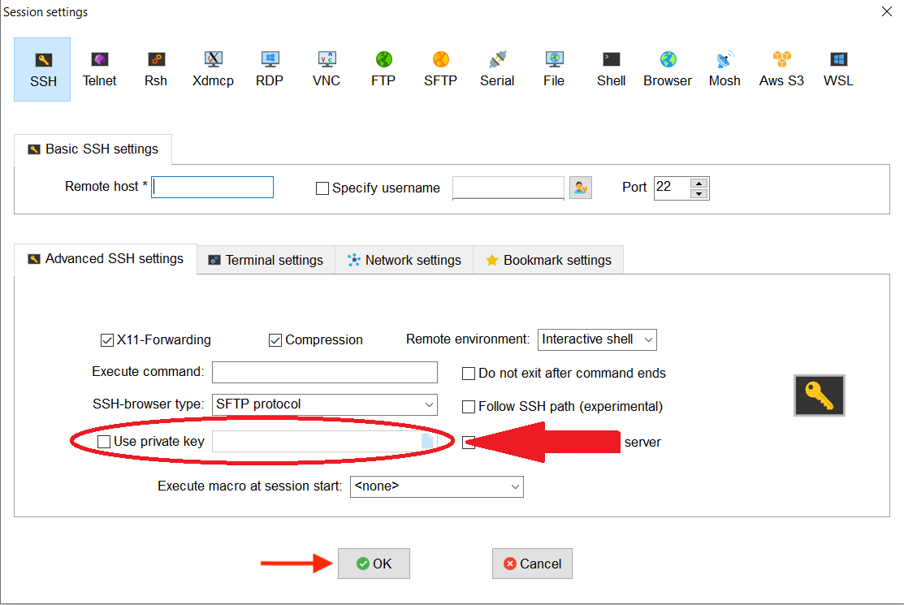
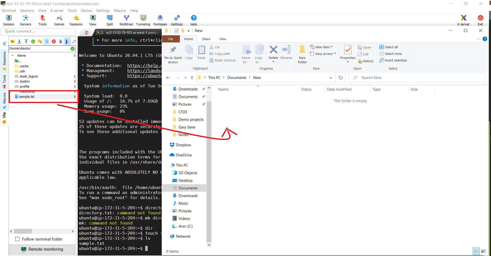

=== "Web Browser"

    This is an OS-agnostic way of connecting to your AWS instance. The advantage of using this method is that Windows users do not need to worry about downloading an SSH client such as [MobaXterm](https://mobaxterm.mobatek.net/){:target="_blank"}. The main disadvantage is that you cannot download files from the instance to your local machine via this web terminal interface.

    ## Step 1: Find your launched instance
    * Go to the page that lists all your instances: <https://us-west-1.console.aws.amazon.com/ec2/v2/home?region=us-west-1#Instances>

    ## Step 2: Select the instance

    * Check the box next to your running instance.

    

    ## Step 3: Connect

    * Click on the <span class="highlight_txt">Connect</span> button on the top of the screen.

    

    ## Step 4: EC2 instance connect tab

    * On this page, make sure the **EC2 Instance Connect** tab is selected (orange highlight).
    * Click the<span class="highlight_txt">Connect</span> button located at the bottom of the page.
    * Do not change the default username. It should read **ubuntu**.

    

    ## Step 5: Web browser terminal tab

    * A terminal window will open up in a new tab.

    

    !!! bug "Timeout"

        The web browser terminal will become unresponsive after some inactivity. If that happens, make sure to close the terminal window and reconnect by following Steps 3 & 4.

    Congratulations! You have successfully connected to your remote computer. You can download files onto your instance and install software programs via this web browser terminal.    


=== "Windows :fontawesome-brands-windows:"

    Ok, so you've created a running computer. How do you get to it?

    The main thing you'll need is the network name of your new computer. To retrieve this, go to the [AWS instance view](https://us-west-1.console.aws.amazon.com/ec2/v2/home?region=us-west-1#Instances:sort=instanceId){:target="_blank"}, click on the instance, and find the "Public DNS". This is the public name of your computer on the internet.

    ## Step 1: Open MobaXTerm

    [MobaXTerm](https://mobaxterm.mobatek.net/){:target="_blank"} is a terminal for Windows with an X11 server, a tabbed SSH client and several other network tools for remote computing (VNC, RDP, telnet,rlogin).

    MobaXterm brings all the essential Unix commands to Windows desktop, in a single portable exe file which works out of the box. You can download the [Home Edition](https://mobaxterm.mobatek.net/download.html){:target="_blank"} for free.

    ## Step 2: Start a new session

    * Click on <span class="highlight_txt">Session</span> located in top left hand corner
    * Choose <span class="highlight_txt">SSH</span>
    * Click <span class="highlight_txt">OK</span>.

    

    

    ## Step 3: Set up ssh settings

    * Enter the public DNS address from the [AWS instance](https://us-west-1.console.aws.amazon.com/ec2/v2/home?region=us-west-1#Instances:sort=instanceId){:target="_blank"} page in the **Remote host** box. It will look something like this: `ec2-XXX-YYY-AAA.compute-1.amazon.aws.com`.
    * Enter **ubuntu** for **Specify username**.

    

    * Under **Advanced SSH settings**, check the box by **Use private key** and search for the path to your **amazon.pem** key pair file.

    

    * Click <span class="highlight_txt">OK</span> to complete session set up.

    If you see this screen and `ubuntu@ip-###-##-#-##:~$` as the command prompt, your AWS instance computer is ready for use!

    

    ## Step 4: Transferring files

    With MobaXterm, you can transfer files between your local computer and the remote instance by dragging and dropping files between MobaXterm's **SCP** tab (located on the left-hand side of the MobaXterm window) and your local computer's file explorer.

    

    


=== "macOS :fontawesome-brands-apple:"

    Ok, so you've created a running computer. How do you get to it?

    The main thing you'll need is the network name of your new computer. To retrieve this, go to the [AWS instance view](https://us-west-1.console.aws.amazon.com/ec2/v2/home?region=us-west-1#Instances:sort=instanceId){:target="_blank"}, click on the instance, and find the **Public DNS** under the <span class="highlight_txt">Details</span> tab. This is the public name of your computer on the internet.

    ## Step 1: Locate private key

    Find the private key file; it is the `.pem` file you downloaded when starting up the EC2 instance. We called it **amazon.pem**. It should be in your Downloads folder. In this lesson, we move it to the desktop for ease of access and compatibility with our lesson commands.

    ## Step 2: Login to remote instance

    * Start Terminal and change the permissions on the `.pem` file for security purposes. Your private key must not be publicly visible.
    * Run the following command so that only the owner i.e. you can read the file.

    ```
    chmod 400 ~/Desktop/amazon.pem

    ```

    * Connect to remote instance:

    ```
    ssh -i ~/Desktop/amazon.pem ubuntu@ ec2-???-???-???-???.compute-1.amazonaws.com
    ```

    where `ec2-???-???-???-???.compute-1.amazonaws.com` is the Public DNS we copied earlier.


    ## Step 3: Transferring Files

    ### Copying files from remote instance to local computer

    - To use `scp` (secure copy) with a key pair use the following command:

    ```
    scp -i ~/Desktop/amazon.pem ubuntu@ec2-xx-xxx-xxx.compute-1.amazonaws.com:path/to/file /your/local/directory/files/to/download
    ```

    - You may also download a file from the remote instance download folder by archiving it:

    ```
    zip -r squash.zip /your/ec2/directory/
    ```

    - You can download all archived files from the remote instance by entering:

    ```
    scp -i ~/Desktop/amazon.pem ubuntu@ec2-xx-xx-xxx-xxx.compute-1.amazonaws.com:~/* /your/local/directory/files/to/download
    ```

    ### Copying files from local computer to remote instance

    - To use `scp` with a key pair use the following command:

    ```
    scp -i ~/Desktop/amazon.pem /your/local/file/to/copy ubuntu@ec2-xx-xx-xxx-xxx.compute-1.amazonaws.com:path/to/file
    ```

    !!! note

            You need to make sure that the user "user" has the permission to write in the target directory. In this example, if ~/path/to/file was created by you, it should be fine.
