# Setting up a GCP Instance

> Lesson in development

In this section, we'll create a project, configure a GCP virtual machine (VM) instance, and connect to the VM.

## Step 1: Create a project

- Click on the three horizontal lines to open the navigation menu
- Scroll down to <span class="highlight_txt">IAM & Admin</span>
- Select the <span class="highlight_txt">Manage Resources</span> page.

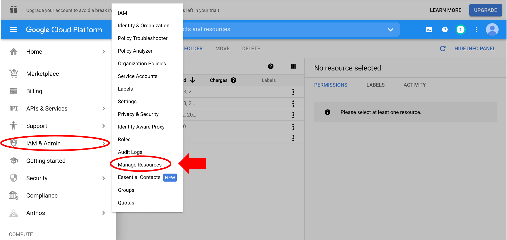

!!! tip "Pin Tabs"

    The navigation menu allows you to pin any tab which will appear on the top under Home. Hover over any navigation menu item and click on the pin icon next to it.

- Click on <span class="highlight_txt">CREATE PROJECT</span>

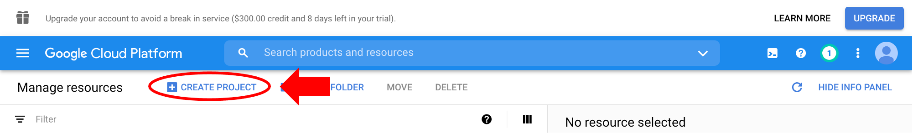

- Enter a unique project name ("My First Project" in the example below).
- Click <span class="highlight_txt">CREATE</span>.

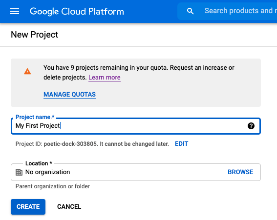

!!! info

    There is a quota for number of projects allowed per billing account. For the free trial account it is set to 12 but can be increased by submitting a request. [Learn more about project quota](https://support.google.com/cloud/answer/6330231).

    The "Location" entry can be left as "No organization". If a centralized billing account is set up, there would be options to set an "Organization" and "Location" with the G Suite organization name.)

- The new project is now listed in the table, along with an auto-generated project ID. Check the box next to the project name to select it.

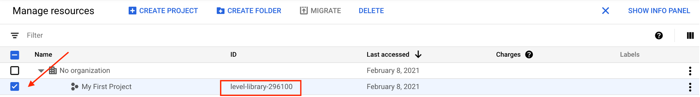

## Step 2: Configure custom VM

- On the navigation menu, scroll down to <span class="highlight_txt">Compute Engine</span> and select <span class="highlight_txt">VM instances</span>. It may take a few minutes to load.

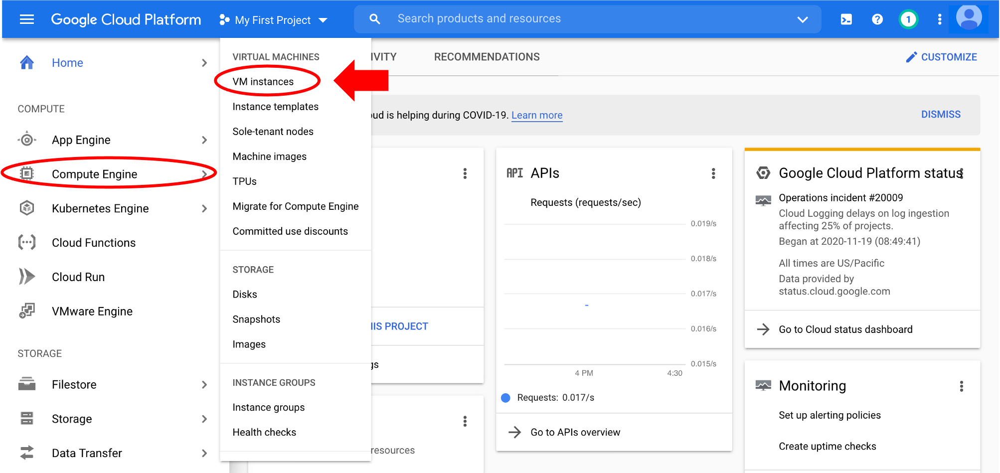

- The first time you create a VM, you'll need to click <span class="highlight_txt">Enable billing</span>. In the popup window select <span class="highlight_txt">SET ACCOUNT</span>.

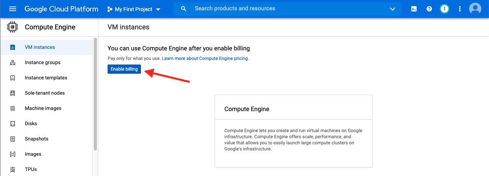

- Click the <span class="highlight_txt">Create</span> on the VM instance window. The compute engine setup may take a few minutes before this option becomes clickable.

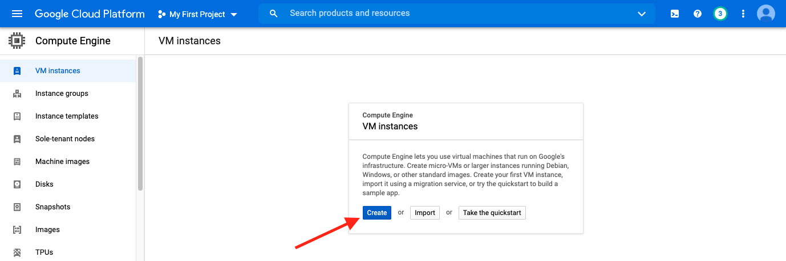

!!! tip

    If the create VM step is taking more than 5 minutes, try refreshing the web browser page.


Follow along with the video and written steps below to set up instance configuration options:

<iframe id="kaltura_player" src="https://cdnapisec.kaltura.com/p/1770401/sp/177040100/embedIframeJs/uiconf_id/29032722/partner_id/1770401?iframeembed=true&playerId=kaltura_player&entry_id=1_vxm10rim&flashvars[mediaProtocol]=rtmp&amp;flashvars[streamerType]=rtmp&amp;flashvars[streamerUrl]=rtmp://www.kaltura.com:1935&amp;flashvars[rtmpFlavors]=1&amp;flashvars[localizationCode]=en&amp;flashvars[leadWithHTML5]=true&amp;flashvars[sideBarContainer.plugin]=true&amp;flashvars[sideBarContainer.position]=left&amp;flashvars[sideBarContainer.clickToClose]=true&amp;flashvars[chapters.plugin]=true&amp;flashvars[chapters.layout]=vertical&amp;flashvars[chapters.thumbnailRotator]=false&amp;flashvars[streamSelector.plugin]=true&amp;flashvars[EmbedPlayer.SpinnerTarget]=videoHolder&amp;flashvars[dualScreen.plugin]=true&amp;flashvars[Kaltura.addCrossoriginToIframe]=true&amp;&wid=1_3gq3bdix" width="608" height="402" allowfullscreen webkitallowfullscreen mozAllowFullScreen allow="autoplay *; fullscreen *; encrypted-media *" sandbox="allow-forms allow-same-origin allow-scripts allow-top-navigation allow-pointer-lock allow-popups allow-modals allow-orientation-lock allow-popups-to-escape-sandbox allow-presentation allow-top-navigation-by-user-activation" frameborder="0" title="Kaltura Player"></iframe>

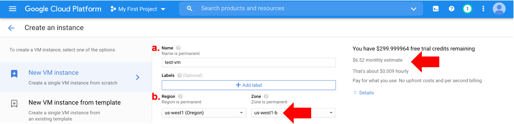

### a. Name your VM

- Type your VM name in the text box.
- Names must be in lowercase letters or numbers.
- Use hyphens `-` instead of spaces.

### b. Choose a Region

- Select a region from the dropdown menu. In this tutorial, we selected the "us-west1 (Oregon)" region.
- Zone is auto-selected based on choice of region.

!!! note "Machine regions"

    It's often best to select the region closest to your physical geographic region, but region choice depends on other factors. For example, if you are downloading data that is stored at a data center in a different region from yours, it may be more expensive to move data between regions. In this case, you'd want to select the same region as the data center. Read more about [regions and zones](https://cloud.google.com/compute/docs/regions-zones?_ga=2.51208687.-79235869.1601574422).

    This tool can help to choose the region closest to you (<http://www.gcping.com>). You may need to refresh several times.

### c. Choose machine type and configuration

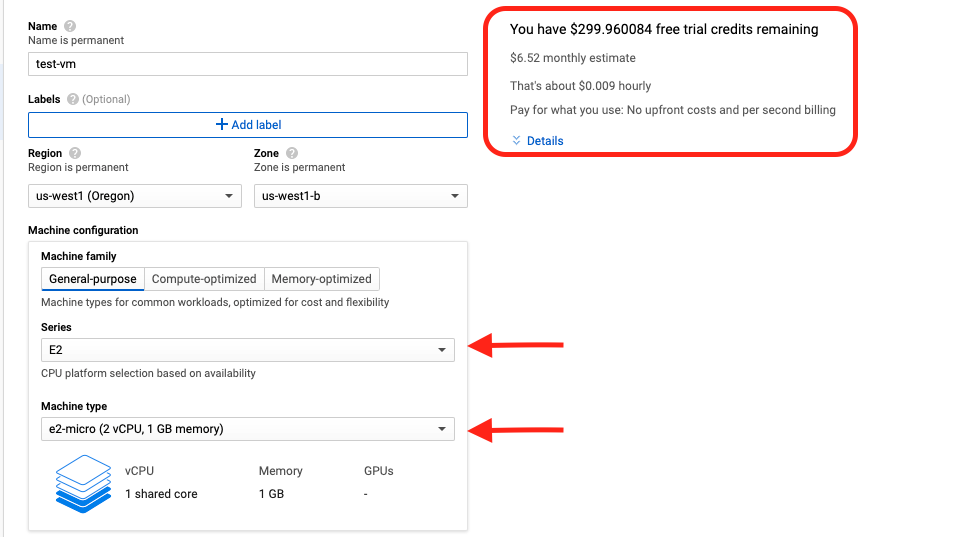

- For this tutorial, select Series **`E2`** and Machine type **`e2-micro`**.
- This machine type is recommended for day-to-day low cost computing.
- The estimated monthly cost for each machine type is shown on the top right side panel.
- Depending on the tasks you will use the VM for, you may need to choose a machine with more CPUs and memory.

!!! note "Machine types"

    See [GCP documentation](https://cloud.google.com/compute/docs/machine-types) for more information about machine type and [recommendations](https://cloud.google.com/compute/docs/machine-types#recommendations_for_machine_types) based on workload.

### d. Customize boot disk


- Click on <span class="highlight_txt">Change</span>.
- The default operating system is Debian, change it to **Ubuntu**.
- Select version **Ubuntu 20.04 LTS**.
- For this tutorial, we'll leave the [persistent disk storage](https://cloud.google.com/persistent-disk) as the default 10Gb. You can increase the storage amount based on task requirements.
- Click <span class="highlight_txt">Select</span>

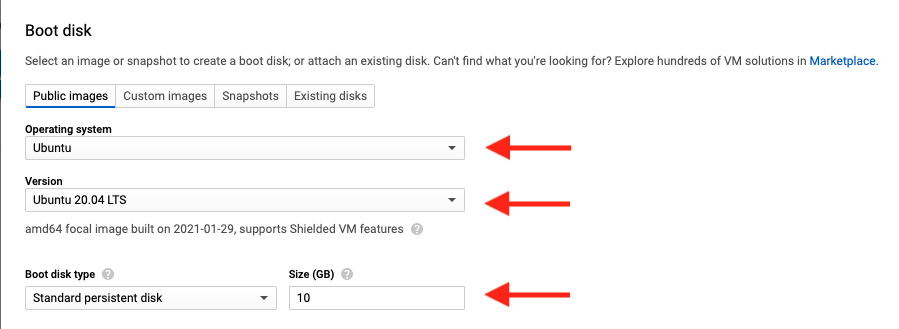

!!! note "Persistent disk storage"

    This type of block storage allows more flexibility for computing - for example, it can be resized or accessed even after a GCP VM instance is in use or deleted. Here's a quick GCP [youtube video](https://www.youtube.com/watch?v=zovhVfou-DI&vl=en) that highlights Google's persistent disk storage features.

- Click <span class="highlight_txt">Create</span> to initiate the VM. This step may take a few seconds to complete.

### e. VM states

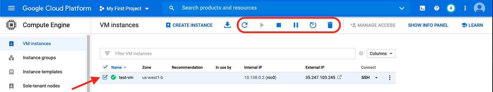

- Successful VM creation will be indicated by a green check mark next to the VM name.
- The icons on the VM instances bar allow for control of VM states (left to right):

=== "Refresh"

    Refresh the instance.

=== "Reset"

    "[Reset](https://cloud.google.com/compute/docs/instances/instance-life-cycle#resetting_an_instance) performs a hard reset on the instance, which wipes the memory contents of the machine and resets the virtual machine to its initial state."

=== "Suspend"

    [Suspending](https://cloud.google.com/compute/docs/instances/instance-life-cycle#suspending_an_instance) "the instance will preserve its running state, similar to closing a laptop. You'll be billed for storage of the suspended VM state and any persistent disks it uses."

    Note that `E2` VMs currently do not support the "Suspend" operation. Use "Stop" state instead.

=== "Stop"

    [Stopping](https://cloud.google.com/compute/docs/instances/instance-life-cycle#stopping_an_instance) the instance is similar to suspending it, but Google doesn't charge you for VM resources while it's stopped.

=== "Start/Resume"

    Start/resume a suspended or stopped instance to open it again.

=== "Delete"

    When you are completely finished working with the VM it can be deleted. This will remove all VM configurations and work you did in the VM.

!!! tip

    If you need to pause during this tutorial and want to save your VM instance and any work you did in the instance (e.g., files downloaded), click on the <span class="highlight_txt">Stop</span> icon to stop the VM. You'll be able to <span class="highlight_txt">Start/Resume</span> to start from your last session.

## Step 3: Connect to your VM

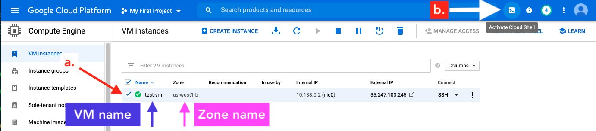

### a. Check box by VM

### b. Open Google Cloud Shell

- Click on the <span class="highlight_txt">Activate Cloud Shell</span> icon.
- A new panel will open on the bottom half of your screen.
- Agree to the Google Cloud terms of service and privacy policy (first time only).
- After starting the shell, it may take a few minutes to connect.
- The Google Cloud Shell command prompt format will show: **`<username>@cloudshell:~ (<project id>)$`**.

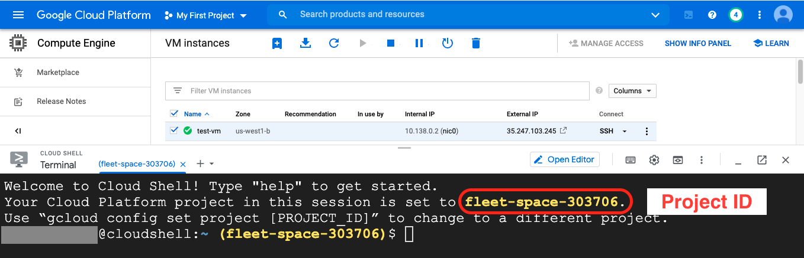

!!! info "Google Cloud Shell"

    The GCP console provides a free Google Cloud Shell. This shell environment is useful for small tasks that do **not** require a lot of CPU or memory (as most bioinformatic analyses do). For example, it is a good place to learn how to use the Google shell environment without incurring cost or to access Google Cloud services (e.g., a Google Storage bucket or GCP virtual machine). [Learn more about using the Google Cloud Shell](https://cloud.google.com/shell/docs/using-cloud-shell).

### c. Connect to VM

- Use the `gcloud compute` command to connect to your virtual machine (`gcloud` is a tool from the Google Cloud SDK toolkit). Follow along with the video and written steps below.

<iframe id="kaltura_player" src="https://cdnapisec.kaltura.com/p/1770401/sp/177040100/embedIframeJs/uiconf_id/29032722/partner_id/1770401?iframeembed=true&playerId=kaltura_player&entry_id=1_slzbh01f&flashvars[mediaProtocol]=rtmp&amp;flashvars[streamerType]=rtmp&amp;flashvars[streamerUrl]=rtmp://www.kaltura.com:1935&amp;flashvars[rtmpFlavors]=1&amp;flashvars[localizationCode]=en&amp;flashvars[leadWithHTML5]=true&amp;flashvars[sideBarContainer.plugin]=true&amp;flashvars[sideBarContainer.position]=left&amp;flashvars[sideBarContainer.clickToClose]=true&amp;flashvars[chapters.plugin]=true&amp;flashvars[chapters.layout]=vertical&amp;flashvars[chapters.thumbnailRotator]=false&amp;flashvars[streamSelector.plugin]=true&amp;flashvars[EmbedPlayer.SpinnerTarget]=videoHolder&amp;flashvars[dualScreen.plugin]=true&amp;flashvars[Kaltura.addCrossoriginToIframe]=true&amp;&wid=1_nmar7tyy" width="608" height="402" allowfullscreen webkitallowfullscreen mozAllowFullScreen allow="autoplay *; fullscreen *; encrypted-media *" sandbox="allow-forms allow-same-origin allow-scripts allow-top-navigation allow-pointer-lock allow-popups allow-modals allow-orientation-lock allow-popups-to-escape-sandbox allow-presentation allow-top-navigation-by-user-activation" frameborder="0" title="Kaltura Player"></iframe>

- You will need your **project ID, zone, and instance name**.
- In the example command below, the project ID is `fleet-space-303706`, the zone is `us-west1-b`, and the instance name is `test-vm`.
- The `ssh` flag indicates we are accessing the VM with [Secure Shell](https://www.ssh.com/ssh/) protocol, which we'll set up below.

!!! important

    Remember to **replace these values** to run the command for your virtual machine!

=== "Input"

    Usage:
    ```
    gcloud compute --project "<your project ID>" ssh --zone <your zone> <your VM name>
    ```

    Example:

    ```
    gcloud compute --project "fleet-space-303706" ssh --zone us-west1-b test-vm
    ```

If you get an error, you may need to configure `gcloud`:

#### Configure Google Cloud SDK

To connect to the GCP VM from the command line of the Google Cloud Shell or your local machine, you need to setup [Google Cloud Software Development Kit (SDK)](https://cloud.google.com/sdk). The Cloud SDK provides a number of important tools like `gcloud` that are used for accessing GCP services.

[Follow the instructions](https://cloud.google.com/sdk/docs/quickstart) to download the appropriate SDK based on your Operating System. Then set up authorization:

- In the terminal/command line, enter:

```
gcloud auth login
```

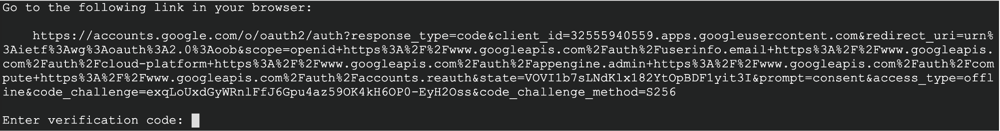

- Click on the Google link. A new browser tab will open.
- Log in to the Google account you used to set up the GCP console.
- Click <span class="highlight_txt">Allow</span> to allow Google Cloud SDK to access your Google account.
- The next page will provide a verification code. Copy/paste the code back in the terminal next to "Enter verification code:".

### d. Authorize Cloud Shell

- The first time you open the shell to access a VM, you will need to authorize the cloud shell.
- Click on <span class="highlight_txt">Authorise</span>:

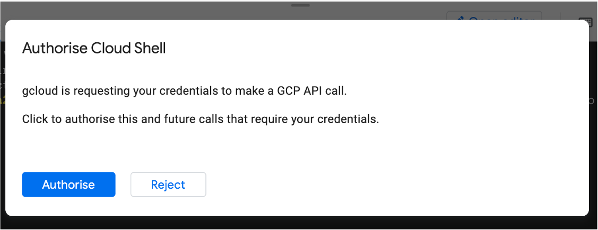

### e. Set up SSH keys

Next, set up SSH public/private keys (first time only). This step provides an extra layer of security to protect access to your instance.

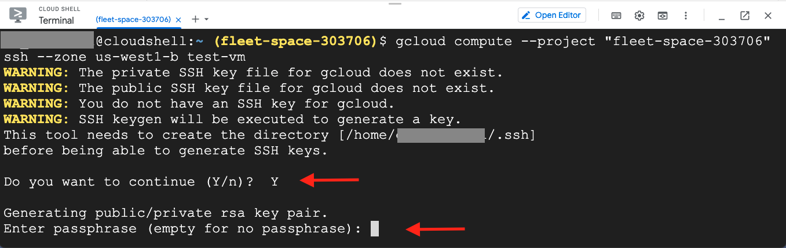

Follow the prompts in the terminal:

- "Do you want to continue (Y/n)?": type ++y++
- "Enter passphrase (empty for no passphrase)": you can create a passphrase or it can be left empty, type ++enter++ to move on
- "Enter same passphrase again": type passphrase if you created one, type ++enter++ to move on
- After the VM is added as a known host you will be prompted to enter the paraphrase if one was set: "Enter passphrase for key"
- On successful login, your command prompt in the terminal should switch to </br>**`<user name>@<VM name>:~$`**. You're now in the VM space!

!!! tip

    If the Google Cloud Shell times out, a popup banner will appear where you can click <span class="highlight_txt">Reconnect</span>.

    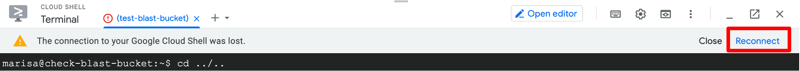

Continue to the [next lesson](./gcp3.md) to run an example analysis using the VM we just configured!
